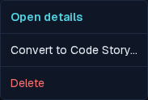
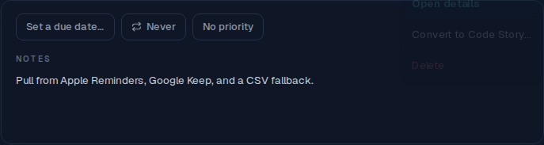
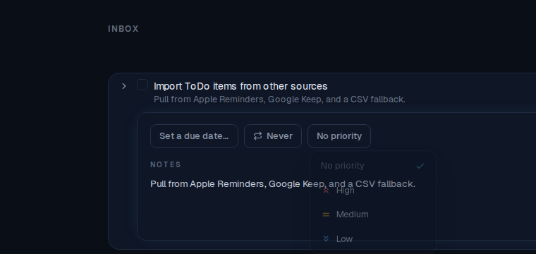
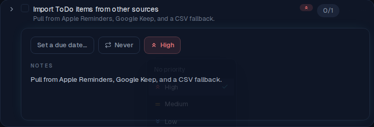

# ALF-67 — task detail menu & auto-saving inline detail

*2026-06-29T19:35:20.711Z*

ALF-67 reworks the task row and its detail (the finalized "2a" direction): a scannable row, a decluttered inline detail with auto-saving chip pickers, and direct detail access from the ⋯ menu. Captured against the live app via the Playwright mock harness.

**The row reads cleanly without opening anything.** Metadata is compact: a one-line notes preview under the title, a `completed/total` subtask count (`0/1`), and — when set — due / repeat / priority pills. The old "Task" type pill is gone (only "Code" still earns a badge).

**The ⋯ menu opens the detail directly.** "Open details" now leads, highlighted teal. The per-field "Set due date / Set priority / Add notes" entries are gone — those edits moved into the detail. Convert / Move / Delete remain.

**The detail is one horizontal chip row + a focused Notes area.** The vertical stack of eyebrow-labeled field rows (each with its own Save/Cancel, plus a global Save and Close) is gone. Each chip — Due · Repeat · Priority — opens its own picker popover; there is no Save/Cancel/Close anywhere.

**Each chip opens an auto-saving picker.** Tapping a chip opens a popover anchored below it; the current value carries a trailing teal ✓. The Due chip opens a month-grid calendar (with Clear / Today); Repeat opens the preset list; Priority opens the level list shown here.

**Selecting a value applies immediately.** Picking *High* saves with no Save step: the detail chip tints red and the row gains the symbol-only High pill (icon, no text) beside the subtask count. Notes likewise auto-save on blur. Detail-open and subtask-expansion are independent — a row can show its detail, its subtasks, both, or neither.

