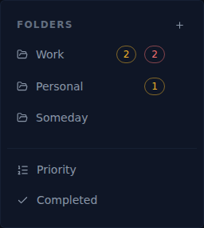

# ALF-84 — Folder attention badges: amber (high-priority / due today) + red (overdue)

*2026-07-01T05:16:57.297Z*

Before this change each folder in the sidebar carried a **single amber badge** counting active tasks *due today or overdue* — the two states were merged into one number with no way to tell "needs attention today" from "already late", and task **priority** never influenced the count at all.

ALF-84 splits that into **two disjoint badges** per folder (each task counts in at most one): an **amber "attention"** tally = active tasks that are **high-priority OR due today** (a high-priority task counts even with no due date), and a **red "overdue"** tally = active tasks **past due**. Overdue takes precedence, so a high-priority *overdue* task counts red only. Completed tasks and Inbox items (no folder) never count; nested subtasks count toward their ancestor's folder.

### The two badges in context (FolderNav sidebar)

Work has an amber **2** (one task due today + one high-priority task with no due date) and a red **2** (two overdue tasks); Personal has an amber **1** (due today); Someday shows nothing — its only task is a future low-priority one.

### The two tones in isolation (committed Storybook baselines)

