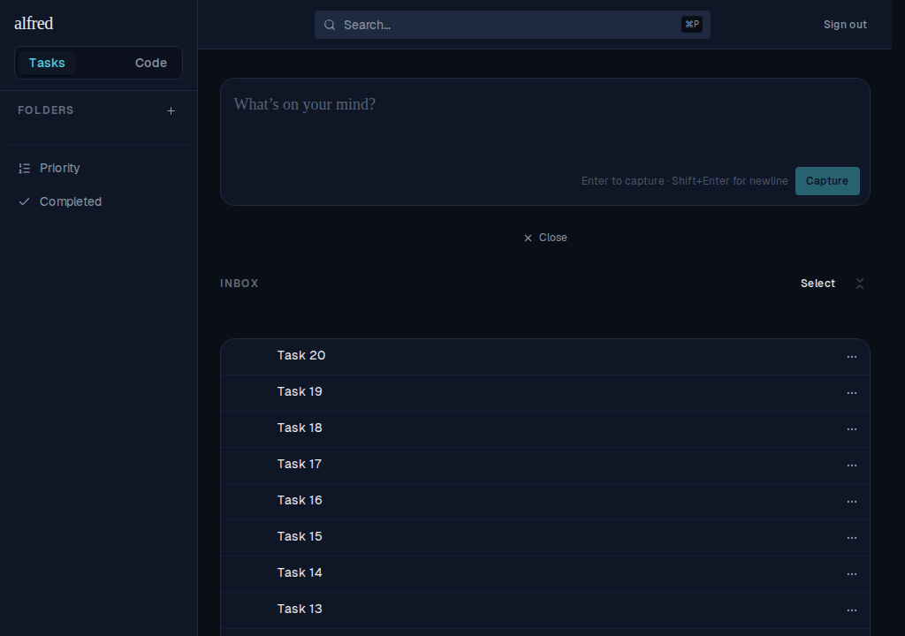
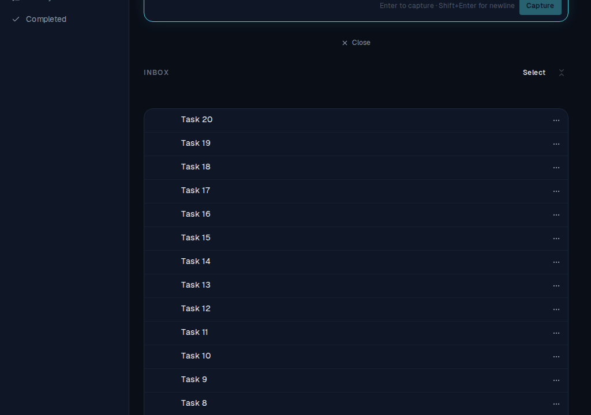
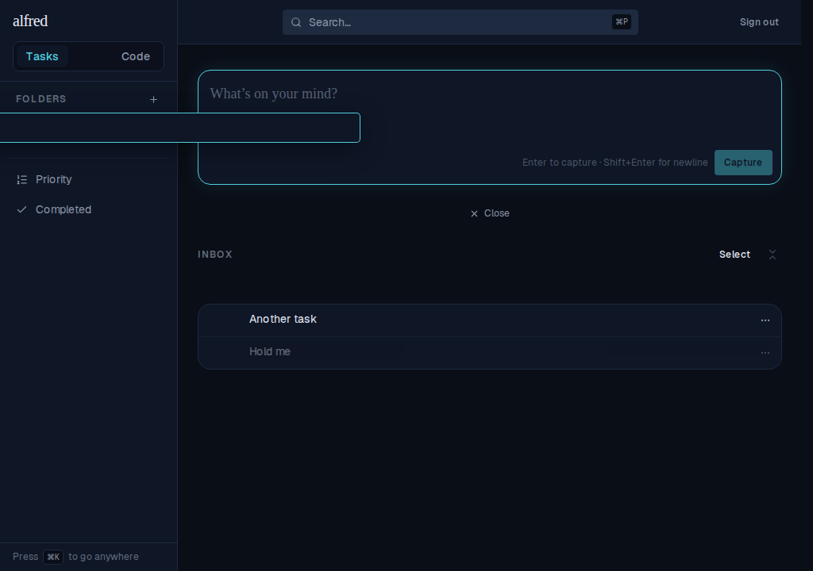
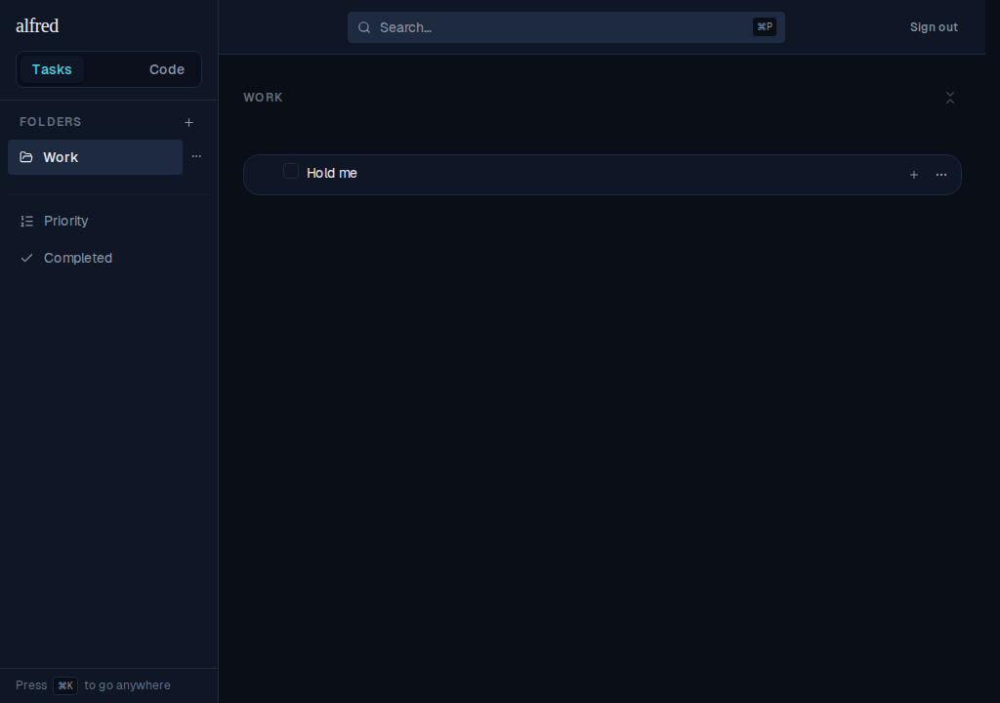

# Hold-first touch drag: a swipe scrolls, a hold lifts

*2026-07-03T00:30:37.713Z*

On a touch device the whole task row is a drag surface, so a plain scroll swipe used to be mis-read as a drag: the single pointer sensor lifted a row after an 8px move and `preventDefault` blocked the scroll, leaving the list un-scrollable by touch. The fix splits that one sensor into a mouse sensor (distance: 8, unchanged) and a touch sensor (delay: 250ms, tolerance: 5px). Touch now needs a brief press-and-hold to engage; a quick swipe scrolls as normal. Mouse and keyboard are untouched. Screenshots below are driven through a real touch context (CDP touch events; mouse events don't drive a TouchSensor).

### 1 · A swipe scrolls the list — no drag

Press a row and swipe up. The move crosses the 5px tolerance long before the 250ms hold elapses, so the touch sensor cancels — no row lifts, no overlay, no drop highlight — and the browser scrolls the list natively (the header has scrolled off the top; the list now shows Task 8–20).

### 2 · Press-and-hold lifts the row, then it drags to a folder

Press "Hold me" and keep the finger still. After ~250ms the row lifts: it dims in place while a floating overlay clone follows the finger. Glide onto the Work folder — it highlights as the drop target — and release.

On release the task is filed under Work via the optimistic moveTask action — exactly as a mouse drag would file it.

Mouse (distance: 8) and keyboard (Space/Enter to lift, arrows to move) activation are untouched, and the isInteractiveTarget guard is carried into both new sensors, so tapping a row's checkbox / chevron / add-subtask / kebab still performs its action and never starts a drag. The mouse, keyboard, and control-guard behaviours stay covered by the existing drag-to-folder, promote-to-root, reparent, and pointer-sensor specs; the new mobile-drag.spec.ts adds the two touch behaviours.
