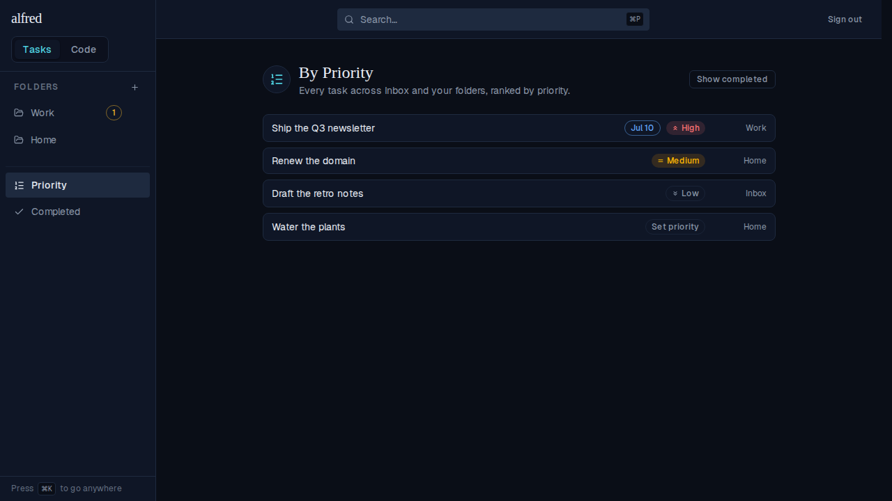
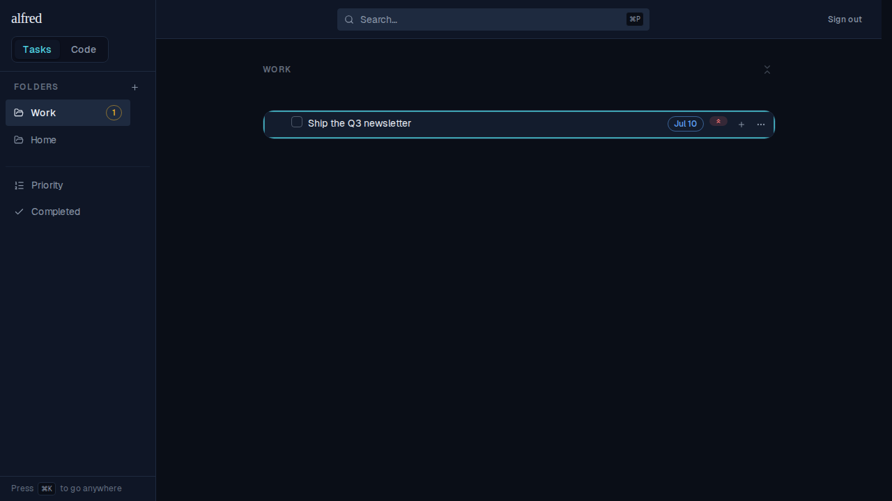

# Click a By-Priority task to jump to its folder and focus it

*2026-07-04T03:38:12.879Z*

ALF-96 — the By-Priority list is a flat, cross-cutting ranking of every task across the Inbox and your folders. Until now a row was inert: you could see a task was urgent, but not get *to* it. Now each title is a link that jumps to the task **in context** — its containing folder (or the Inbox / Completed view) — and rings the row so it's easy to spot. It reuses the same navigate-then-focus jump global search already performs.

### 1. The By-Priority list — every title is now a clickable link

Clicking **Ship the Q3 newsletter** (which lives in the Work folder) switches to that folder's view — a client-side history push, no server round-trip — exactly as global search does. It stays a real `<a href>`, so a ⌘- or middle-click opens the folder in a new tab instead.

### 2. It lands in the Work folder with the row scrolled in and ringed teal

The focus survives the view switch even though the destination row only mounts *after* the navigation: the jump records the target id, and the row claims it on mount (or catches the live event when it's already on screen), so the highlight lands regardless of timing.
