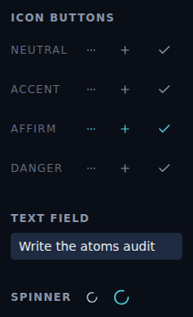
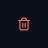
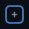
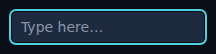
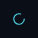

# Storybook visual testing for atom components

*2026-06-11T17:45:24.828Z*

Every component in `frontend/components/atoms/` now has Storybook **image-snapshot** visual tests covering each of its states — including real `:hover` and `:focus-visible` states. The test-runner's `postVisit` hook (`.storybook/test-runner.ts`) drives a real pointer / keyboard, freezes all animation, screenshots a component-tight crop with Playwright, and diffs it against a PNG baseline committed to git via `jest-image-snapshot`. Stories opt in with `parameters.visualTest`; everything else in the Storybook is untouched.

21 baselines were generated (`npm run test:storybook:update -w frontend`) and live in `frontend/__image_snapshots__/`:

```bash
ls -1 frontend/__image_snapshots__ | sort
```

```output
atoms-fieldlabel--default.png
atoms-gallery--library.png
atoms-iconbutton--accent-hover.png
atoms-iconbutton--accent.png
atoms-iconbutton--affirm-hover.png
atoms-iconbutton--affirm.png
atoms-iconbutton--danger-hover.png
atoms-iconbutton--danger.png
atoms-iconbutton--disabled.png
atoms-iconbutton--focused.png
atoms-iconbutton--neutral-hover.png
atoms-iconbutton--neutral.png
atoms-spinner--default.png
atoms-spinner--large.png
atoms-spinner--saving.png
atoms-spinner--teal.png
atoms-textfield--date-input.png
atoms-textfield--default.png
atoms-textfield--disabled.png
atoms-textfield--focused.png
atoms-textfield--with-value.png
```

**The `Atoms/Gallery` baseline** — every atom together on the real dark theme, proving the captures render the components (not a blank canvas):



**Hover is a real CSS `:hover`, captured by moving the actual pointer.** `userEvent.hover` in a play function would *not* engage the pseudo-class. Neutral IconButton at rest (muted grey) vs hovered (fades to foreground):


Each tone hovers to its own colour — danger fades to the destructive red:



**Focus is `:focus-visible`, captured by pressing Tab** (programmatic `.focus()` would give a plain `:focus` with no ring). The IconButton shows its blue focus ring; the TextField shows its signature teal ring:





The Spinner's `animate-spin` is frozen at capture time, so its rotation is deterministic across runs:



**Regenerating** baselines after an intentional change: `npm run test:storybook:update -w frontend` (rebuilds Storybook, rescreenshots, rewrites the PNGs). **The gate** runs on pre-push via `check:slow` → `test:storybook`, which uses `test-storybook --ci` and *fails* on any missing or mismatched baseline rather than silently overwriting it. A small `failureThreshold` (1%, percent) absorbs cross-machine antialiasing while still catching real tone/hover/focus regressions.
