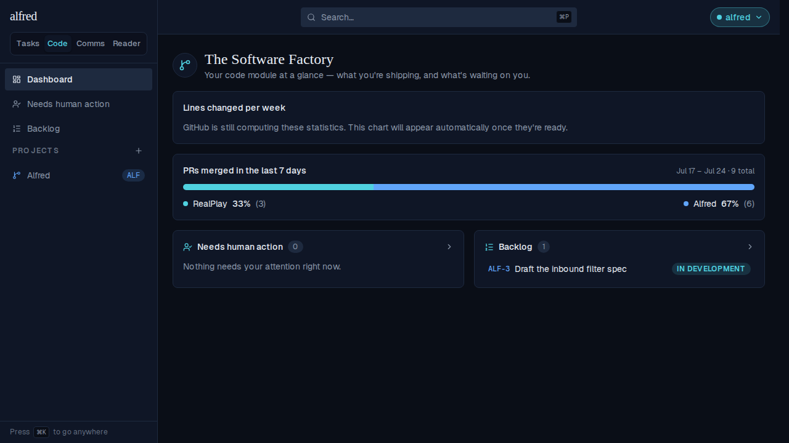
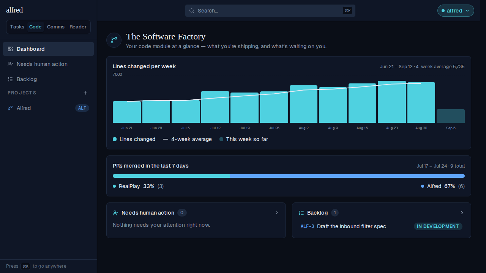

# LoC graph auto-refreshes once GitHub finishes computing

*2026-09-20T21:16:36.026Z*

ALF-243: the lines-changed card on the Code dashboard used to tell you GitHub was still computing its contributor statistics and to 'Refresh in a minute' — leaving a manual page reload as the only way to see the chart land. The card's data hook (`useLocVelocity` in `frontend/lib/hooks/use-loc-velocity.ts`) now polls the endpoint every 15 seconds (`COMPUTING_POLL_MS`) on its own while the status stays 'computing', and swaps in the real chart the moment GitHub answers — no reload, no click.

Before: the Dashboard hits /code/dashboard while GitHub answers 202 (still computing). The card shows the note and stops there.

After (same page, no reload, ~15s later): the card's own poll finds the statistics ready and renders the real chart in place of the note.

The journey above is driven end to end through the real running Dashboard (stubbing only the GitHub-backed endpoint, per the repo's e2e convention): the first request finds GitHub still computing, the request the card's own timer fires next finds it ready. The default Playwright assertion timeout is raised for that one wait, since the poll is real wall-clock time (15s), not a mocked clock. (Regression coverage for the hook's scheduling/cleanup itself lives in frontend/components/code/loc-velocity.test.tsx, driven by a fake clock.)
