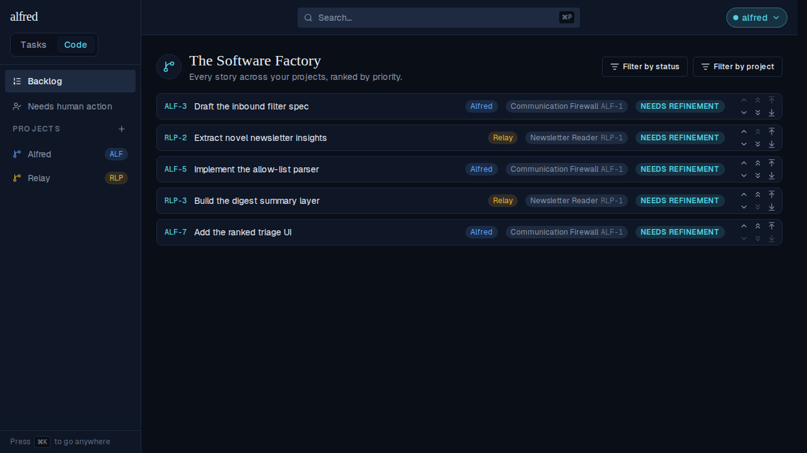
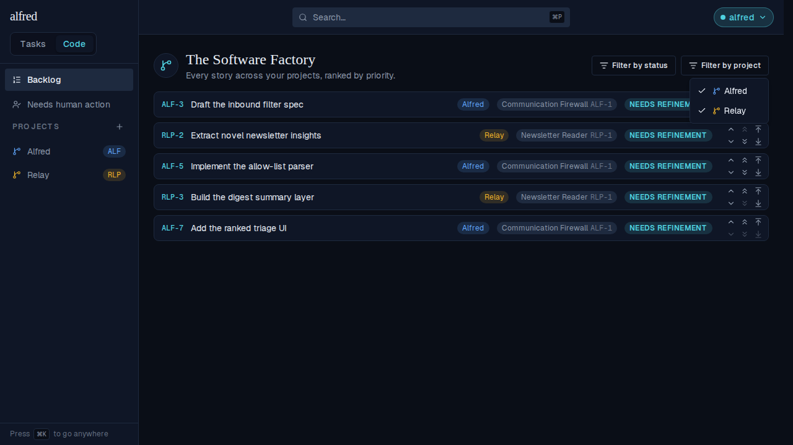
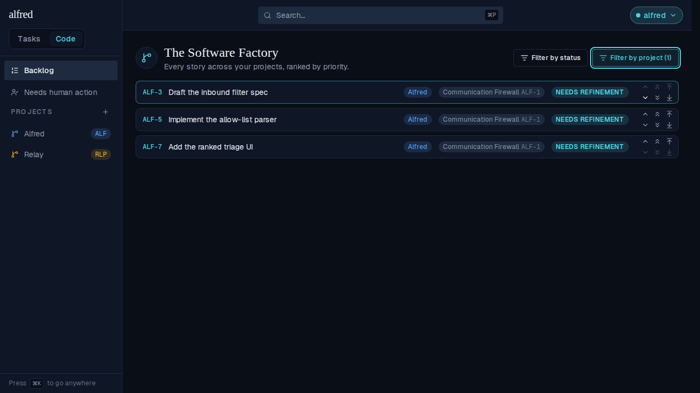
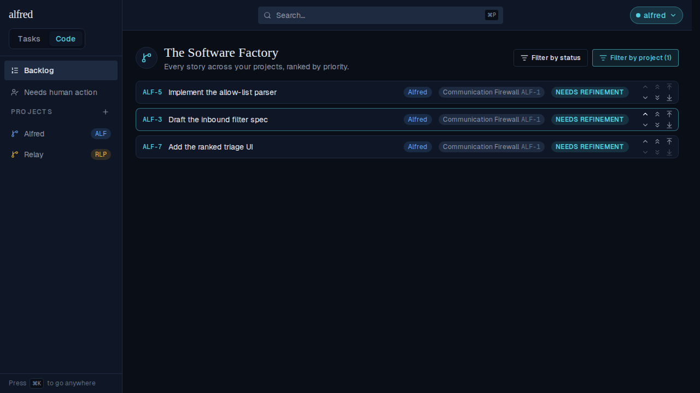
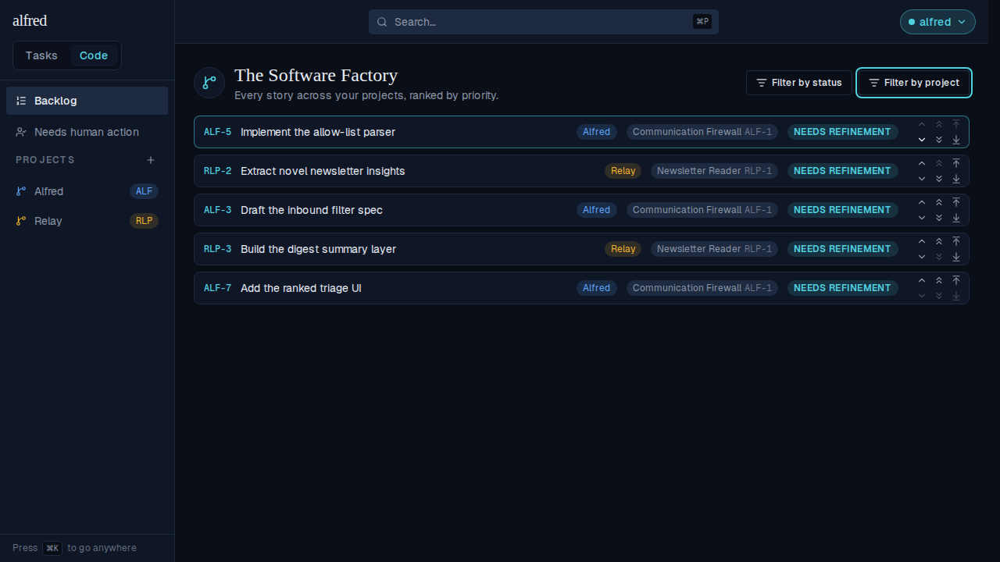

# Backlog: filter by project (ALF-156)

*2026-08-07T18:05:02.639Z*

The Backlog lists every story across every project, ranked by one global priority. ALF-156 adds a **Filter by project** multi-select beside the existing Filter by status, so the owner can narrow that cross-project list to the projects they are actually working on today — without changing anyone's rank.

## 1. The Backlog, unfiltered

Five stories interleaved across two projects (Alfred and Relay), in global priority order. The header now carries two filter controls.

## 2. The control

One checkbox per project, in creation order — the same stable order that assigns each project its palette colour, so the menu glyphs match the row badges and the sidebar. Every project is checked at rest: the Backlog stays cross-project until you narrow it.

## 3. Narrowed to one project

Unchecking **Relay** drops its two stories. The three Alfred stories keep the global ranking they already had — ALF-3, ALF-5, ALF-7 — and the trigger goes teal with the count of what's selected, the same treatment Filter by status uses.

## 4. Reordering acts on what you can see

The chevrons swap a story with its **visible** neighbour, so they follow the filter. Clicking *Move ALF-5 up* here swaps it with ALF-3 — even though RLP-2 still ranks between them globally. That's the swap's real semantics: the two stories exchange global priorities, so a hidden story between them stays exactly where it was.

## 5. Re-checking the project brings it back

Relay's stories return, ranked by the priority they never lost — and the swap from step 4 persisted: ALF-5 now leads, with RLP-2 sitting between it and ALF-3. Nothing about Relay's ranking was touched by hiding it. The selection also survives SPA navigation to a board and back (it lives in the same `CodeFilterProvider` as the status filter, keyed per view).

## Deliberately not in this change

The ticket noted that while filtering, the arrow-to-line **top/bottom of list** jumps should land at the top/bottom of the *visible* projects rather than the whole Backlog. That is not implemented here, by decision: the extreme is computed server-side by the `move_code_priority` RPC, so honouring it needs a project-scoped RPC (mirroring `move_code_priority_in_project`'s midpoint math over a set of project ids), a route, and a mock-backend handler — a full-stack change deferred to its own ticket. Today those two buttons still jump to the ends of the whole Backlog while a project filter is active; the single chevrons and the per-project jumps already behave correctly under the filter, as shown above.
