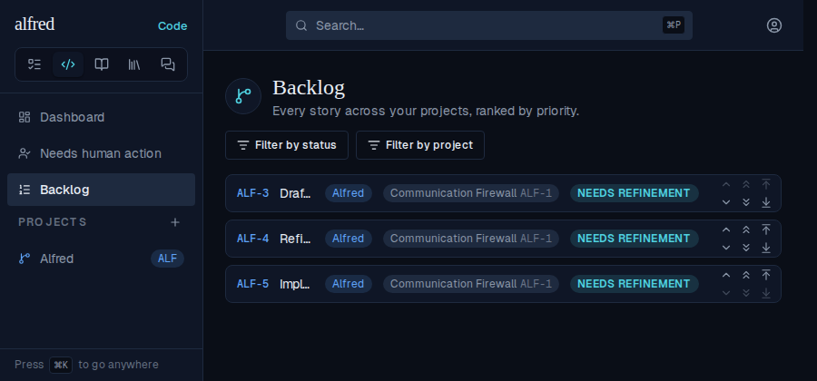
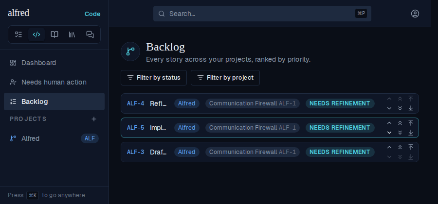

# ALF-250: Backlog nudges reach the server in click order

*2026-10-04T20:01:09.138Z*

Two single-chevron nudges down on ALF-3 (start order ALF-3, ALF-4, ALF-5), the second clicked after the first's 200 ms debounce had flushed. The first /api/code/reorder request was held 2.5 s by a Playwright route and the second only 0.2 s — a slow request overtaken by a fast one, as on a flaky connection. Each swap_code_priority call trades ranks with a named neighbour, so applying them out of order lands a different ranking than the screen showed. The last shot in each section is after a full page reload, i.e. what the server actually stored.

## Starting order

## Before the fix (base commit)

After the two nudges the list shows ALF-4, ALF-5, ALF-3 — but both requests were in flight at once, the server applied the second swap first, and on reload ALF-3 has climbed back ABOVE ALF-4: 'down' moved it up.

## After the fix

Every burst now joins one queue that sends a single swap at a time in click order, and an item with a swap still queued keeps its optimistic rank against earlier responses and realtime echoes. The second request waits for the first, and the reload shows exactly what the screen showed.

