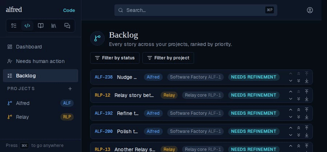

# Backlog nudges no longer snap back or stall (ALF-250)

*2026-10-04T18:59:31.913Z*

A Backlog story's rank reached the browser from four writers that arrived in no fixed order — the optimistic nudge, each sync's reply, a failed sync's rollback, and the Realtime echo of every server write — and whichever landed last won. So a nudged story snapped back up when an earlier step's reply landed, and a stale rank could tie it with its neighbour, after which Down swapped two equal ranks and did nothing. On the server, `swap_code_priority` parked the story at a top-of-Backlog rank mid-swap (a real Realtime event: the story flashed to the top of the list on every nudge) and read ranks without locking, so two swaps of one story in flight at once 409'd.

## The server: one write per row, row-locked (migration 0042)

Against a throwaway real Postgres, a trigger logs every row write a nudge makes — one line per Realtime UPDATE the browser receives. Before 0042, the nudged story is first written to `-3`, the top of the whole Backlog; and a second swap of the same story in flight at once fails with a unique violation. After 0042, each row is written once, straight to its final rank, and the concurrent swap waits and commits.

```bash
node docs/demos/backlog-nudge-stale-ranks/swap-writes.mjs
```

```output
== BEFORE 0042 ==
before: ALF-1=-1, ALF-2=-2
row writes streamed to the browser, in order:
  ALF-1 → -3
  ALF-2 → -1
  ALF-1 → -2
ALF-3↔ALF-4 committed; ALF-3↔ALF-5 (in flight at the same time): FAILED: duplicate key value violates unique constraint "code_items_priority_key"

== AFTER 0042 ==
before: ALF-6=-6, ALF-7=-7
row writes streamed to the browser, in order:
  ALF-6 → -7
  ALF-7 → -6
ALF-8↔ALF-9 committed; ALF-8↔ALF-10 (in flight at the same time): committed
```

## The browser: a burst of nudges with a slow server

The Backlog filtered to the Alfred project (as in the report), every reorder sync slowed to one second. ALF-238 is nudged Down three times in a burst, then Up once while the burst is still syncing.

**Before** — when the first step's reply lands, ALF-238 snaps back up a row, then slides down again as the later replies land:


**After** — ALF-238 stays where the burst left it until every sync has settled; the Up nudge lands one row up and stays there:


