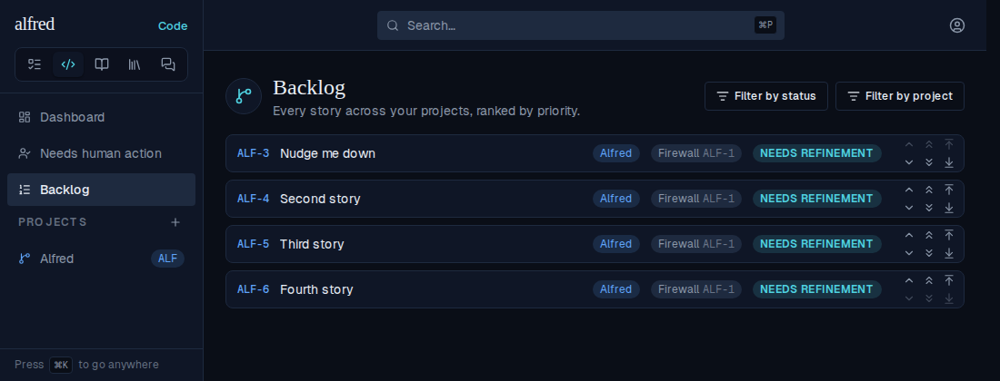
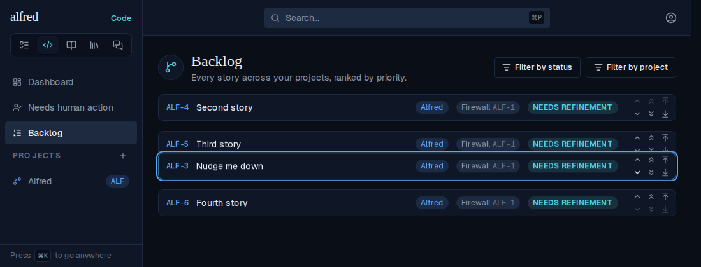
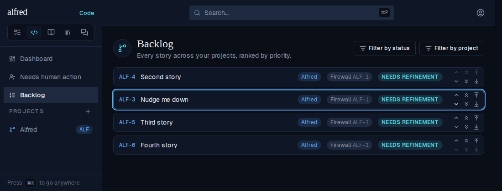
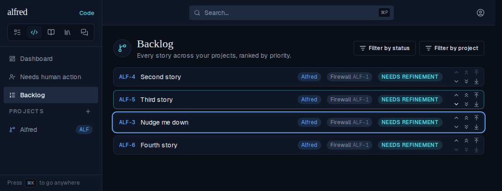

# Backlog single-chevron nudges stay put (ALF-250)

*2026-10-04T20:53:55.167Z*

Nudging a story down the Backlog one chevron at a time made it snap back up and slide down again, and under repeated clicks the nudges stopped landing. Two layers fed it: the swap RPC broadcast a transient row version (the story parked at the very top of the Backlog) and raced a second, overlapping swap into a 409; and the store applied every intermediate server rank — each step's response and realtime echo — over a list that had already moved past it.

## 1. The database: what one swap broadcasts

A throwaway Postgres with the real migrations, once through 0041 and once with 0042. An AFTER UPDATE trigger records every row version `swap_code_priority` writes — each one is a change event `supabase_realtime` pushes to an open Backlog. Then a second swap of the same story overlaps the first's open transaction (the next chevron burst committing while one is in flight).

```bash
node docs/demos/backlog-swap-steady/swap-row-versions.mts
```

```output
== swap_code_priority through 0041 (before)
Backlog before:  ALF-4=-4  ALF-3=-3  ALF-2=-2  ALF-1=-1
Row versions broadcast, in order:
  ALF-4 -> -5
  ALF-3 -> -4
  ALF-4 -> -3
Overlapping second swap: failed: duplicate key value violates unique constraint "code_items_priority_key"
Backlog after:   ALF-3=-4  ALF-2=-3  ALF-4=-2  ALF-1=-1

== swap_code_priority with 0042 (after)
Backlog before:  ALF-4=-4  ALF-3=-3  ALF-2=-2  ALF-1=-1
Row versions broadcast, in order:
  ALF-3 -> -4
  ALF-4 -> -3
Overlapping second swap: landed
Backlog after:   ALF-3=-4  ALF-2=-3  ALF-1=-2  ALF-4=-1
```

Before, ALF-4 is written at -5 (the global top) before landing on -3 — that first version is the "snapped to the top" every open tab saw — and the overlapping swap 409s. After, each row is written once, to its final rank, and the overlapping swap waits for the first and lands: ALF-4 ends two slots down, as two Down clicks intended.

## 2. The Backlog: two quick Down clicks on ALF-3

Driven through the real app on the e2e mock backend. The first `/api/code/reorder` response is held until both clicks have applied, then released while the second swap is still on the wire.

Start — ALF-3 at the top:



Both clicks applied instantly — ALF-3 is two slots down:



Before the fix — the first swap's response lands while the second is in flight, and ALF-3 snaps back up a slot:



After the fix — the same moment; the stale rank is held back and ALF-3 stays where the clicks put it:



Settled, once the second swap answers:


