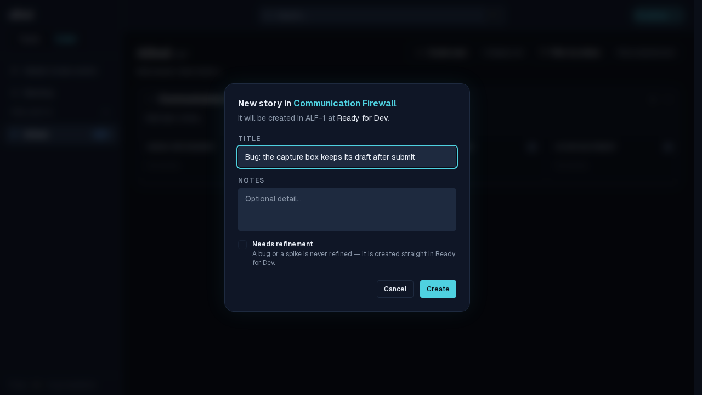
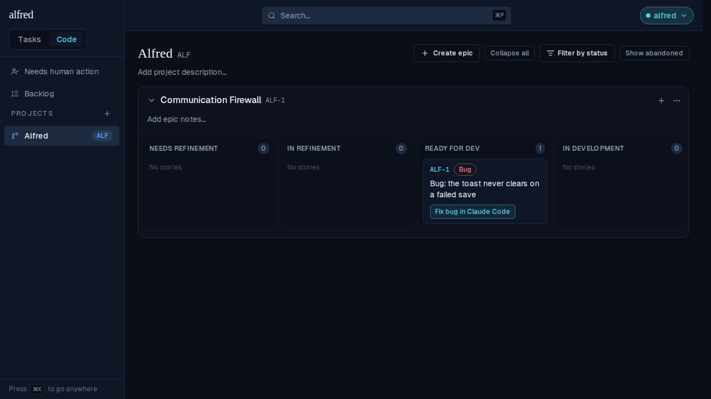
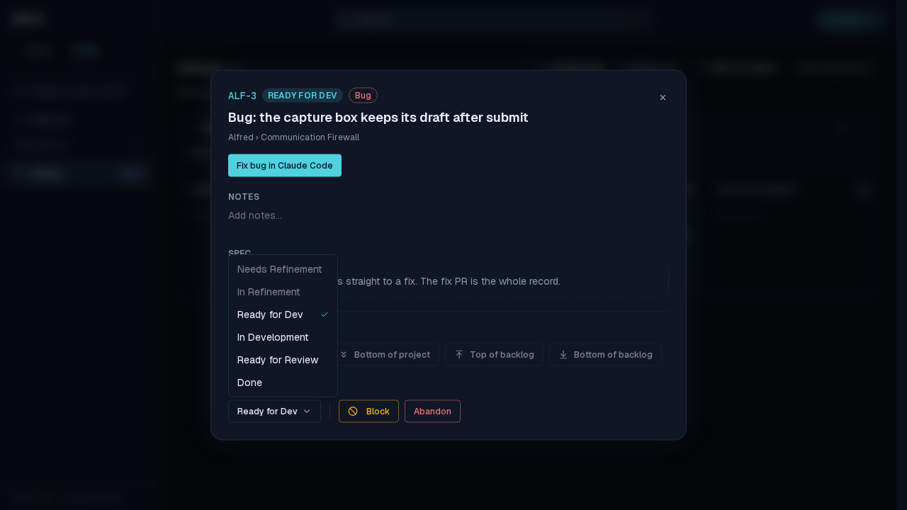
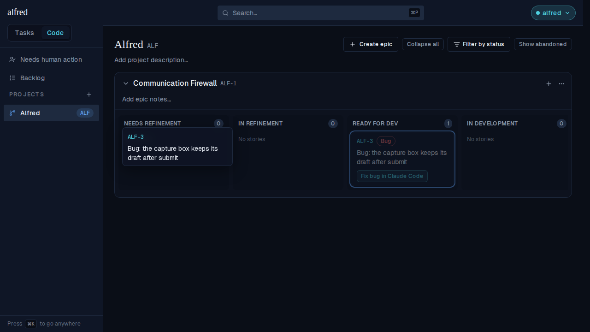
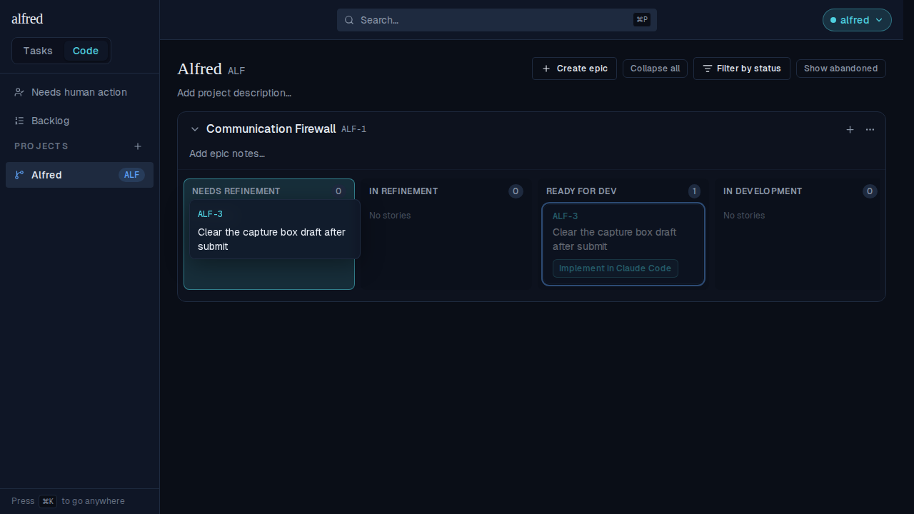
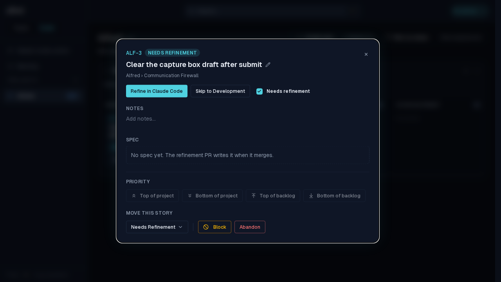
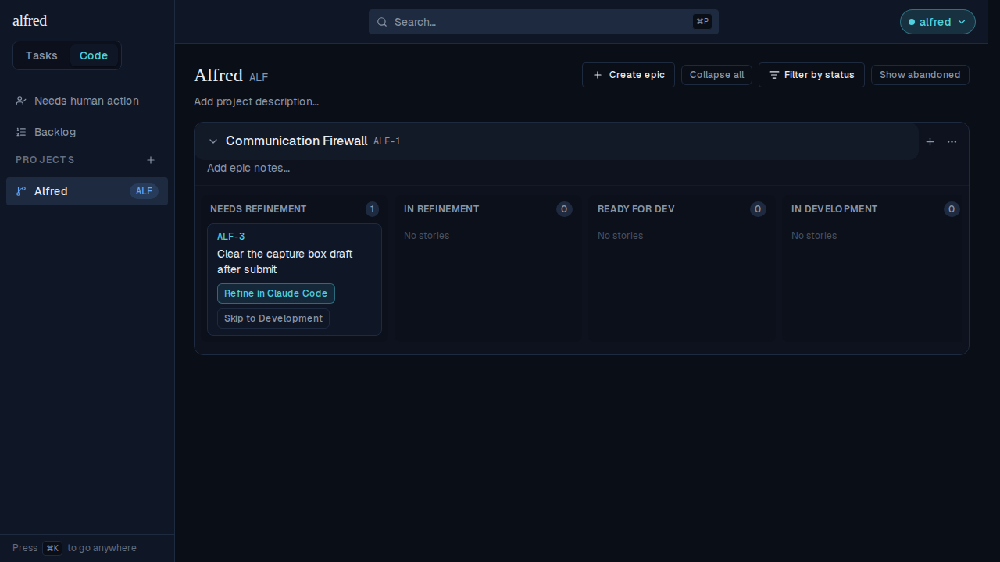

# Bug and spike stories start in Ready for Dev, and can't be put back

*2026-09-07T22:26:13.062Z*

ALF-215. A spike answers a question and a bug restores behaviour the app already promised — neither is work you write a spec for. Alfred already knew that at launch time (a `Bug:` / `Spike:` card offers one session, not refine-then-implement), but the two lanes in front of that session were still open to it: a bug was created in Needs Refinement, could be dragged back into it, and could be picked back into it from the status menu.

Three things change. Both creation paths land a bug or a spike in **Ready for Dev**; the two refinement lanes are **closed** to one, in the status menu and in the drag gesture alike; and a **rename** that crosses the kind boundary moves the card so it never sits in a lane its new kind can't occupy. The kind is still derived from the title alone — no column, no migration for it, and a rename re-classifies instantly.

## 1. Creating one from the board

Type a `Bug:` title in the New Story dialog and the "Needs refinement" checkbox clears itself and locks, saying why; the dialog's own preview line updates to **Ready for Dev** before you submit.

Submit, and the card is minted straight into Ready for Dev, wearing its Bug badge and offering the one session it runs.

## 2. Gating a `Bug:` task in from the Inbox

The other creation path is the gate, which admits an item that already exists. It landed every story on the `factory_state` column default, so a task captured as "Bug: …" and sent to the Code module arrived in Needs Refinement. Migration `0033` gives `enter_code_module` the same `p_requires_refinement` parameter `create_code_story` has had since `0025`, so both entry points now agree — and the RULE still lives only in the frontend, where the title is read.

## 3. The refinement lanes are closed

In the detail modal's status menu, both refinement lanes render **disabled** rather than hidden — a greyed-out "Needs Refinement" says *a bug is never refined*, where a menu silently four items long would just look broken. Every other lane is still one pick away.

The drag gesture refuses the same two lanes, and refuses them *early*: the lane's drop-target highlight runs through the same resolver the drop does, so it never arms. Here the bug's card is lifted and held over Needs Refinement — no highlight, and the lane's count stays at 0.

The control: an **ordinary story**, same lane, same gesture, same pointer position — and Needs Refinement lights up. The refusal is targeted at the kind, not a dead card.

## 4. Renaming across the kind boundary

Because the kind is read off the title, a rename can strand a story in a lane its new kind can't occupy. So a rename that crosses the boundary moves the card too — and only when it has to. Dropping the `Bug:` prefix off a story sitting in **Ready for Dev** sends it to **Needs Refinement**: the state chip flips, the Bug badge is gone, the refinement mark comes back checked, and the primary action becomes *Refine in Claude Code*.

Behind the modal, the card has already moved lanes.

The mirror holds in the other direction (a story in a refinement lane renamed to `Bug:` moves to Ready for Dev), and **only** those two cases move: a bug renamed back into a story mid-build stays in In Development, and a story already carrying a committed `spec_path` is never rewound — the spec exists whatever the title now says.

## Not covered

The **epic conversion** (`convert_to_code_epic`, which turns a 1-deep parent into an epic plus one story per child) still lands every child at Needs Refinement, whatever its title — its RPC takes no per-child mark. A `Bug:` child that arrives that way is recoverable by hand (moves OUT of a refinement lane are never blocked) or by touching its title, but it does not start in the right lane.
