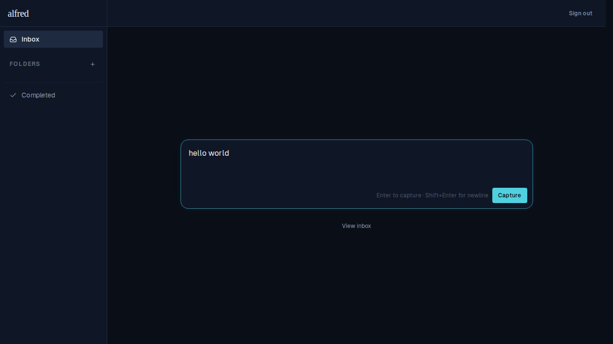
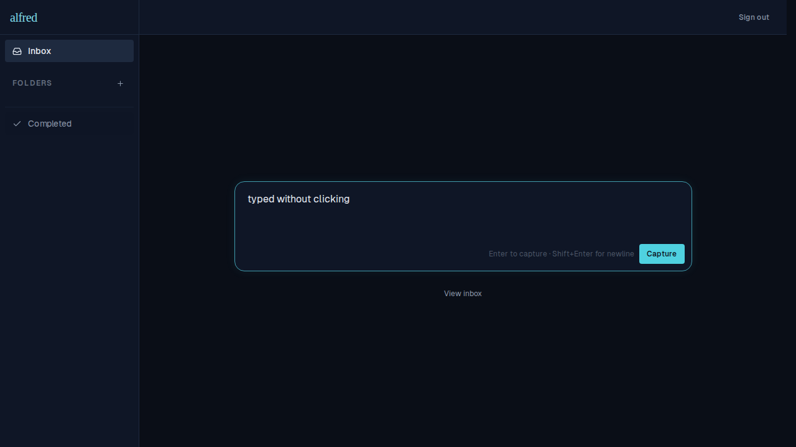

# Capture box auto-focuses on load and alfred link

*2026-06-13T04:19:05.340Z*

The capture box now auto-focuses when the app first loads, and re-focuses whenever the user taps the "alfred" wordmark link in the top-left to return to the landing screen. The teal focus ring (border + glow) is the visual indicator.

On app load: the capture box is immediately focused. Text typed below was entered without clicking — the teal ring confirms focus.

After clicking the alfred wordmark from the Completed view: text typed immediately without clicking — focus is restored to the capture box.

