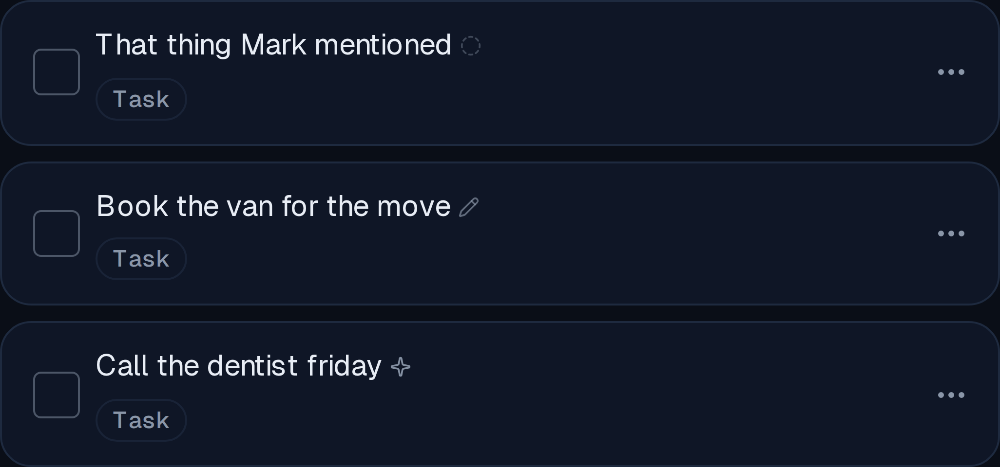
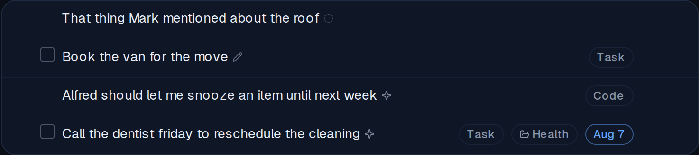
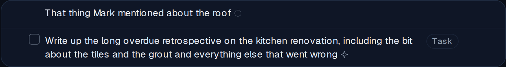
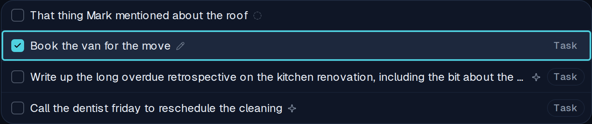
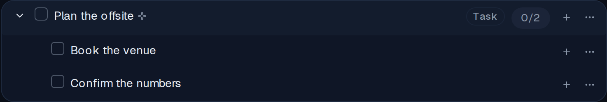
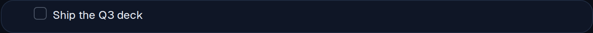
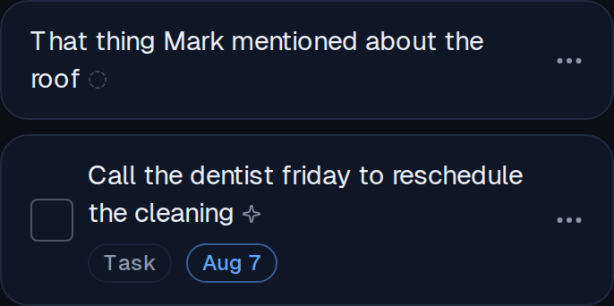
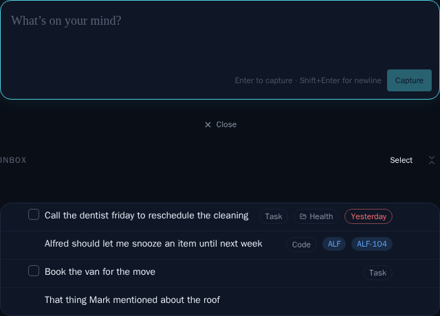
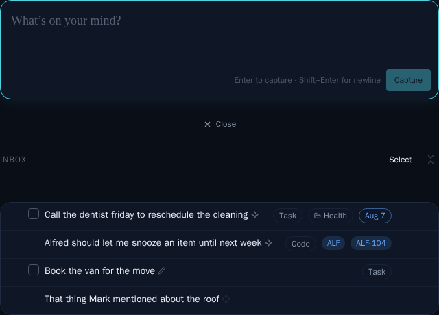

# Provenance marks on Inbox rows — AI-classified vs. human-claimed

*2026-08-09T20:45:03.636Z*

An Inbox row has always known who filled in its labels — the classifier, or you — and shown nothing. This adds one small monochrome glyph after the title text saying which, and nothing else: no accept, no reject, no confidence, no diff. It is derived per render from two columns the row already carries (`classified_at`, `classified_provider`); no store, selector, filter, count, query, API route or migration was touched.

Three states, and the shape is what names them — grey is the only register the row's palette hadn't already spent. A dashed circle means nothing has judged the row yet; a pencil means a human edit claimed it; a sparkle means the classifier wrote its verdict. Magnified 4× here, because at its real 11px it is meant to be noticed only when looked for.

At real size, mid-triage. Reading top to bottom: an unjudged capture, a row a human claimed, a code row and a task row the classifier judged. The mark sits with the title — the thing that was classified — rather than among the badges, which are its output.

**A wrapping title keeps its mark.** The glyph lives inside the title span, glued to the last word by a non-breaking space. Appended as a plain sibling it would be its own inline box with a break opportunity in front of it, so a title that fills its final line would drop the mark onto a line of its own. Here it stays with "wrong".

**Select mode keeps every mark, and stays inert.** Here the title is one clipped line, so the mark is its sibling rather than its content — inside, the ellipsis would eat it on exactly the long titles you are choosing between (see row 3, where it survives the clip). The whole row is a single `<button>`; the mark is always a plain ``, so it needs no non-interactive variant the way the row's chips do, and nesting it stays valid HTML.

**The gate: Inbox rows only.** "Plan the offsite" carries its mark; its two subtasks do not, even though the fixtures stamp them — the classifier's sweep only ever judges top-level rows, so marking a subtask would promise a judgement nothing intends to make.

The same holds once an item has been filed. This row is classifier-judged too, but in a folder view the triage question is settled, so it shows nothing. Neither does a completed row, a priority-view row, or any row outside the Inbox.

**The badge cluster is untouched, so a phone gains no line.** The mark is not metadata, so it never enters the row's `hasMeta` decision: a bare unjudged capture still renders no badge footer at 390px and the glyph simply rides the title's last line. (The row below it wraps because its title is long — as it does today — and carries a footer because it actually has badges.)

**The committed visual baselines moved, and were approved.** Every Inbox story fixture used to derive from a `classified_at: null` base, so the four Inbox snapshots would have sprouted an identical wall of "not yet classified" marks; they now carry a realistic provenance mix instead. Worth noting for review: an 11px glyph is well under the snapshot gate's 1% threshold, so these four baselines went **stale while still passing** — they were deleted and regenerated rather than left to drift, since `:update` skips a baseline that passes. The mid-triage crop as committed before this change:

…and after:

One behaviour is deliberately not screenshotted: editing a label on an unjudged row flips its mark to "Labelled by you" the moment the PATCH reconciles, with no reload. That claim is written by a Postgres trigger, and the E2E harness's in-memory Supabase mock deliberately does not reproduce trigger semantics — so it is pinned by a React Testing Library case that drives a real title edit and asserts the mark re-derives from the reconciled row, plus its mirror image (editing a classifier-marked row leaves the mark alone).
