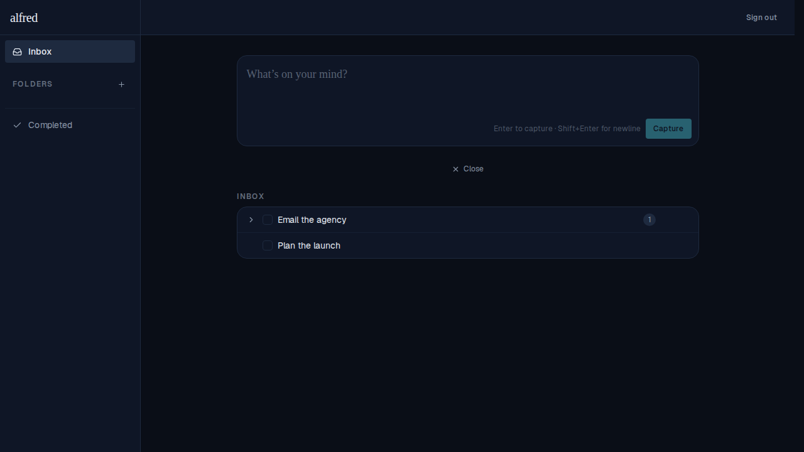
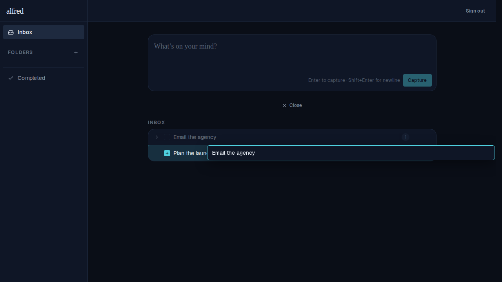
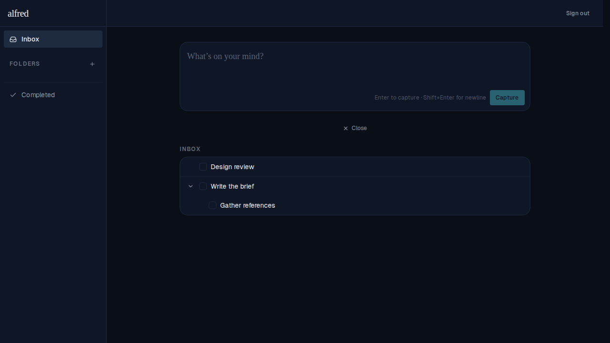
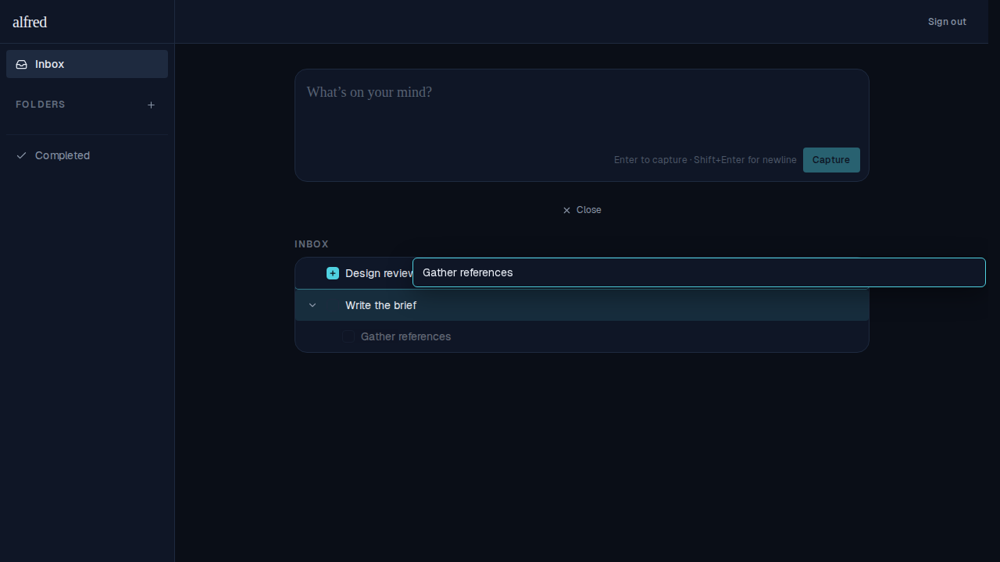

# Drag & drop tasks between parents

*2026-06-12T23:38:08.506Z*

Tasks can now be **re-parented by drag-and-drop**. Press anywhere on a task row that isn't a button and drag it onto another task: that target highlights teal and swaps its checkbox for a "+", and on drop the dragged task — together with its whole subtree — becomes a child of the target. The move is optimistic (it shows instantly, then reconciles) and has no enter/exit animation; the existing drag-overlay styling is unchanged.

## Re-parenting a top-level task (its subtree comes along)

Two independent inbox tasks. "Email the agency" already owns one subtask (the `1` badge).

Dragging "Email the agency" onto "Plan the launch": the target row lights up teal and its checkbox becomes a "+", while the dragged title floats under the cursor and the source row dims.

After the drop, expanding both rows shows the whole subtree moved intact: **Plan the launch → Email the agency → Call the vendor**.

## Re-parenting a subtask onto a different task

"Gather references" starts as a subtask of "Write the brief"; "Design review" is a separate top-level task.

Dragging the subtask "Gather references" onto "Design review" — same highlight + "+" affordance applies when the source is a subtask.

On drop it re-homes under "Design review", leaving "Write the brief" with no children.

## Interaction-model changes

- The left-edge **grip handle is gone**, along with the grab/closed-hand cursor logic — the default pointer cursor stays at all times. The **entire row** is now the drag surface; a press-drag on any non-button area (not the open-task chevron, the add-subtask `+`, or the kebab menu) initiates the drag, so those controls still click normally.
- The task title is **no longer highlightable** (`select-none`), so a press-drag on the text drags the row instead of selecting text.
- **Double-clicking** the title still opens the inline title editor, exactly as before.
