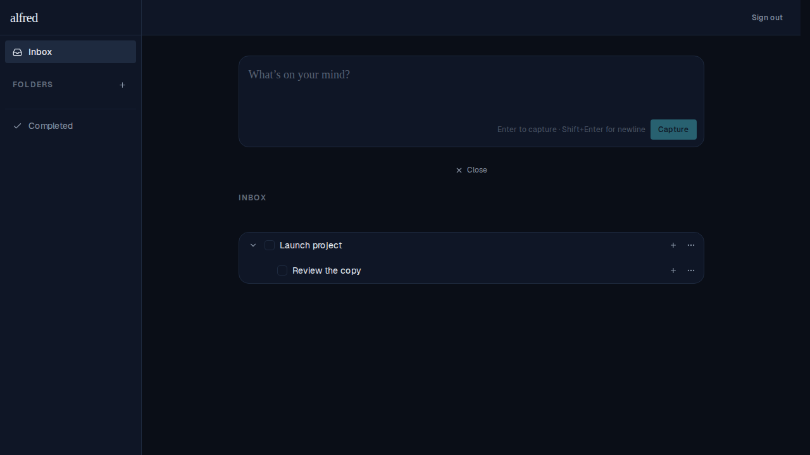
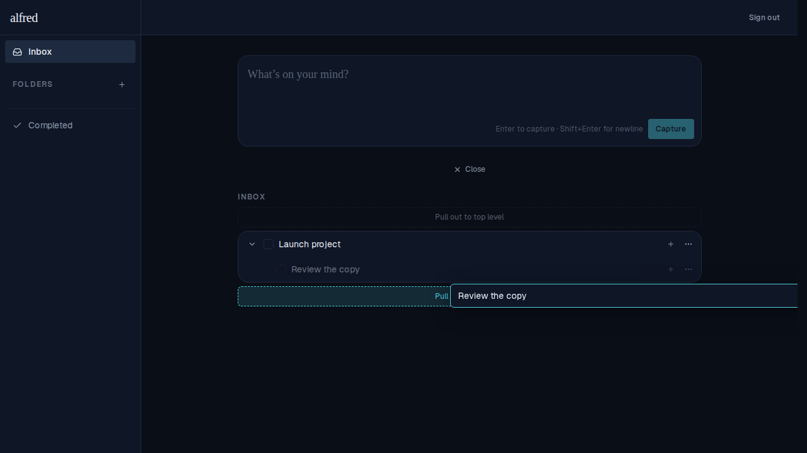
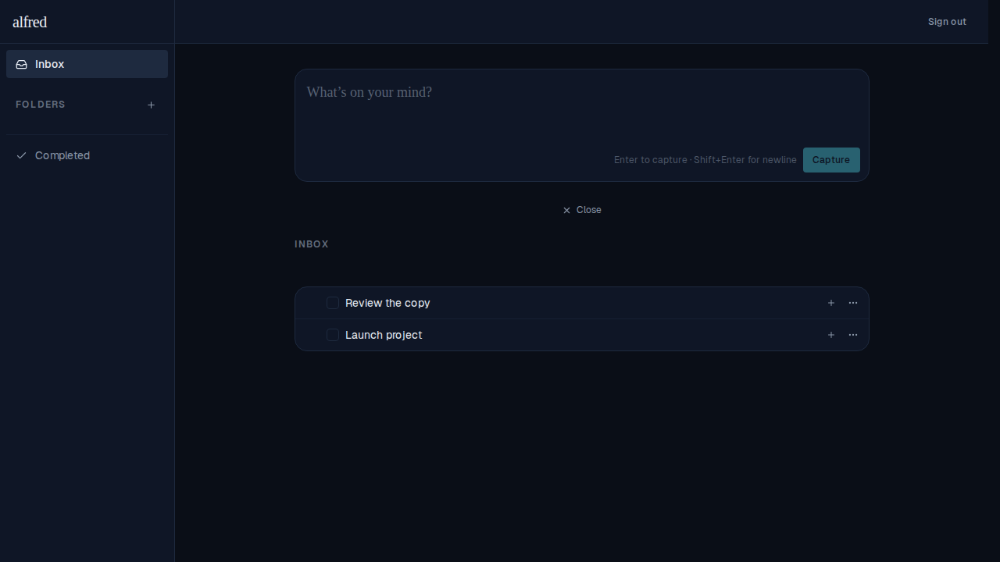

# Drag & drop tasks between parents

*2026-06-12T23:38:08.506Z*

Tasks can now be **re-parented by drag-and-drop**. Press anywhere on a task row that isn't a button and drag it onto another task: that target highlights teal and swaps its checkbox for a "+", and on drop the dragged task — together with its whole subtree — becomes a child of the target. The move is optimistic (it shows instantly, then reconciles) and has no enter/exit animation; the existing drag-overlay styling is unchanged.

## Re-parenting a top-level task (its subtree comes along)

Two independent inbox tasks. "Email the agency" already owns one subtask (the `1` badge).

Dragging "Email the agency" onto "Plan the launch": the target row lights up teal and its checkbox becomes a "+", while the dragged title floats under the cursor and the source row dims.

After the drop, expanding both rows shows the whole subtree moved intact: **Plan the launch → Email the agency → Call the vendor**.

## Re-parenting a subtask onto a different task

"Gather references" starts as a subtask of "Write the brief"; "Design review" is a separate top-level task.

Dragging the subtask "Gather references" onto "Design review" — same highlight + "+" affordance applies when the source is a subtask.

On drop it re-homes under "Design review", leaving "Write the brief" with no children.

## Interaction-model changes

- The left-edge **grip handle is gone**, along with the grab/closed-hand cursor logic — the default pointer cursor stays at all times. The **entire row** is now the drag surface; a press-drag on any non-button area (not the open-task chevron, the add-subtask `+`, or the kebab menu) initiates the drag, so those controls still click normally.
- The task title is **no longer highlightable** (`select-none`), so a press-drag on the text drags the row instead of selecting text.
- **Double-clicking** the title still opens the inline title editor, exactly as before.

## Bug fix: dropping a task on itself (or an invalid target) is a safe no-op

Previously, dropping a task back on itself — especially after hovering another task first — could silently re-parent it onto the wrong target via a *stale* drop target, making the task and its whole subtree vanish (and persisting a cycle to the server). The fix keeps every row a registered drop target (a disabled droppable is what produced the stale target), validates the drop in one place, and guards the optimistic `reparentTask` action against any cycle (onto itself or a descendant) at the source of truth. This is covered by store unit tests (`reparentTask` no-ops on self/descendant) and an end-to-end regression (drag onto self after hovering another → the task stays put with its subtree intact).

## Feature: pull a subtask out to the top level

Dragging a **subtask** past the top or bottom edge of the list reveals a "Pull out to top level" drop zone; dropping there clears its parent so it becomes its own top-level task (its current folder is kept). A top-level task has nothing to pull out, so the zone never appears while dragging one.

"Review the copy" starts as a subtask of "Launch project".

Dragging it past the bottom edge: the edge zone lights up teal to signal it will be pulled out (the reserved zone above the list also shows the affordance).

After the drop, "Review the copy" is its own top-level task, a sibling of "Launch project".

