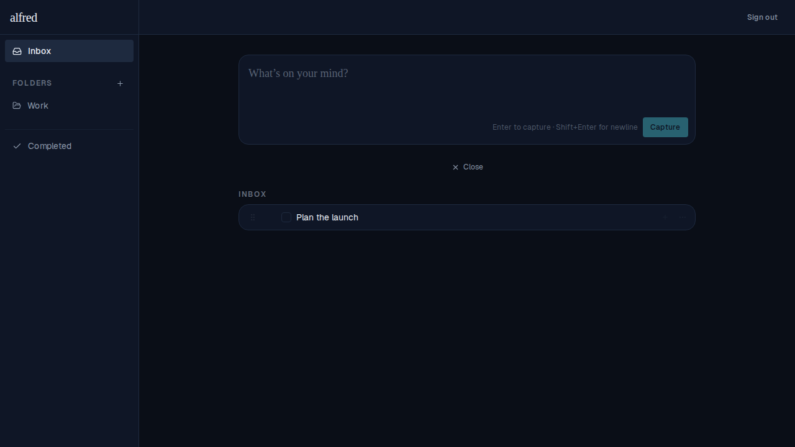
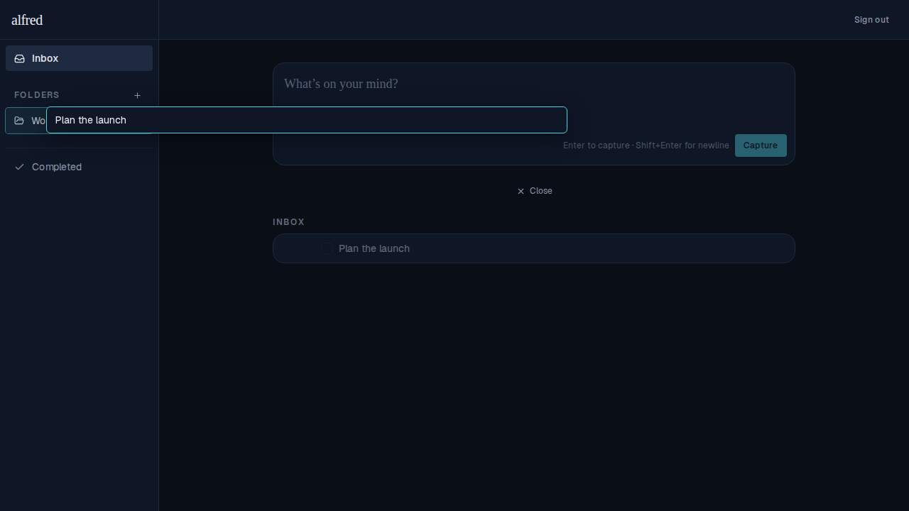
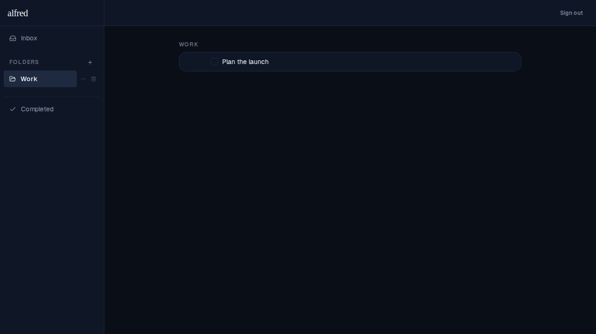

# Drag a task to a folder

*2026-06-12T19:28:32.417Z*

Top-level tasks can now be dragged onto a sidebar folder — or back onto the Inbox — to file them. It's a pointer shortcut for the existing "More actions → Move to…" menu, and reuses the same optimistic `moveTask` action, so the move shows instantly and reconciles with the server on its own.

Only top-level tasks are draggable: a subtask's folder follows its parent, so subtasks (and completed or not-yet-saved rows) carry no drag handle.

**1. Inbox** — hovering a task reveals its drag handle (the grip at the row's left edge).

**2. Mid-drag** — the task lifts into a floating overlay that follows the cursor; the source row dims and the folder under the cursor (Work) lights up as the drop target.

**3. Dropped** — the task is now filed under Work and has left the Inbox.

Keyboard and screen-reader users keep the existing accessible path (the "Move to…" submenu), and the handle also carries dnd-kit's built-in keyboard sensor and live-region announcements. Drop resolution is unit-tested in `lib/dnd/drag-to-folder.ts`; the full drag is exercised in a real browser by `e2e/drag-to-folder.spec.ts`.
