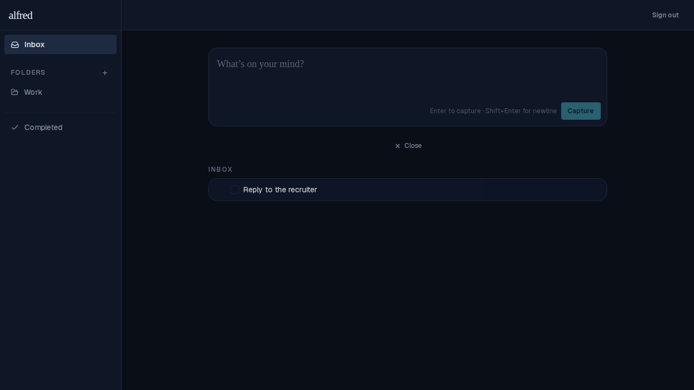
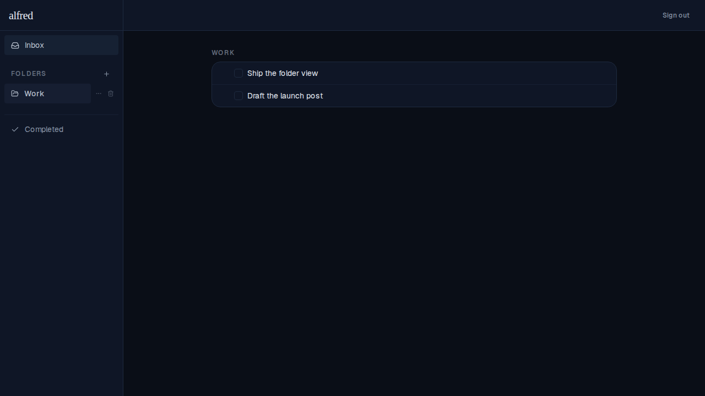

# Client-side view switching (no per-view server round-trip)

*2026-06-12T17:36:47.653Z*

Navigating between the inbox, a folder, and Completed used to take ~1s. All folders and items are already fetched once and held in client stores (see the data-flow skill), yet each view was its own Server Component route — so every switch via `<Link>` paid a full RSC server round-trip for data the client already had.

Now the three routes are thin shells that all render one client view router (`TaskViews`), and the nav links (`ViewLink`) switch the URL with the native History API — Next.js syncs `usePathname`/`useSearchParams` without an RSC fetch. Switching views is instant, and `/folders/[id]` and `/completed` still work for deep links and refresh.

The inbox at `/?view=inbox`, rendered from the seeded store:



Clicking the **Work** folder in the sidebar switches to `/folders/f1` client-side (the sidebar highlight follows). The folder's tasks render from the same store — no server round-trip:



The no-round-trip property is locked in by an e2e guard (`frontend/e2e/client-nav.spec.ts`): switching across all three views must record zero document loads and zero RSC (`_rsc`) fetches, and an in-memory marker must survive (proving the document never reloaded):

```bash
grep -n 'roundTrips\|resourceType\|survivedNav' frontend/e2e/client-nav.spec.ts
```

```output
16:  __survivedNav?: boolean;
39:    (globalThis as MarkerWindow).__survivedNav = true;
43:  const roundTrips: string[] = [];
45:    if (request.resourceType() === 'document' || request.url().includes('_rsc')) {
46:      roundTrips.push(request.url());
68:  expect(roundTrips).toEqual([]);
69:  expect(await page.evaluate(() => (globalThis as MarkerWindow).__survivedNav)).toBe(true);
```
