# A Dashboard lands the Code module: lines-changed velocity, the PR ratio, and both queues at a glance

*2026-09-12T03:23:28.365Z*

Entering the Code module used to open one queue with the other invisible, and the only measurement the app took — the merged-PR split — was wedged above the Backlog's re-ranking workspace. `/code` now opens a **Dashboard**: lines changed per week with a trailing-average trend, the PR-ratio bar in its new home, and a digest pane per queue. The Backlog hands over the module's hero name and keeps a plain one of its own.

## 1 · The landing view

`/code/dashboard` (and the bare `/code`) at desktop width, with both GitHub endpoints stubbed at the network boundary — no live query, here or in any test. Twelve weekly bars oldest-left, each labelled with its Sunday; the four-week trailing average running over them in the neutral foreground; the axis maximum rounded up to a nice 7,000 tick rather than the raw 6,140 peak; and the week still in progress drawn dimmed with the line stopping short of it. The legend names exactly those three marks. The PR-ratio bar sits below, behaviourally identical to the one that used to live on the Backlog, and the two digest panes sit side by side beneath.

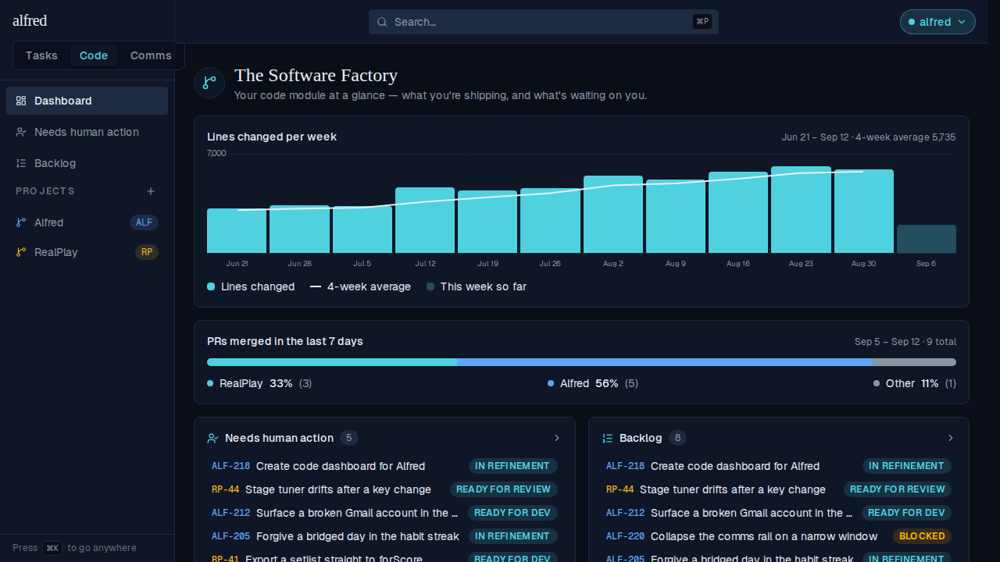

Each pane header carries its queue's FULL size — 5 and 8 — not the five rows drawn, so the pane says how much it is hiding. The two overlap on purpose: the Backlog's states are a superset of Needs human action's, so `ALF-218` and `RP-44` legitimately appear in both.

## 2 · Journey A — a pane header opens its page

Clicking anywhere on the **Needs human action** header above — glyph, title, count or chevron — navigates client-side to the full queue. The same five stories, now with their reorder controls and project pills.

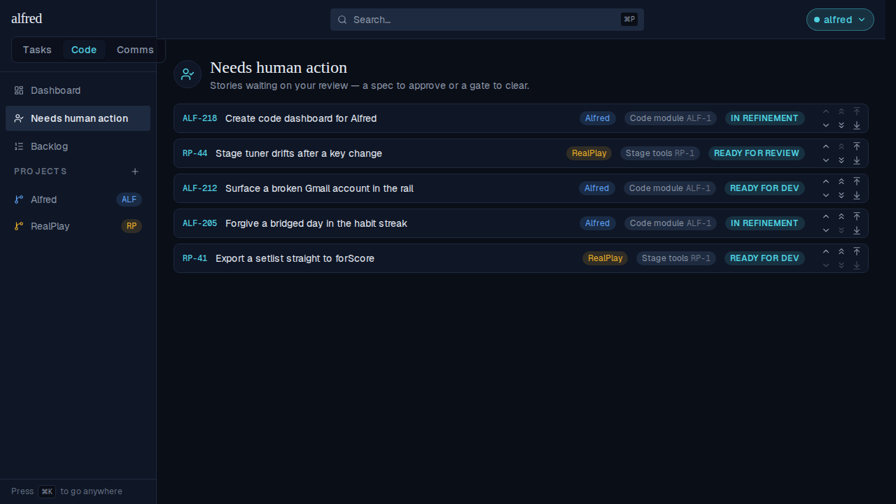

The sidebar highlight follows: **Dashboard** is highlighted on `/code` and `/code/dashboard`, each queue only on its own route. The order reads Dashboard → Needs human action → Backlog, above Projects.

## 3 · Journey B — a pane row opens that story's modal

Back on the Dashboard, clicking the `RP-44` row navigates to `/code/p2?story=RP-44` — its project board's deep-link seam — which opens the detail modal on arrival.

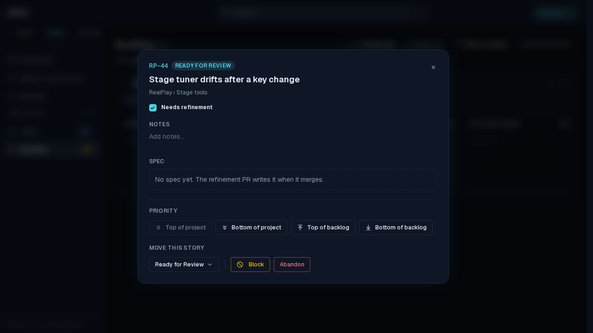

## 4 · The Backlog hands over the hero name — and the ratio card

`/code/backlog` is now titled **Backlog**, keeping its own description, with the same `GitBranch` glyph and the same filter row. The PR-ratio card that used to sit under this heading is gone — the story list starts directly beneath it. (This shot is taken with the ratio endpoint answering a real split, so a surviving copy of the card would show up rather than quietly rendering nothing.)

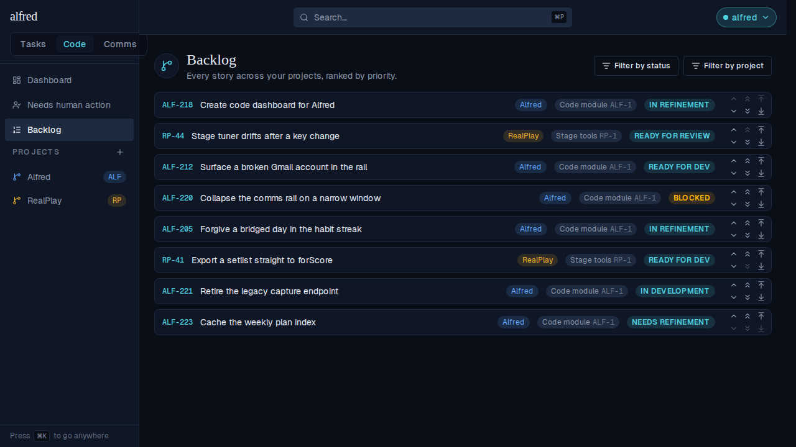

## 5 · Navigation — sidebar, ⌘K and the module switch

⌘K lists **Dashboard** ahead of Needs human action with its own icon, mirroring the sidebar order, and routes to `/code/dashboard`.

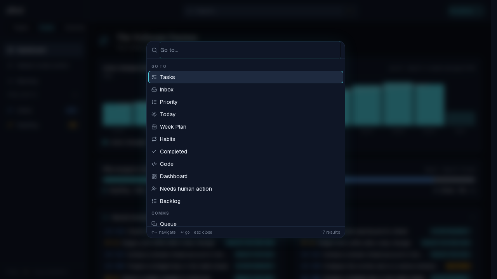

The sidebar's own change is a committed Storybook snapshot, so the gate emits a diff image when the baseline moves. Old on the left, new in the middle, the pixels that changed on the right — the Dashboard link joins the top of the rail and pushes the two queues down a slot:

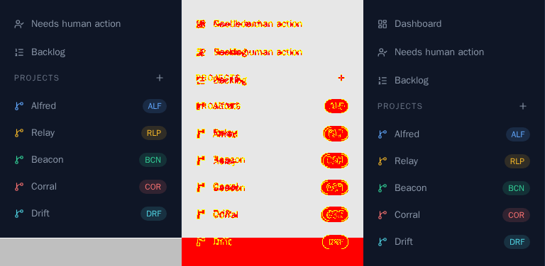

## 6 · The chart's other four states

GitHub computes contributor statistics asynchronously and answers a cold cache with a bodyless **202**. That is its own outcome, not an error: the card says so and invites a refresh, because an error note would be wrong about something that works in a minute and a chart of zeros would be a lie.

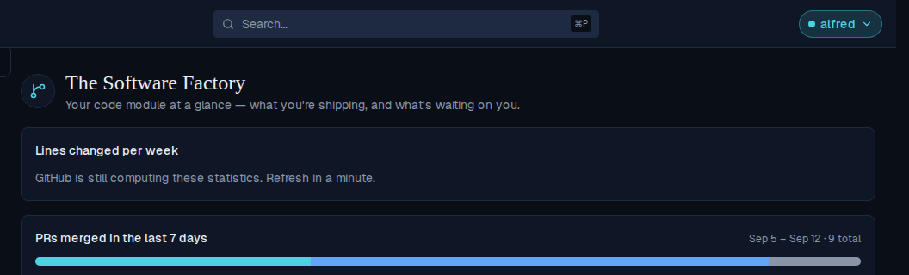

A **502** — GitHub unreachable or rate-limited — gets one muted line. Silence here would read as "you wrote no code for three months", which is why the two outcomes are kept apart. The ratio beside it is unaffected either way.

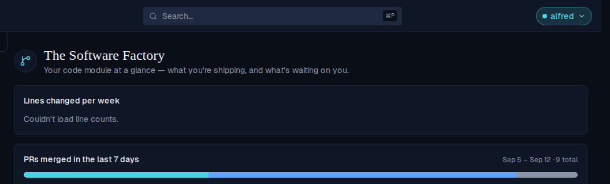

A **200 whose every week is zero** is a genuinely quiet quarter, not an error — and a flat plot reads as broken, so the card says it in words instead.

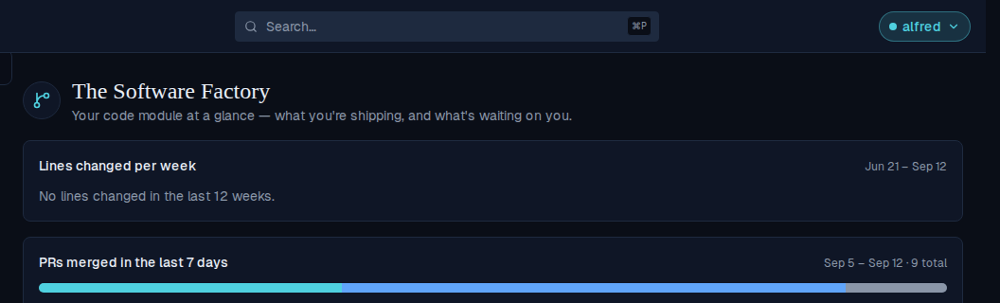

A **501** — a deployment that measures no repos — renders nothing at all. No card, and no gap either: the panes move straight up under the heading. (Both widgets answer 501 here, so neither is drawn.)

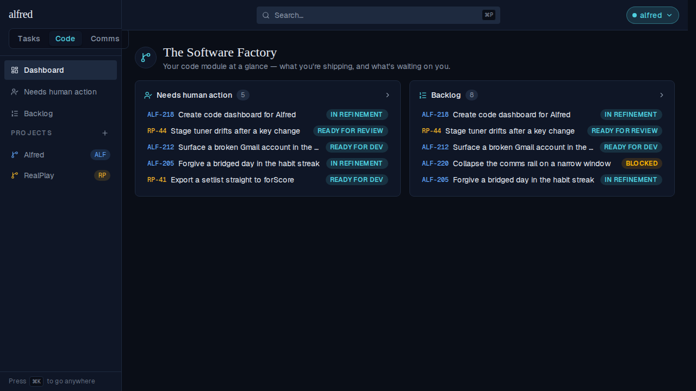

The fifth state is the in-flight one: the card reserves the plot's height so the cards beneath it don't jump when the series lands.

## 7 · At phone width

The panes stack to one column below `md`. The chart keeps all twelve bars at every width — none is dropped to make room — and hides alternate week labels below `sm`, letting the survivors overflow the blank columns beside them rather than truncating to a row of ellipses.

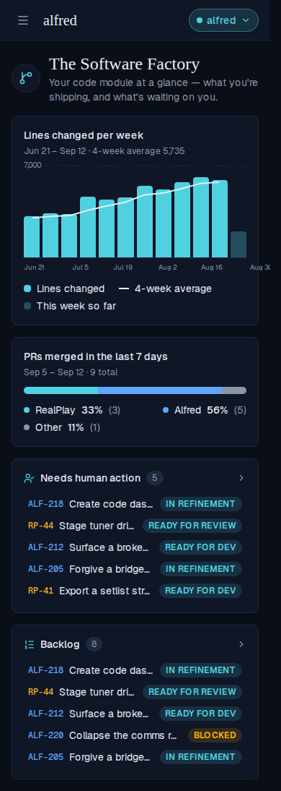

## 8 · The endpoint

`GET /api/code/loc-velocity` takes no query params — GitHub buckets these statistics on Sunday-UTC weeks and does so itself, so there is no timezone for the caller to name. It answers under a browser session **or** the ingest API key, and it is behind that auth because the fan-out carries the fine-grained PAT. Below, the app runs against the in-memory Supabase backend the E2E suite wires up: real route handler, real Supabase client, no live database — and no GitHub call, because every request here stops at the config gate.

```bash
cd frontend
export MOCK_SUPABASE_PORT=54338 INGEST_API_KEY=demo-ingest-key
export NEXT_PUBLIC_SUPABASE_URL=http://localhost:54338 \
       NEXT_PUBLIC_SUPABASE_ANON_KEY=sb_publishable_mock \
       SUPABASE_SERVICE_ROLE_KEY=sb_secret_mock
# This deployment measures no repos, so nothing below can reach GitHub.
unset GITHUB_TOKEN PR_RATIO_REPOS PR_RATIO_AUTHORS
npm run build >/dev/null 2>&1
node scripts/mock-supabase.mjs >/dev/null 2>&1 & MOCK=$!
npm run start -- -p 3018 >/dev/null 2>&1 & APP=$!
cleanup() { pkill -P "$APP" 2>/dev/null; kill "$APP" "$MOCK" 2>/dev/null; }
trap cleanup EXIT
until curl -sf localhost:54338/__mock__/health >/dev/null 2>&1; do sleep 0.2; done
until curl -s -o /dev/null localhost:3018/login 2>/dev/null; do sleep 0.5; done

API=localhost:3018/api/code
echo "--- no credentials: the PAT-bearing fan-out is behind auth"
curl -s -o /dev/null -w "%{http_code}\n" "$API/loc-velocity"
echo "--- ingest API key, no repos configured"
curl -s -w "\n%{http_code}\n" -H "x-api-key: demo-ingest-key" "$API/loc-velocity"
```

```output
--- no credentials: the PAT-bearing fan-out is behind auth
401
--- ingest API key, no repos configured
{"error":"Lines-changed velocity is not configured"}
501
```

The two widgets share one repo set and one author set — no new environment variable — but read it under different minimums: a split needs two repos to be a split, while one repo is a perfectly good velocity series. With exactly one repo configured, the ratio reports itself unconfigured and the chart does not. Neither request below reaches GitHub: the ratio stops at its own config gate, and the chart's is satisfied, so its 502 is a real fan-out that the unresolvable host refuses.

```bash
cd frontend
export MOCK_SUPABASE_PORT=54339 INGEST_API_KEY=demo-ingest-key
export NEXT_PUBLIC_SUPABASE_URL=http://localhost:54339 \
       NEXT_PUBLIC_SUPABASE_ANON_KEY=sb_publishable_mock \
       SUPABASE_SERVICE_ROLE_KEY=sb_secret_mock
# Exactly ONE repo, and a token that is never sent anywhere real.
export GITHUB_TOKEN=ghp_demo_not_a_real_token
export PR_RATIO_REPOS=ac3charland/alfred:Alfred
export PR_RATIO_AUTHORS=ac3charland
npm run build >/dev/null 2>&1
node scripts/mock-supabase.mjs >/dev/null 2>&1 & MOCK=$!
npm run start -- -p 3019 >/dev/null 2>&1 & APP=$!
cleanup() { pkill -P "$APP" 2>/dev/null; kill "$APP" "$MOCK" 2>/dev/null; }
trap cleanup EXIT
until curl -sf localhost:54339/__mock__/health >/dev/null 2>&1; do sleep 0.2; done
until curl -s -o /dev/null localhost:3019/login 2>/dev/null; do sleep 0.5; done

API=localhost:3019/api/code
KEY="x-api-key: demo-ingest-key"
echo "--- the ratio still needs two repos"
curl -s -w "\n%{http_code}\n" -H "$KEY" "$API/pr-ratio"
echo "--- the chart is configured by the one, and gets past the gate"
curl -s -w "\n%{http_code}\n" -H "$KEY" "$API/loc-velocity"
echo "--- and neither response carries the token"
curl -s -H "$KEY" "$API/loc-velocity" | grep -c ghp_demo_not_a_real_token
```

```output
--- the ratio still needs two repos
{"error":"PR ratio is not configured"}
501
--- the chart is configured by the one, and gets past the gate
{"error":"GitHub request failed"}
502
--- and neither response carries the token
0
```

## 9 · What the numbers mean

The metric is **churn** — additions plus deletions — summed over every commit authored by a configured login, across every configured repo. A week spent deleting a dead module or rewriting a component nets out near zero while being the busiest week of the month, so net growth honestly measures codebase size and misleadingly measures velocity. The authors are the same ones the PR-ratio bar counts, because two widgets in one card stack disagreeing about whose work counts would be worse than either being wrong.

Three things about GitHub's `stats/contributors` endpoint shape the reading, and each is pinned by a unit test rather than trusted: deletions come back as a **positive** count there (they are negative on the sibling `code_frequency` endpoint, and copying that sign convention would silently subtract deletions from churn); the server reads **fifteen** weeks and returns **twelve**, so the first drawn bar already has a true four-week mean instead of a spurious opening ramp; and the newest bucket is the week still in progress, drawn because it is real work but flagged partial with no average, so the trend line stops at the last complete week.

No charting library was added. The bars are a flex row of HTML divs sized by an inline height percentage, the way `RatioBar` sets its widths, with the axis labels as real text so they scale with the reader's font size. Only the trend line is SVG — one absolutely-positioned `viewBox="0 0 100 100"` overlay with `preserveAspectRatio="none"`, so its coordinates are plain percentages, and `vector-effect="non-scaling-stroke"` keeps the stroke uniform under that non-uniform scale (without it the line is visibly fat horizontally and thin vertically).

```bash
grep -Ec "recharts|chart\.js|d3|victory|visx|nivo|apexcharts" frontend/package.json || echo "0 charting dependencies added"
```

```output
0
0 charting dependencies added
```
