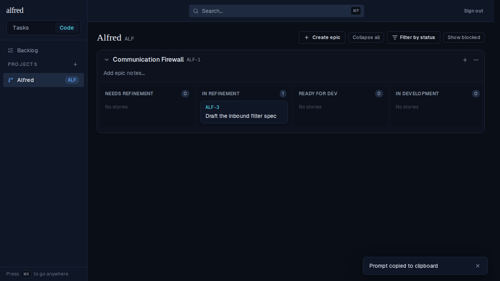

# Launch copies the prompt to the clipboard (mobile paste-fallback)

*2026-07-01T23:55:01.477Z*

The "Refine/Implement in Claude Code" launch buttons open claude.ai/code with the repo + prompt prefilled via the documented `repo`/`q` params. That prefill works on web and desktop, but the mobile Claude app opens the universal link with the composer EMPTY (it drops `q`). So on launch we now ALSO copy the prompt to the clipboard and confirm it with a toast, giving a phone user a one-tap paste even when the composer opens blank.

The toast ("Prompt copied to clipboard", bottom-right) fires from the same launch handler that advances the story — here ALF-3 has just moved from Needs Refinement into In Refinement. The copy is best-effort: if the Clipboard API is unavailable or the write is denied, the tab still opens and no toast is shown.
