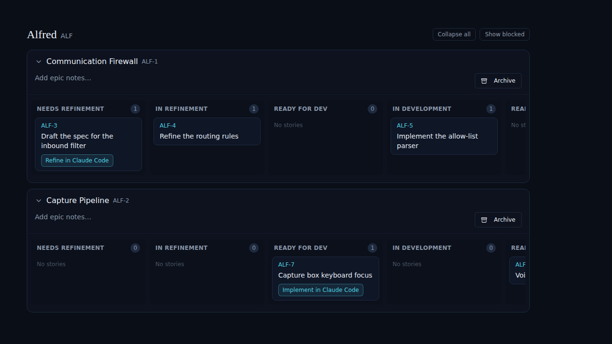
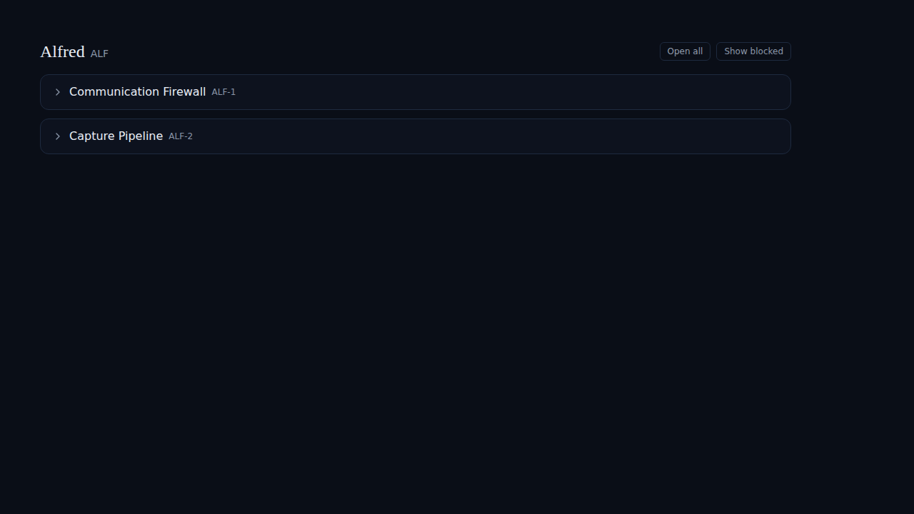

# Code module: Collapse all epics button

*2026-06-15T15:04:02.601Z*

Added a 'Collapse all' text button to the code module board header, next to the 'Show blocked' toggle. Clicking it collapses all currently-visible epics. When all epics are collapsed the button flips to 'Open all', which re-expands them all. The button is hidden when there are no visible epics.

Before: both epics expanded. The 'Collapse all' text button appears at the top right, next to 'Show blocked'.

After clicking 'Collapse all': both epics collapse to their header rows. The button flips to 'Open all'.

