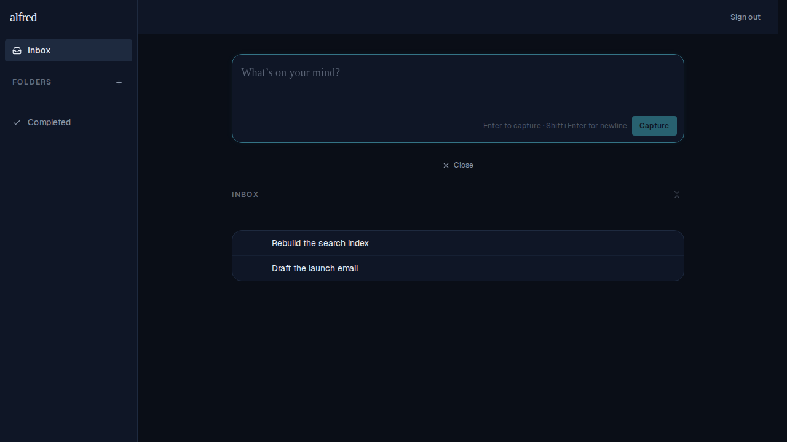
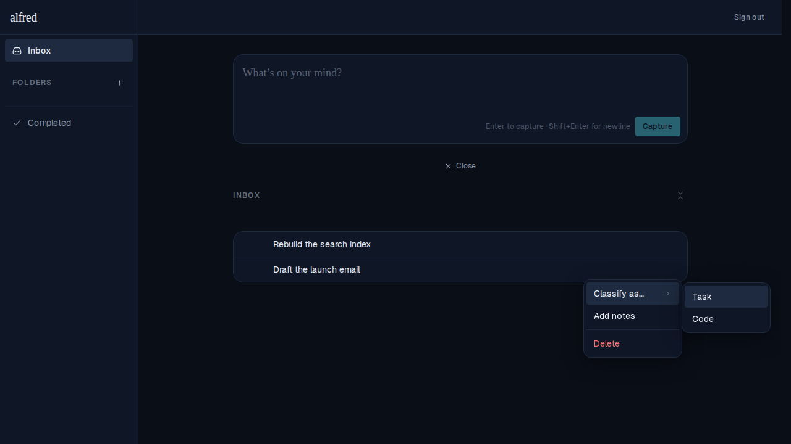
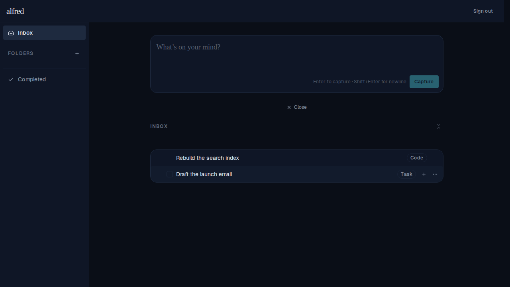

# M2 — Inbox classification, type badges & type-gating

*2026-06-15T06:30:49.878Z*

Milestone M2 of the Software Factory. Capture still creates `unclassified` items; the row's actions menu now offers a **Classify as…** submenu (Task / Code) that flips `item_type`. Classifying as **Task** unlocks the task-only affordances — completion checkbox, due date, subtasks — plus a Task badge; **Code** shows a Code badge but unlocks none of them. Notes stay generic on every type. Factory items (those with a `code_items` sidecar) also leave the Tasks/Inbox views via the new `task_items` read path.

### 1. Freshly captured items are unclassified — no badge, no checkbox

Two captured rows. Neither shows a type badge or a completion checkbox: an unclassified item exposes no task affordances until it is classified.



### 2. The Classify as… submenu (Task / Code)

The actions menu offers **Classify as…** only while the row is unclassified, with **Task** and **Code** (Knowledge is reserved, not built). Note the menu also has **Add notes** (generic) but **no Set due date** — that's task-only and stays gated out here.



### 3. Badges + type-gating after classifying

`Rebuild the search index` was classified as **Code**: it shows a Code badge but no checkbox and no add-subtask button. `Draft the launch email` was classified as **Task** (hovered): it shows a Task badge plus the full task affordances — completion checkbox, add-subtask (+), and the actions menu.



### 4. The task_items read-path swap (§4.5)

The tasks data layer now reads the `task_items` view instead of the raw `items` table. The view drops any item that has a `code_items` sidecar, so a story sent to the Software Factory disappears from Tasks/Inbox (a code-classified-but-not-yet-sent item still appears — membership is decided by the sidecar, not the type). This has no visual surface, so the evidence is the data-layer source:

```bash
grep -n "from('task_items')\|overrideTypes" frontend/lib/data/items.ts
```

```output
30:    .from('task_items')
37:    .overrideTypes<Item[]>();
```
