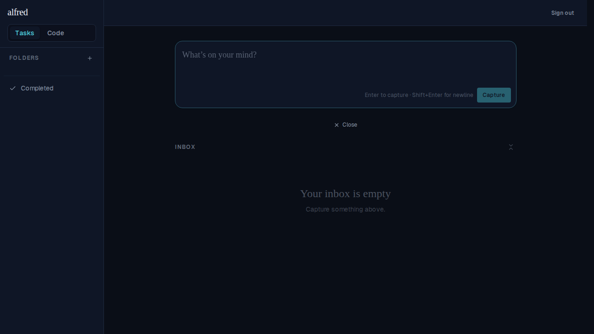
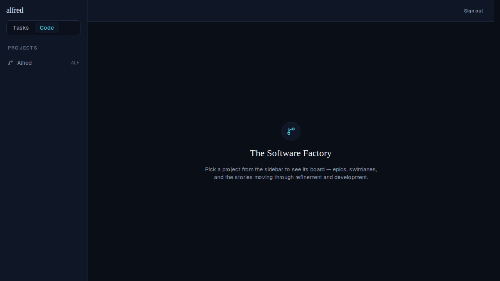
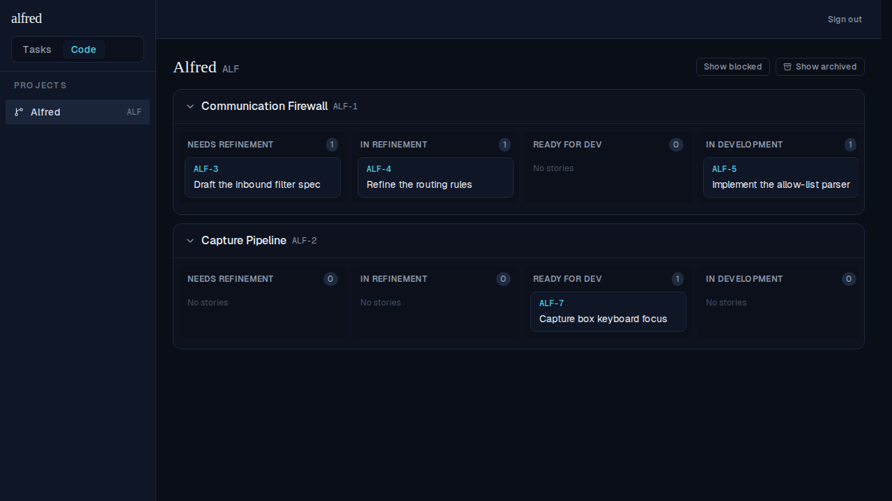
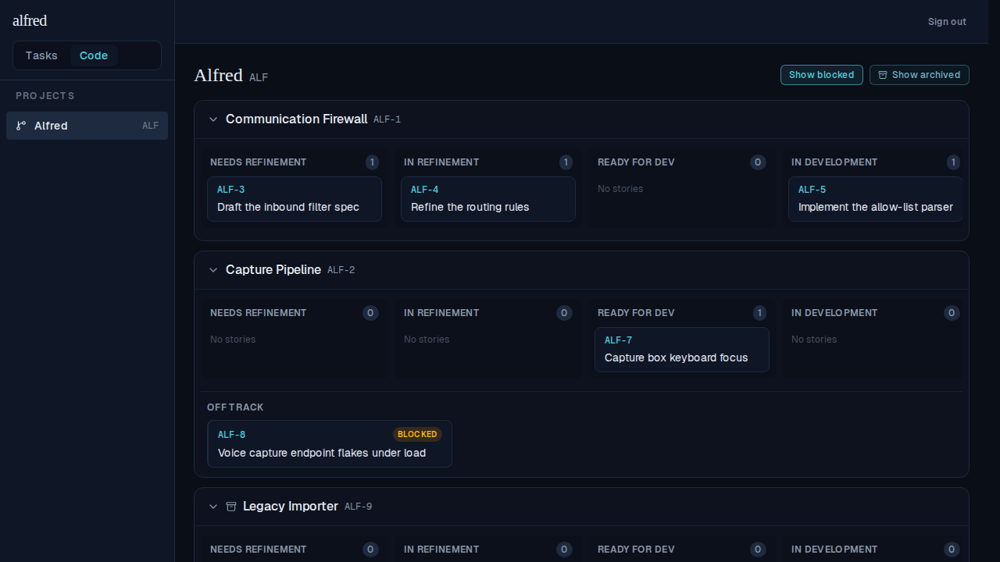

# M3 — Tasks⇄Code switcher & the Code board skeleton

*2026-06-15T07:09:43.760Z*

Milestone M3 of the Software Factory: a shared app shell with a Claude-desktop-style **Tasks | Code** switcher, the Inbox nav button removed (§6.2), the new `(code)` route group with a `CodeProvider`, a `ProjectNav`, and a read-only board (collapsible epics → 6 happy-path swimlanes → story cards). All screenshots are the live authenticated app driven through the Playwright in-memory Supabase mock.

### The new `(code)` route group + shared shell

```bash
find 'frontend/app/(code)' frontend/components/code frontend/components/shell -type f | sort
```

```output
frontend/app/(code)/code/[project-id]/page.tsx
frontend/app/(code)/code/page.tsx
frontend/app/(code)/layout.tsx
frontend/app/(code)/mobile-nav.tsx
frontend/components/code/board.stories.tsx
frontend/components/code/board.test.tsx
frontend/components/code/board.tsx
frontend/components/code/code-landing.tsx
frontend/components/code/code-view.tsx
frontend/components/code/project-nav.test.tsx
frontend/components/code/project-nav.tsx
frontend/components/code/story-card.stories.tsx
frontend/components/code/story-card.test.tsx
frontend/components/code/story-card.tsx
frontend/components/code/swimlane.stories.tsx
frontend/components/code/swimlane.test.tsx
frontend/components/code/swimlane.tsx
frontend/components/shell/app-shell.tsx
frontend/components/shell/view-switcher.test.tsx
frontend/components/shell/view-switcher.tsx
```

Both module layouts now render through `components/shell/app-shell.tsx` (wordmark + switcher + sign-out). The board reads from `lib/stores/code-store.tsx` (`useProjects` / `useProjectBoard`), seeded by `lib/data/code.ts`.

### 1. The Tasks ⇄ Code switcher (§6) — Tasks active, no Inbox button (§6.2)



The segmented switcher sits under the `alfred` wordmark; the wordmark still reaches capture and `?view=inbox` still opens the inbox list, so removing the standalone Inbox link loses no path. The sidebar now shows only Folders + Completed.

### 2. Clicking **Code** switches modules to the `(code)` landing



Code is now active; the left nav is `ProjectNav` (the seeded `Alfred / ALF` project). The landing guides the user to pick a project.

### 3. The board (§9.2): collapsible epics → 6 swimlanes → story cards



Selecting the project routes to `/code/[project-id]`. Each epic (Communication Firewall ALF-1, Capture Pipeline ALF-2) is a collapsible row of the six happy-path swimlanes with live counts; stories are cards (ref + title) grouped into the lane matching their `factory_state` (ALF-3 → Needs Refinement, ALF-5 → In Development, ALF-7 → Ready for Dev). Lanes scroll horizontally to fit the dense layout.

### 4. Show blocked + Show archived toggles



blocked/abandoned stories never get a column — toggling **Show blocked** reveals them per-epic as an *Off track* card with a distinct amber/red treatment (ALF-8). Archived epics are hidden by default — toggling **Show archived** reveals the archived *Legacy Importer* (ALF-9) epic. Both are client-side read filters; swimlanes are read-only this milestone.
