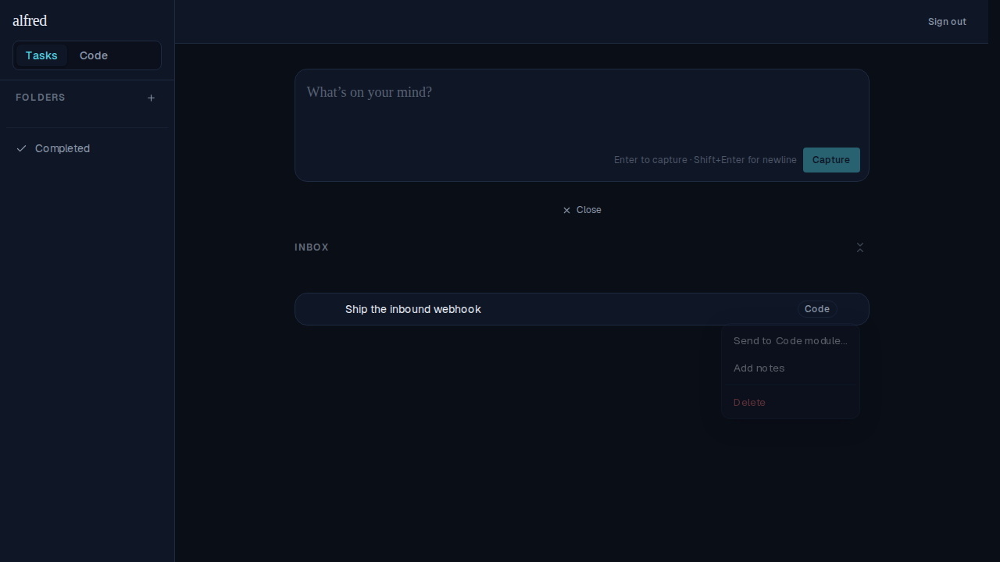
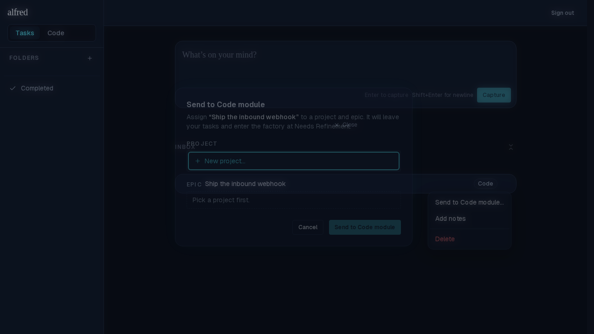
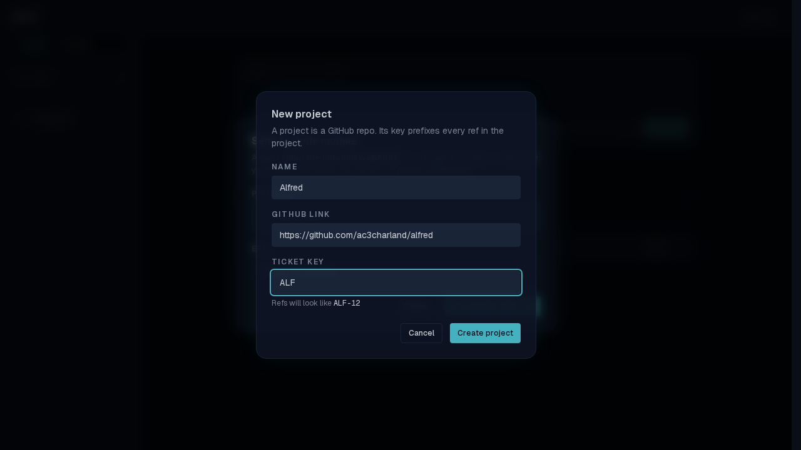
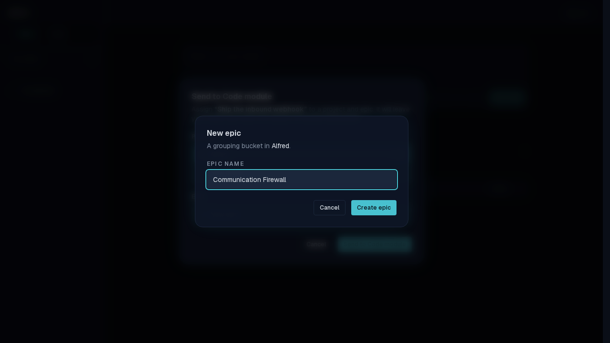
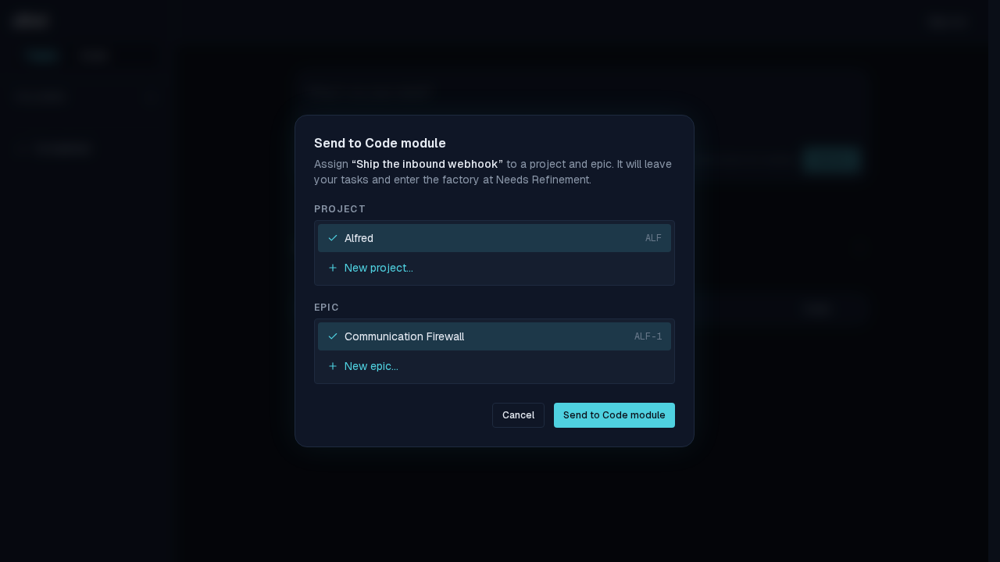
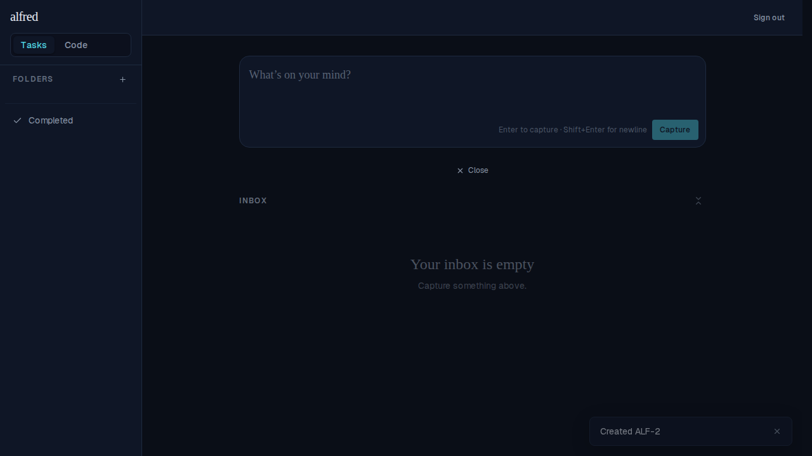
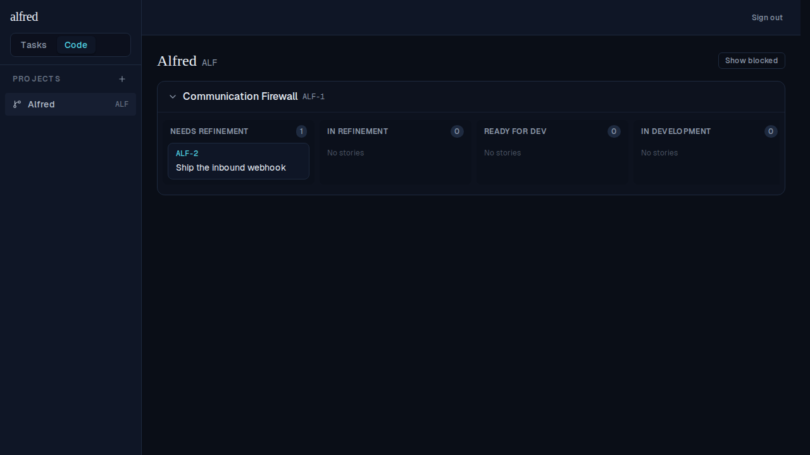

# M4 — The gate: Send to Code module / Convert to Code Story

*2026-06-15T08:06:24.139Z*

M4 wires up **the gate** — the Project+Epic assignment that admits an inbox item into the Software Factory (§8). It is reachable from the Tasks/Inbox view, so the dialog is deliberately CodeProvider-free: it fetches projects on open and calls `lib/api-client` directly. On confirm it runs the `enter_code_module` RPC, the item leaves `task_items`, a toast announces the new ref, and the story appears on the Code board.

Below is the full happy path: classify an item as Code → Send to Code module → create a brand-new project (with a live ref-key preview) and epic → confirm → the item leaves the inbox and lands on the board. All screenshots are the real authenticated app driven by Playwright against the in-memory Supabase mock.

**1. The code item's actions menu.** Once an item is classified as Code (the M2 `Classify as…` submenu), its menu gains **Send to Code module…** — the gate entry point.

**2. The gate dialog.** Project and Epic selectors, both blank until chosen; the Epic selector says "Pick a project first" and the **Send to Code module** confirm button is disabled until BOTH are set.

**3. + New project…** — a nested dialog: Name, GitHub link (parsed into `repo_owner`/`repo_name` on submit), and a 3-char uppercase **Ticket key** validated against the §4.2 regex and existing keys, with a live "Refs will look like `ALF-12`" preview.

**4. + New epic…** — a nested dialog with just an epic name; on submit it calls the `create_epic` RPC (which allocates the shared per-project ref) and auto-selects the new epic.

**5. Both selected → confirm enabled.** With the new project and epic chosen, the gate is ready to confirm.

**6. After confirm, the item has left the inbox.** `enter_code_module` created the `code_items` sidecar, so the item dropped out of the `task_items` view and the tasks store removed it. A toast "Created ALF-2" is shown the instant confirm resolves (it auto-dismisses after 4s, so it isn't in this still — it's asserted in both the RTL and Playwright suites). Note the ref is **ALF-2**: epics and stories share one per-project counter, so the new epic took ALF-1.

**7. The story on the Code board.** Switching to Code and opening the new **Alfred** project shows the story as a card — **ALF-2 · Ship the inbound webhook** — in the **Needs Refinement** swimlane under its **Communication Firewall** epic. (The same RPC also powers **Convert to Code Story…** on a task; that path is covered in `e2e/code-gate.spec.ts`.)

