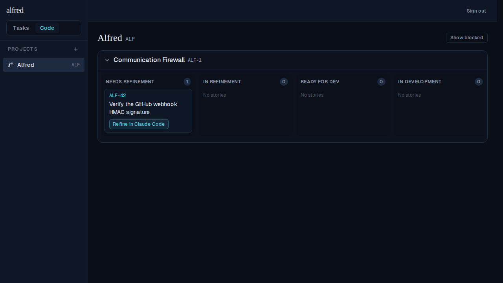
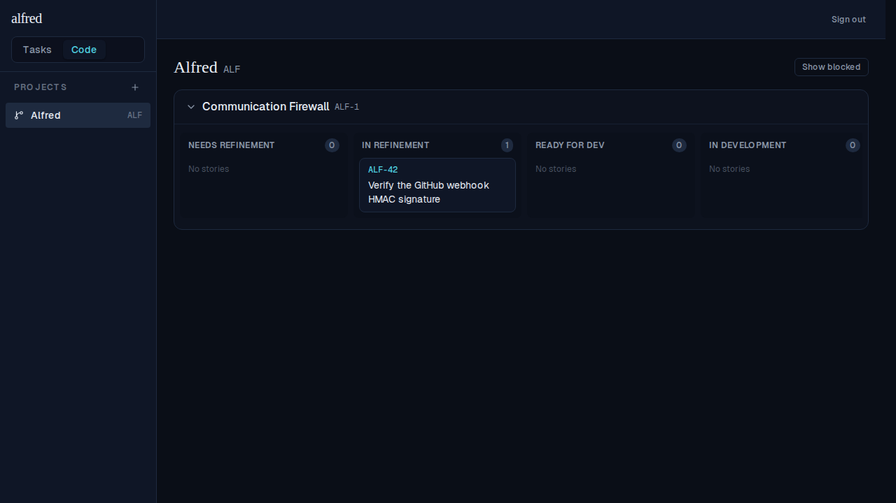

# M5 — Claude Code links & the human launch

*2026-06-15T08:40:55.618Z*

M5 puts a **phase-appropriate "Open Claude Code" button** on each story card (§11) and wires the §11.3 *await-write-then-open* launch. A `needs_refinement` story shows **Refine in Claude Code**; a `ready_for_dev` story shows **Implement in Claude Code**; every other state shows no button. Clicking it transitions the story (the card moves swimlane) and *then* opens a prefilled `claude.ai/code` tab — the tab is never opened on a failed write, eliminating the "looks launched but didn't persist" edge.

## The phase-appropriate button on the card (Storybook)

A `needs_refinement` story — the card offers **Refine in Claude Code** (the ref + title lead the prompt so the new tab is scannable):


Once the refinement PR has merged the story is `ready_for_dev` — the button switches to **Implement in Claude Code**:


While a session is running (`in_refinement` / `in_development` / `ready_for_review` / `done` / blocked / abandoned) **no launch button applies** — the card is just ref + title:


## The click → state-transition → open (live board)

On the board, ALF-42 sits in **Needs Refinement** with the Refine button:



Clicking it **awaits the state write first**: the card moves to **In Refinement** (Needs Refinement drops to 0) and the launch button disappears — and only after that durable write does `window.open` fire the prefilled tab (stubbed here so the test never navigates to claude.ai):



## The exact built URL (the real `buildRefinementUrl` / `buildImplementationUrl`)

These `exec` blocks call the **actual** pure builders in `frontend/lib/code/links.ts` (run via Node's TS strip-types) so reviewers see the genuine `https://claude.ai/code?...` href and its decoded prompt — not a hand-copied sample. The URL carries `repo=<owner>/<name>` + a URL-encoded `prompt`; the prompt leads with the ref+title, references the spec file (never inlines it, §11.1), and embeds the ```alfred``` PR frontmatter block (§12).

```bash
cd frontend && node --experimental-strip-types --input-type=module -e "
import { buildRefinementUrl } from './lib/code/links.ts';
const project = { repo_owner: 'ac3charland', repo_name: 'alfred', name: 'Alfred', key: 'ALF', id: 'p1', github_url: null, ref_seq: 5, created_at: 'x' };
const story = { ref: 'ALF-42', title: 'Verify the GitHub webhook HMAC signature', notes: 'Use HMAC-SHA256; compare constant-time.', spec_path: 'specs/ALF-42.md', factory_state: 'needs_refinement' };
const url = buildRefinementUrl(project, story);
console.log('URL:', url);
console.log();
console.log('DECODED PROMPT:');
console.log(new URL(url).searchParams.get('prompt'));
" 2>/dev/null
```

````output
URL: https://claude.ai/code?repo=ac3charland%2Falfred&prompt=ALF-42%3A+Verify+the+GitHub+webhook+HMAC+signature%0A%0AYou+are+refining+the+alfred+ticket+ALF-42.+Write+a+SPEC+ONLY+for+this+story+%E2%80%94+do+NOT+implement+anything+yet.%0A%0AFollow+the+project%27s+refinement+guide+at+%60.alfred%2Frefinement.md%60+%28a+proposed+convention+%E2%80%94+this+path+is+not+yet+finalized%3B+if+it+is+absent%2C+write+an+OpenSpec-style+spec%29.+Save+the+spec+to+%60specs%2FALF-42.md%60.%0A%0AThen+open+a+pull+request+whose+description+carries+this+machine-readable+block+exactly+%28alfred+reads+it+to+advance+the+ticket%29%3A%0A%0A%60%60%60alfred%0Aalfred-ticket%3A+ALF-42%0Aphase%3A+refinement%0Aspec-path%3A+specs%2FALF-42.md%0A%60%60%60%0A%0A%0AContext+%28from+the+ticket%29%3A%0AUse+HMAC-SHA256%3B+compare+constant-time.

DECODED PROMPT:
ALF-42: Verify the GitHub webhook HMAC signature

You are refining the alfred ticket ALF-42. Write a SPEC ONLY for this story — do NOT implement anything yet.

Follow the project's refinement guide at `.alfred/refinement.md` (a proposed convention — this path is not yet finalized; if it is absent, write an OpenSpec-style spec). Save the spec to `specs/ALF-42.md`.

Then open a pull request whose description carries this machine-readable block exactly (alfred reads it to advance the ticket):

```alfred
alfred-ticket: ALF-42
phase: refinement
spec-path: specs/ALF-42.md
```


Context (from the ticket):
Use HMAC-SHA256; compare constant-time.
````

```bash
cd frontend && node --experimental-strip-types --input-type=module -e "
import { buildImplementationUrl } from './lib/code/links.ts';
const project = { repo_owner: 'ac3charland', repo_name: 'alfred', name: 'Alfred', key: 'ALF', id: 'p1', github_url: null, ref_seq: 5, created_at: 'x' };
const story = { ref: 'ALF-42', title: 'Verify the GitHub webhook HMAC signature', notes: null, spec_path: 'specs/ALF-42.md', factory_state: 'ready_for_dev' };
const url = buildImplementationUrl(project, story);
console.log('URL:', url);
console.log();
console.log('DECODED PROMPT:');
console.log(new URL(url).searchParams.get('prompt'));
" 2>/dev/null
```

````output
URL: https://claude.ai/code?repo=ac3charland%2Falfred&prompt=ALF-42%3A+Verify+the+GitHub+webhook+HMAC+signature%0A%0AYou+are+implementing+the+alfred+ticket+ALF-42.+Implement+the+merged+spec+committed+at+%60specs%2FALF-42.md%60+in+this+repo+%E2%80%94+read+it+first%2C+then+build+it.%0A%0AWhen+done%2C+open+a+pull+request+whose+description+carries+this+machine-readable+block+exactly+%28alfred+reads+it+to+advance+the+ticket%29%3A%0A%0A%60%60%60alfred%0Aalfred-ticket%3A+ALF-42%0Aphase%3A+implementation%0Aspec-path%3A+specs%2FALF-42.md%0A%60%60%60%0A

DECODED PROMPT:
ALF-42: Verify the GitHub webhook HMAC signature

You are implementing the alfred ticket ALF-42. Implement the merged spec committed at `specs/ALF-42.md` in this repo — read it first, then build it.

When done, open a pull request whose description carries this machine-readable block exactly (alfred reads it to advance the ticket):

```alfred
alfred-ticket: ALF-42
phase: implementation
spec-path: specs/ALF-42.md
```
````

## URL-contract verification (§11.1 — flagged, not blocking)

Verified against the current Claude Code on the web docs (`https://code.claude.com/docs/en/web-quickstart`, *Pre-fill sessions*):

- **Base + params:** `https://claude.ai/code` with `prompt=<urlencoded>` (alias `q`) and `repositories=<owner>/<repo>` (documented alias **`repo`**, which alfred uses; a single `owner/name` is accepted). An `environment=` param can preselect an environment. **Matches the §11.1 contract.**
- **Prefill-only, no auto-run:** the docs are explicit — the params populate the composer and the user presses Enter; **no auto-execution** (keeps the launch ToS-clean, §1).
- **Branch param:** **none documented** — the session UI has a branch selector, but no `branch=`/`ref=`/`base=` URL param. alfred emits none.
- **Length cap:** the **web** docs state **no** limit (only "URL-encode each value"); the desktop CLI reportedly truncates `q` ~14k chars, but that is **not** documented for the web. Per §11.1 we built defensively anyway: the prompt **references the committed spec file and never inlines the spec**, and inlined notes are capped at 1000 chars — the URLs above are well under 14k.

**No discrepancy with §11.1; nothing blocks the milestone.**
