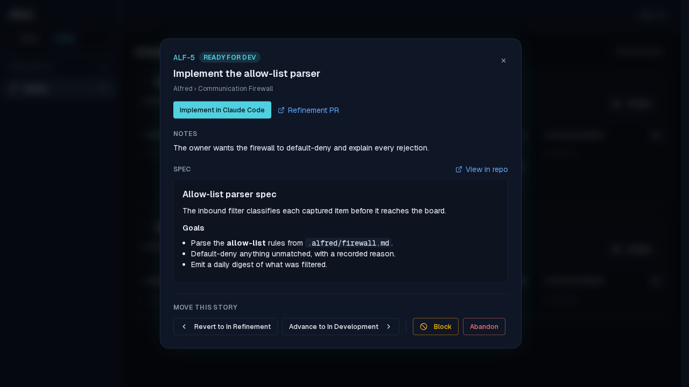
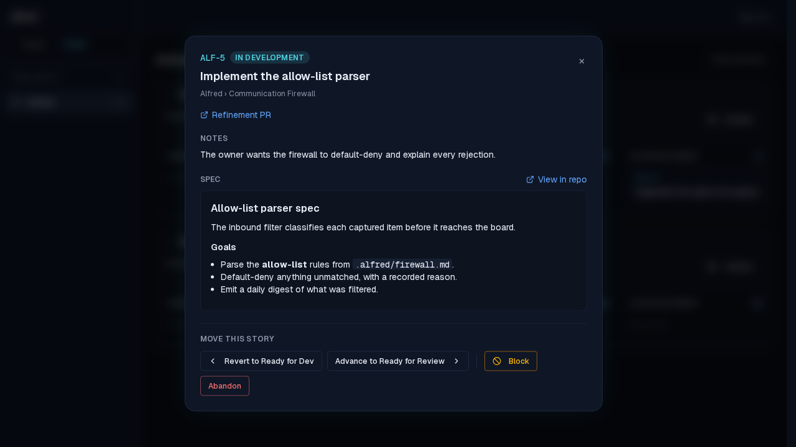
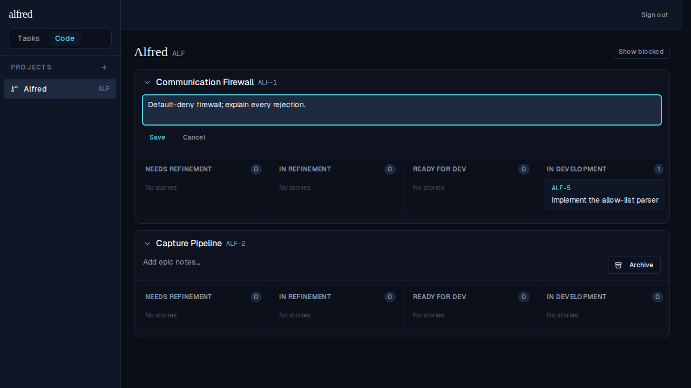
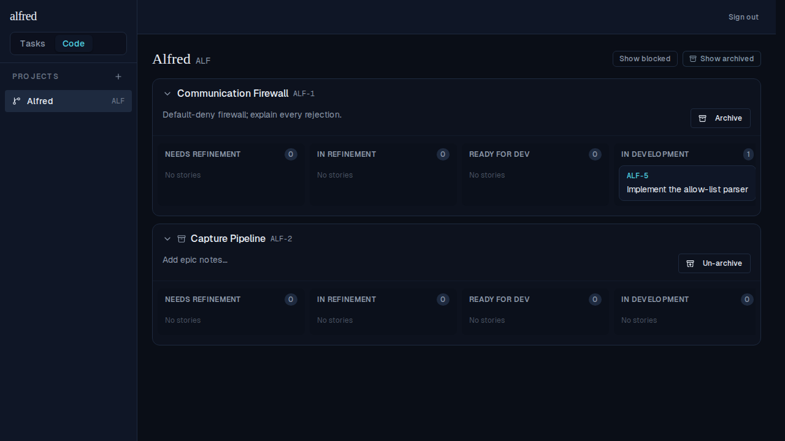

# M6 — Story detail modal (the final milestone)

*2026-06-15T09:15:06.619Z*

Clicking a board card opens the Jira-style detail modal (§10): the ref + an inline-editable title, the Project › Epic breadcrumb, the factory-state chip, the story notes, the rendered spec markdown with a View-in-repo link, the PR links, the phase-appropriate "Open Claude Code" launch button (§11), and the §5.2 manual fallback controls (Advance/Revert/Block/Abandon). The epic header gains notes-editing + archive/un-archive (§9.2). All screenshots are the real authenticated app driven against the in-memory Supabase mock.

## Opening the modal — the full Jira-style detail view (§10)

Clicking the ALF-5 card opens the modal. The header shows the ref + the factory-state chip and an inline-editable title (double-click or the pencil to edit — it PATCHes the items row via updateItem and reflects through the store's patchStory). Below it: the Project › Epic breadcrumb, the phase-appropriate "Implement in Claude Code" launch button (this story is ready_for_dev), the Refinement PR link, the story notes, the rendered spec markdown (react-markdown + remark-gfm — heading, sub-heading, bullet list, bold, inline code all render), and a "View in repo" link built from repo_owner/repo_name + spec_sha + spec_path.



## A manual transition — Advance one step (§5.2)

The manual fallback controls move a story without a PR. Clicking "Advance to In Development" calls updateCodeState(ref, 'in_development') optimistically; the chip and the controls update immediately to reflect the new state (now "Revert to Ready for Dev" / "Advance to Ready for Review").



Closing the modal reveals the board with ALF-5 now in the In Development swimlane — the optimistic move persisted.

## Epic notes + archive from the header (§9.2)

The epic header edits notes inline and archives / un-archives. Editing "Communication Firewall"'s notes opens a textarea (Save / Cancel); both go through the store's optimistic updateEpic, backed by PATCH /api/epics/[id].



Archiving the "Capture Pipeline" epic (its header Archive button sets archived_at) drops it off the active board; the "Show archived" toggle reveals it again with an archive icon + an "Un-archive" button. The saved firewall notes and ALF-5's new In Development position both persist.



## Under the hood

The modal mounts inside the board (under CodeProvider) and tracks the open story by item_id, so it always re-reads the live row from the store. The spec renderer adds two deps to the frontend workspace:

```bash
node -e "const p=require('./frontend/package.json'); console.log('react-markdown', p.dependencies['react-markdown']); console.log('remark-gfm', p.dependencies['remark-gfm']);"
```

```output
react-markdown ^10.1.0
remark-gfm ^4.0.1
```
