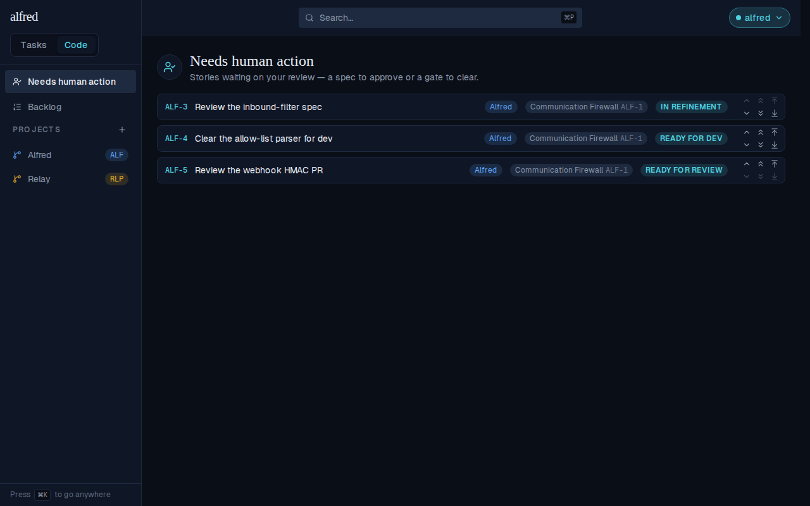
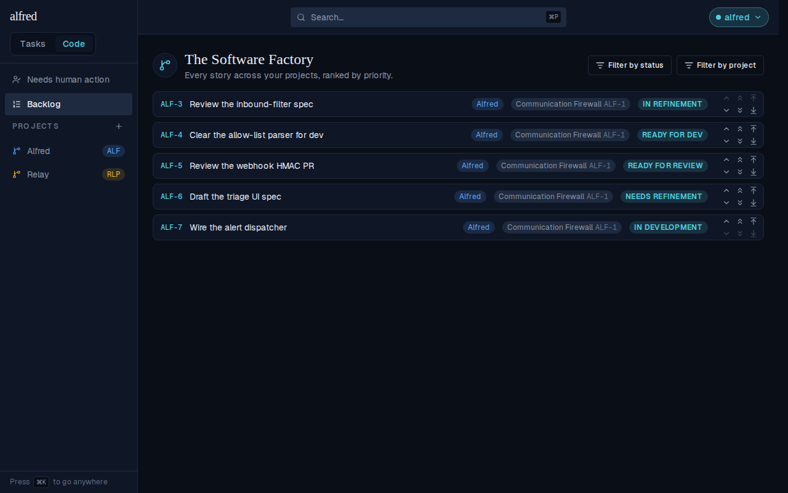
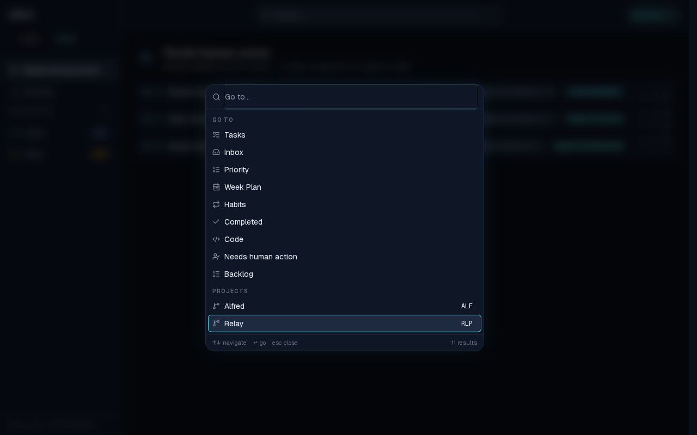
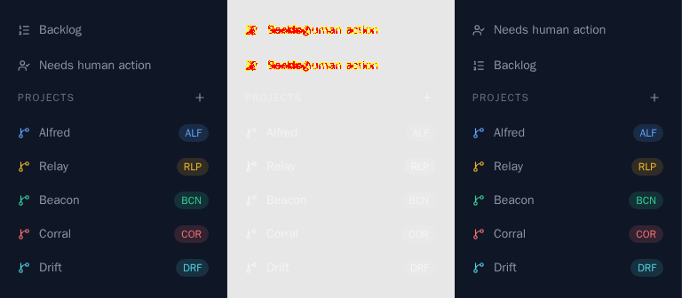

# Needs human action is the default Code view

*2026-08-28T14:52:18.048Z*

ALF-174 changes which view the Code module opens on. Entering the module should put the work that is blocked on the owner first, not the full ranked backlog — so the cross-project **Needs human action** queue is now the default view (the bare `/code`), and it sits **above** the Backlog in the sidebar menu. The Backlog keeps its own explicit route, `/code/backlog`.

### 1. Tasks → Code lands on Needs human action

Clicking `Code` in the header switcher routes to the bare `/code`, which now renders the human-review queue: the three stories in `in_refinement` / `ready_for_dev` / `ready_for_review`. In the sidebar, **Needs human action** is the first link — above **Backlog** — and it carries the active highlight for `/code`.

### 2. The Backlog is still one click away

Clicking **Backlog** in the sidebar navigates to `/code/backlog` and renders the full ranked Software Factory list — all five outstanding stories, with its status and project filters. The Backlog lost the default slot, not its view.

### 3. A hard load of the bare /code resolves the same default

Deep-linking (or refreshing) `/code` server-renders the queue too — the route and the client view router agree, and the sidebar highlight follows.

### 4. The command palette follows the same order

⌘K lists the Go-to destinations in their natural order. **Needs human action** now precedes **Backlog** there as well, so the two menus agree on which Code destination leads.

### 5. The sidebar's committed visual snapshot moved

Swapping the two links moves the `Code/ProjectNav` image baseline, so the snapshot gate failed and emitted its three-panel diff — baseline | changed pixels | received. It shows exactly the intended change and nothing else: the top two rows trade places, the project list below is untouched. The new baseline is approved (`npm run test:storybook:update -w frontend`) and committed alongside this doc.

