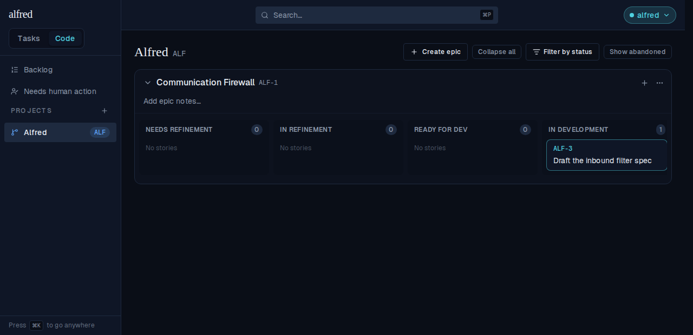
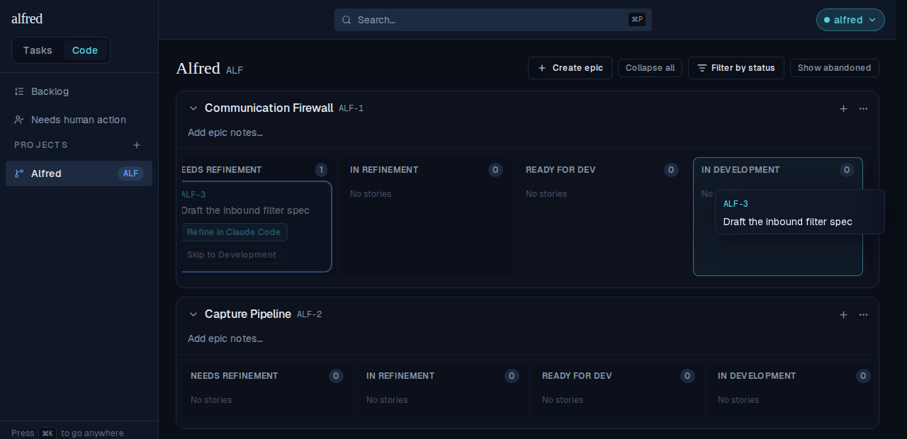
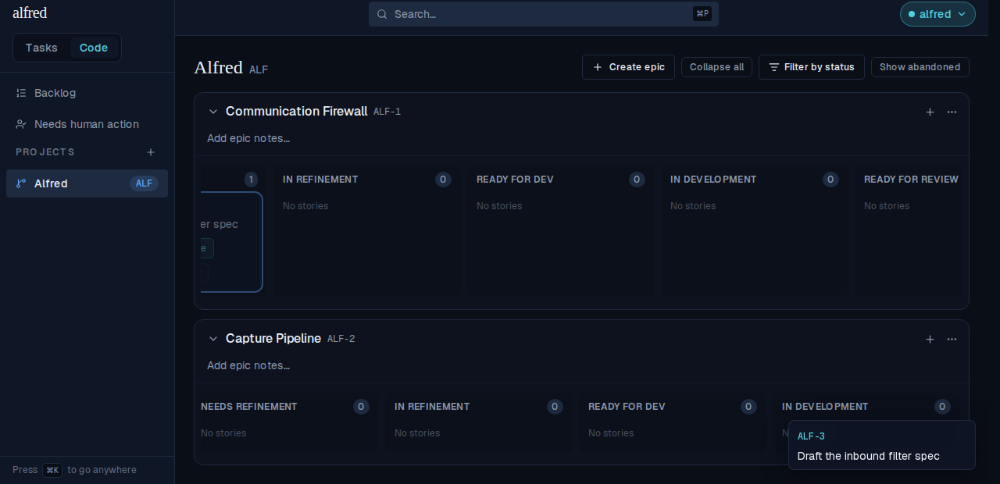
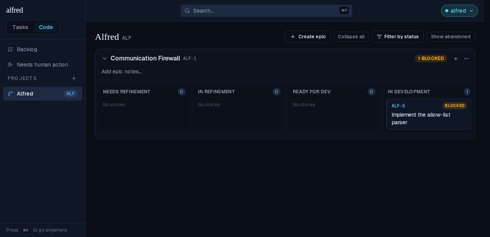
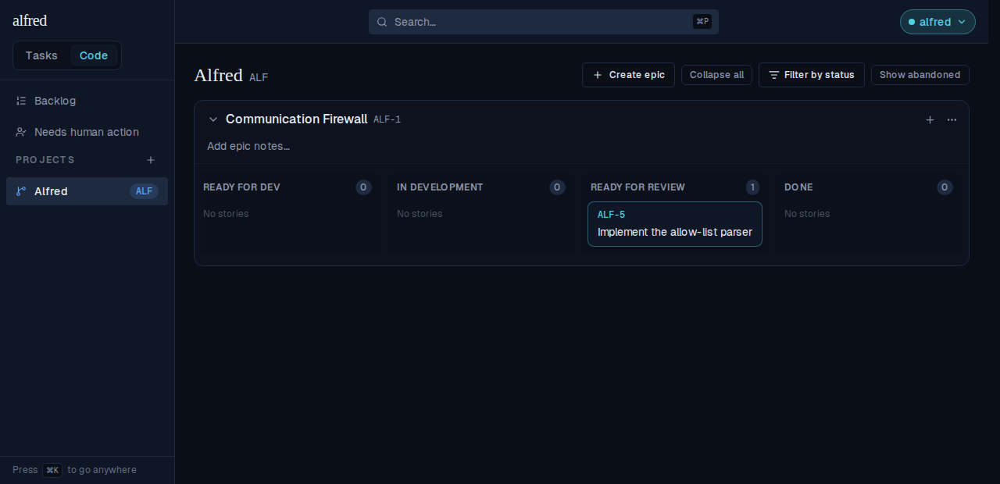

# Drag a code story between swimlanes

*2026-07-30T16:20:15.852Z*

ALF-155 adds a click-and-drag gesture to the Code board: pick a story card up anywhere on its body and drop it on another of its epic's swimlanes to move it to that state. The drop routes through the same optimistic `updateCodeState` write the detail modal's status menu makes, so the card lands in its new lane the instant it is released.

## Dragging a card to another lane

ALF-3 sits in **Needs Refinement**. Pressing its body and moving past the 8px activation distance lifts it: the in-place card dims, a ghost follows the cursor, and the lane under the pointer washes teal to say it will take the drop. Releasing moves the story to **In Development**, where its count ticks to 1.

## The move is durable, not just optimistic

A full page reload re-reads the board from the server, so the card reappears in its new lane only if the PATCH actually landed — it does. (Its "Refine in Claude Code" chip is gone too: launch actions are phase-appropriate, and `in_development` offers none.)

## A lane only lights up when it will take the drop

The gesture is state-only — it never re-homes a story. Every lane of the card's **own** epic is a target: here "In Development" under **Communication Firewall** is armed while ALF-3 hovers it. Note the dimmed source card behind the ghost keeps its launch chips: those stay clickable, because only the card *body* is marked as the drag surface.

Carry the same card down to the identically-named lane under a **different** epic — Capture Pipeline — and nothing lights up. Releasing there is a no-op and the story stays where it was; moving a story between epics remains the detail modal's job.

## Dragging a blocked card unblocks it

A blocked story keeps its card in the lane it was blocked *from*, so it drags like any other. ALF-5 is blocked out of **In Development**, carrying its amber tag and feeding the epic header's `1 BLOCKED` badge.

Dropping it on **Ready for Review** lands it there unblocked — the tag and the epic badge both go, and the stored `blocked_reason` is cleared by the same write (the drop sends `blocked_reason: null` alongside the new state, exactly as the modal's status menu does). Because `blocked` is never a lane's own state, this works even when the card is dropped straight back on the lane it was blocked from.

