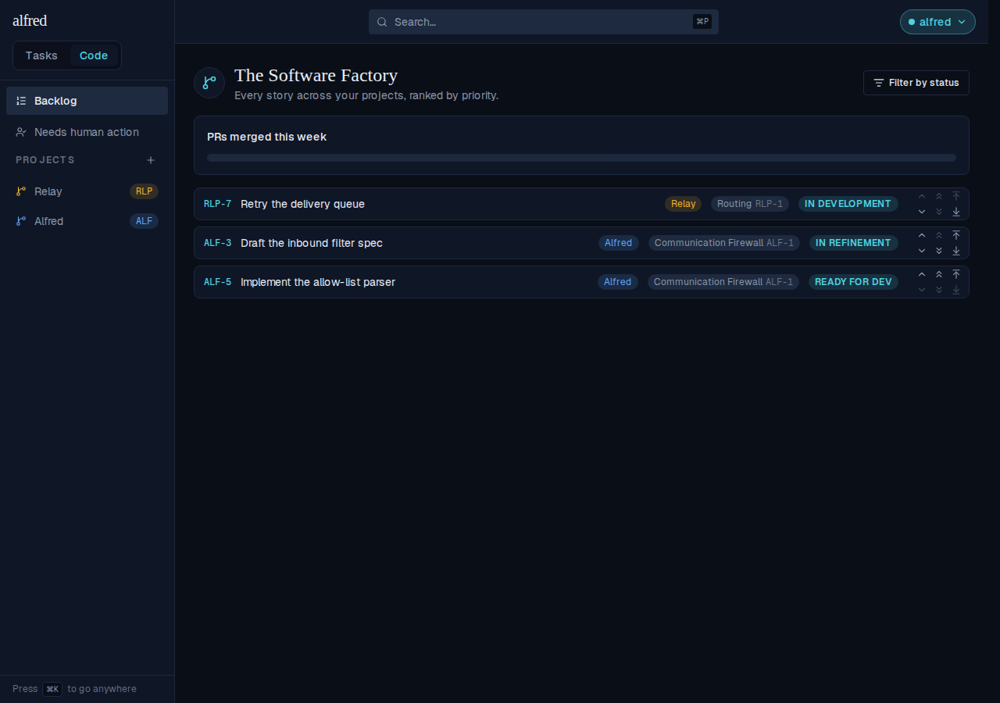
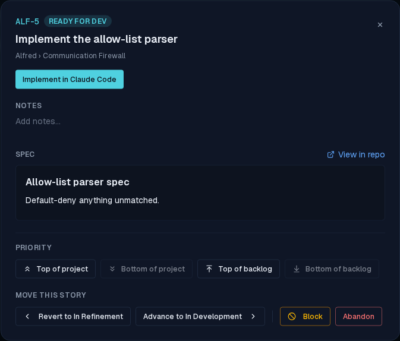
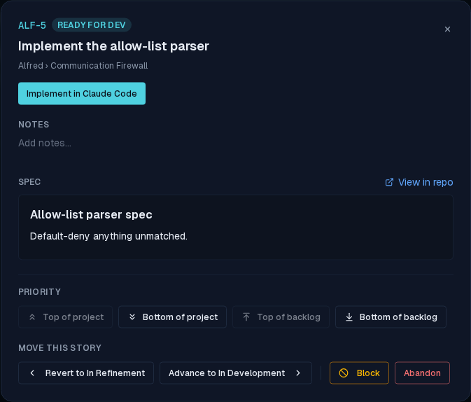
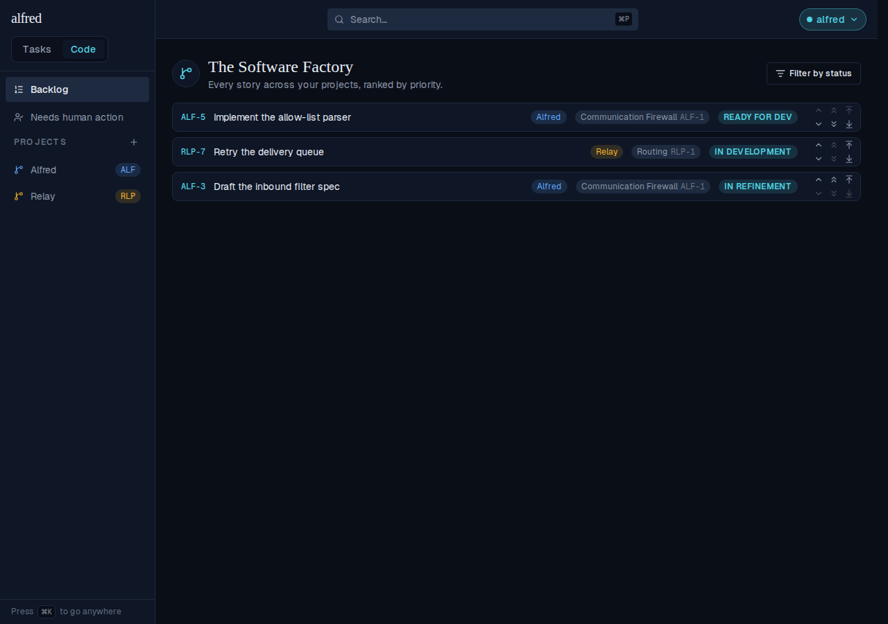
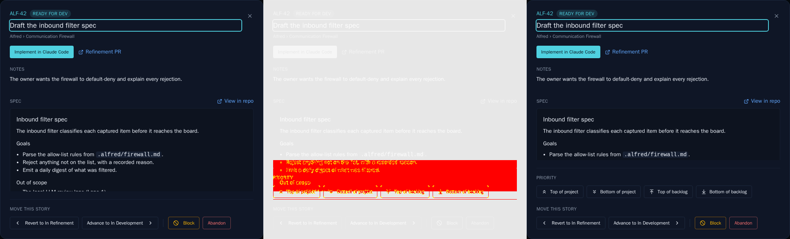

# Adjust a code story's Backlog priority from its detail modal

*2026-07-26T04:21:53.046Z*

ALF-141. Until now a code story's priority could only be adjusted from a Backlog row's chevrons — open a story's detail modal from a board card and there was no way to re-rank it without navigating away. The modal now carries a **Priority** section with the same four jumps a Backlog row exposes: top/bottom of the story's own **project** (the midpoint re-rank that leaves other projects undisturbed) and top/bottom of the **whole Backlog**. A jump the story already satisfies is disabled.

### 1. Before — ALF-5 sits last

Three outstanding stories across two projects: Relay's RLP-7 leads, then Alfred's ALF-3, then Alfred's ALF-5.

### 2. The new Priority section

Opening ALF-5's detail modal (from its Backlog row's deep link, or a board card) now shows the four jumps above the existing "Move this story" state controls. ALF-5 already trails both its project and the whole Backlog, so **Bottom of project** and **Bottom of backlog** are disabled — there is nowhere to jump to.

### 3. Top of project — the button disables the moment it is satisfied

Clicking **Top of project** re-ranks the story in the store immediately; the buttons re-derive from the new position, so **Top of project** greys out and both **Bottom** jumps come alive. **Top of backlog** stays live, because another project still ranks above.

### 4. It persisted — and stopped short of the other project

Back on the Backlog (a fresh server read): ALF-5 now leads Alfred's work, ahead of ALF-3 — while Relay's RLP-7 never moved. That is the project-scoped midpoint re-rank, the same `move_code_priority_in_project` RPC the Backlog's double chevrons call.

### 5. Top of backlog — past every project

Reopening the modal and clicking **Top of backlog** takes ALF-5 past RLP-7. It now holds the top slot outright, so **Top of project** and **Top of backlog** are both disabled.

### 6. Persisted again — ALF-5 leads everything

### The committed Storybook baseline moves

The modal's visual snapshot picks up the new section, so the `Code/StoryDetailModal` baselines are stale by design. The gate's 3-panel diff (baseline | changed pixels | received) for `ReadyForDev` — the Priority row is the whole of the change, and the dialog grows 80px taller to hold it:

