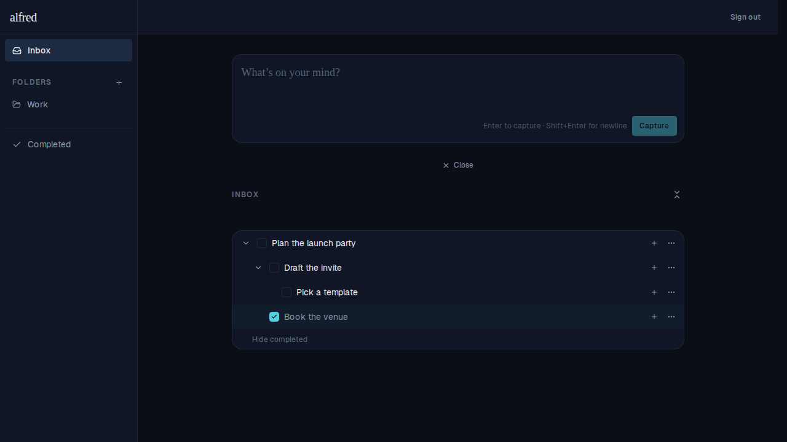
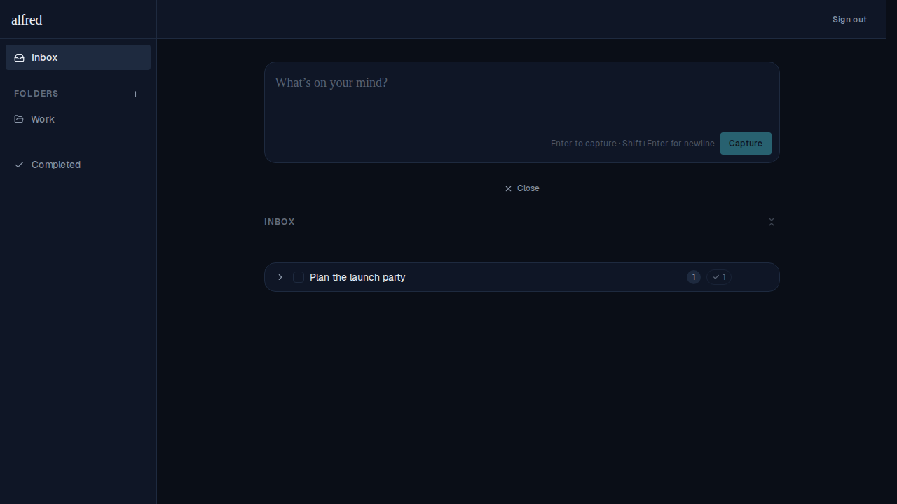
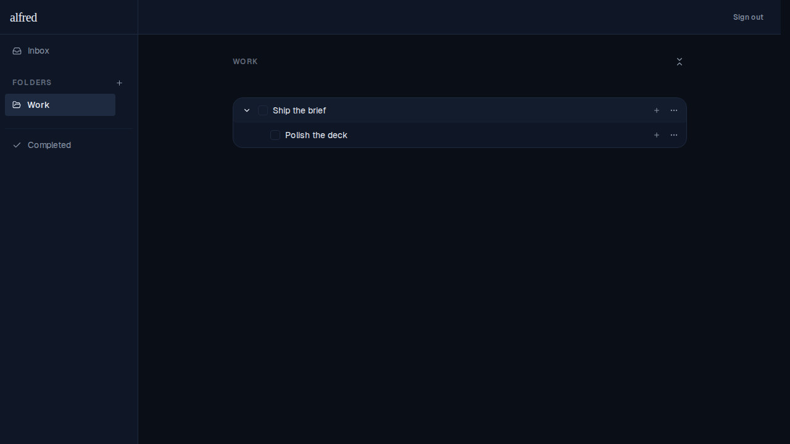
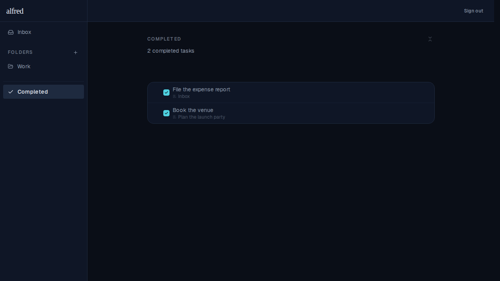
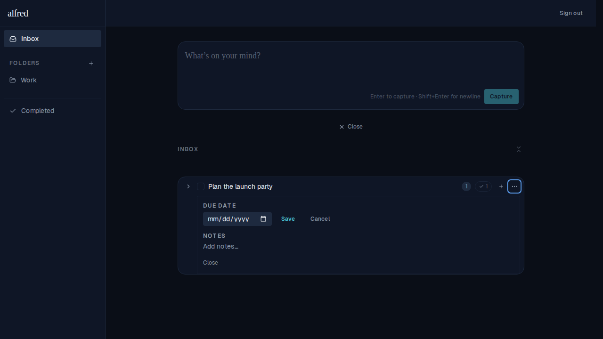

# Collapse-all control + the edit-metadata-no-expand fix

*2026-06-14T17:58:16.038Z*

Each view header (inbox, every folder, and Completed) now carries a **collapse-all** control at its top-right — the lucide `chevrons-down-up` icon. One click closes every open subtask tree (at any depth) **and** every open "Show completed" panel in that view.

**State management.** Row expansion was per-row `useState`, which a header button can't reach. Collapse-all is a genuine cross-row invariant, so the two child-disclosure flags (the subtask tree and the completed panel) now live in a small `ExpansionProvider` coordination store — mounted in the layout and seeded with no server data, exactly like `ActiveEditorProvider`. Rows **read** their flags from the store and **call** its actions; the button dispatches `collapseAll(viewIds)` scoped to the view, so collapsing one view leaves the others untouched. This is the project's redux-y data-flow pattern: cross-component changes go through a store function, component state is read from the store.

## Inbox — collapse everything in one click

"Plan the launch party" is expanded two levels deep (→ "Draft the invite" → "Pick a template") with its completed panel open ("Hide completed"). The collapse-all icon at the top-right is **enabled**.

After a single click on the control, the whole view collapses back to its roots — subtree levels and the completed panel all closed. With nothing left open, the control **disables** itself.

## The control appears in folder and Completed views too

A folder view ("Work") with an expanded task — the same collapse-all icon sits at the top-right of the folder header.

And the Completed view carries it as well (here disabled, since nothing is expanded).

## Bug fix: editing a parent's metadata no longer expands it

Previously, choosing "Set due date" / "Edit due date" or "Add notes" / "Edit notes" from a parent's menu force-expanded its subtree — even though the meta panel renders as a **sibling** of the subtree, not inside it. Now it opens the meta panel only: below, "Plan the launch party" keeps its collapsed chevron (▷) and child-count badges while the Due date / Notes editor is open.

