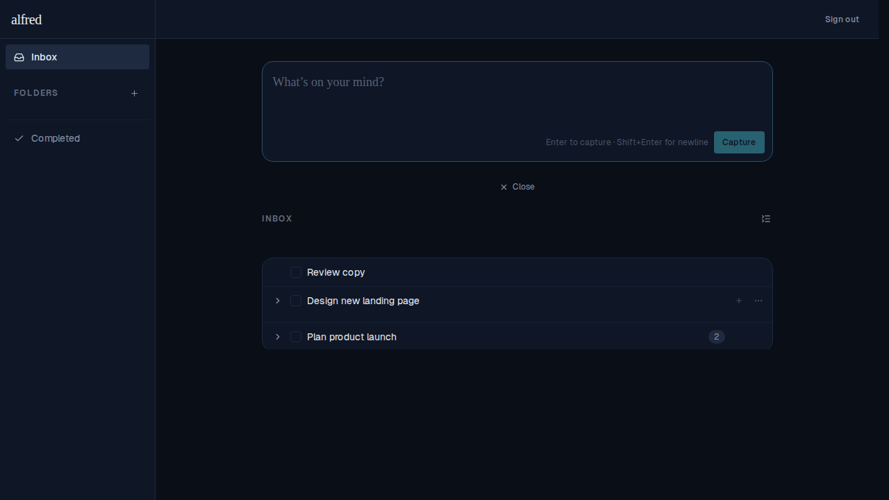
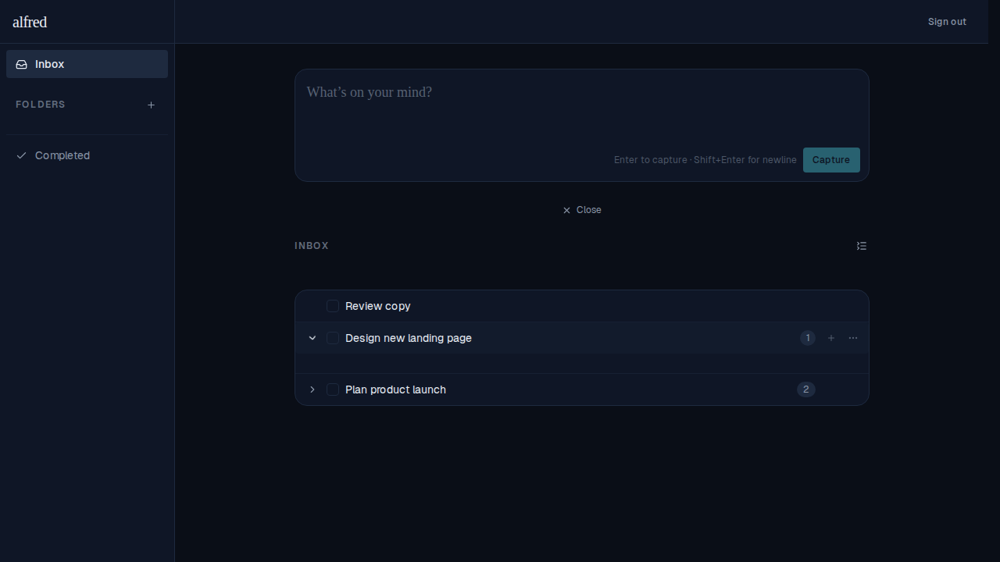
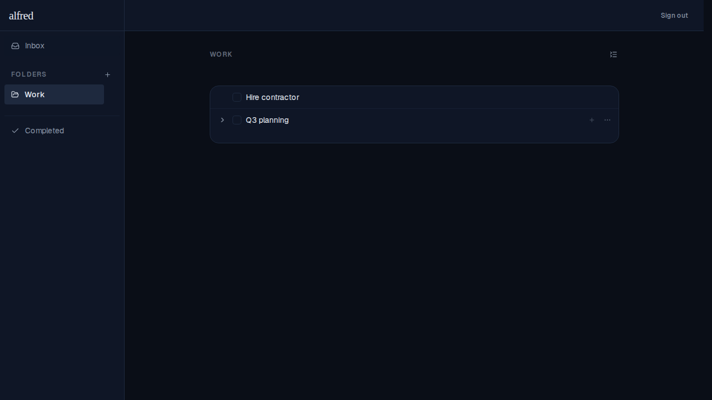
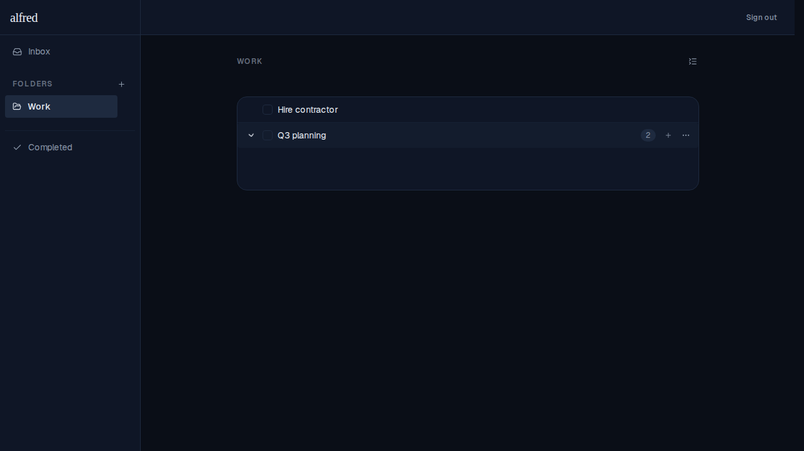

# Collapse all tasks icon

*2026-06-13T18:03:09.899Z*

A `ListCollapse` icon button was added to the top-right header of the inbox list and each folder view. Clicking it fires a subscription-based context event that collapses all expanded task and subtask rows in one shot, resetting both the subtask tree and the "show completed" toggle for every visible row.

Inbox view — the collapse icon appears at the top-right of the INBOX header. After expanding a task's subtasks, clicking the icon collapses all of them at once.

Folder view — the same collapse icon appears at the top-right of each folder header.

