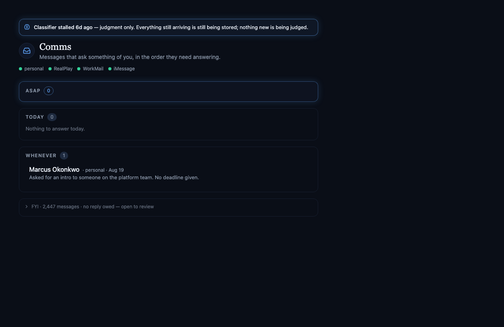
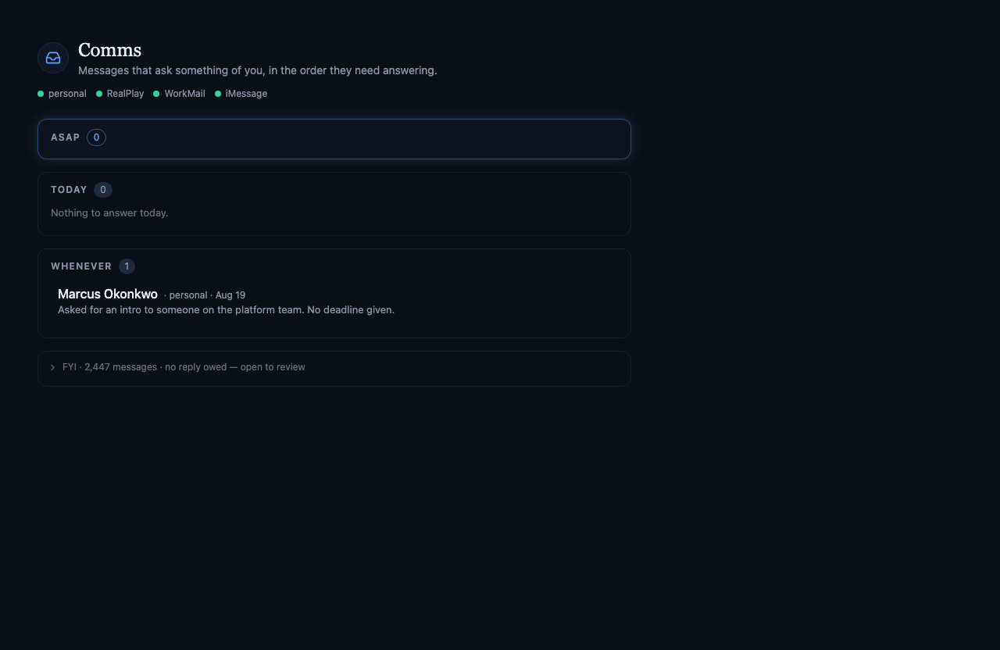

# A false stall banner, an unreachable Gmail cron, and a poll that failed in silence

*2026-09-11T19:42:02.932Z*

Three defects found in the comms module after it went live, all of them reported by the owner as "weird" rather than by any check. None was caught by a suite, and two of them were actively hiding.

## 1. The classifier banner counted messages that were already answered

The module reported `Classifier stalled 7d ago — judgment only`, dated a week before the classifier had been switched on at all, while the health row said it had succeeded thirty seconds earlier and rows were visibly being judged.

The banner's second signal counts inbound messages left unjudged past the sweep cadence. In production all 97 of those had already been drained by a reply:

    select cleared_by, count(*) from comm_messages
     where direction='inbound' and tier is null group by 1;

     cleared_by | count
     reply      |    97

The daemon's seven-day iMessage backfill carried in the owner's own outbound replies, and an outbound message drains its thread. Those rows were answered days before alfred existed, and the sweep correctly never judges one — `fetchUnjudgedMessages` filters on `cleared_at is null`. The banner did not, so it read a week of settled history as a judgment outage.

The new `FreshlyActivated` story draws exactly that state: a backfill of answered threads, every dot green, judgment healthy. **Before the fix** — a six-day outage that never happened:



**After** — same data, same green dots, no banner:



A second rule went in beside it. The sweep judges a capped batch per tick, so a first run over a real backlog leaves rows waiting far past the cadence while working exactly as designed — the banner would have fired again the moment Gmail backfilled its own seven days. `classified_at` is the proof of life: a verdict inside the window means the classifier is draining, not stalled, and when there is no such verdict the LAST one it managed is when judgment actually stopped. A message's `received_at` only says when it arrived, which for anything backfilled is a much older and quite different moment — it is now the fallback for a classifier that has never judged anything at all.

## 2. The Gmail poll's cron was unreachable

Neither Gmail account had ever completed a poll. `gmail-personal` held a row with **both** `last_seen_at` and `last_error_at` null, and `gmail-realplay` had no row at all — though both refresh tokens were set:

          key       |        last_seen_at        | last_error_at |          created_at
    ----------------+----------------------------+---------------+------------------------------
     gmail-personal |                            |               | 2026-09-11 17:30:39.914149+00
     imessage       | 2026-09-11 19:14:16.032+00 |               | 2026-09-11 17:32:00.395162+00
     workmail       | 2026-09-11 19:13:57.279+00 |               | 2026-09-11 17:32:01.594423+00

The poll had been given its own cron (`1-59/2 * * * *`, the odd minutes) so it would stop competing with the judge pass for the 50-subrequest budget. Cloudflare registered that string and its API echoed it back verbatim — but the SCHEDULER ran the offset-free form. Five minutes of `wrangler tail` caught it: three consecutive odd minutes fired nothing, and every even minute fired TWICE, seven seconds apart, both invocations reporting the same expression.

    cron= '*/2 * * * *' | scheduled= 19:20:27
    cron= '*/2 * * * *' | scheduled= 19:20:34

Two distinct schedules, one label. Since `event.cron` is the whole dispatch, `POLL_CRON` never matched and `pollGmail` was never called once — every tick silently took the fall-through branch and ran the sweep twice. The poll now rides an offset-free expression, which cannot collapse onto another schedule. The dispatch table below is read out of the shipped source rather than restated, so it cannot drift from what deploys:

```bash
node docs/demos/comms-health-and-cron/crons.mjs
```

```output
Schedules the handler dispatches on:

  OK   TICK_CRON       */2 * * * *     registered
  OK   POLL_CRON       */3 * * * *     registered
  OK   RETENTION_CRON  17 9 * * *      registered

Registered but unhandled: none
Distinct expressions: 3 of 3
```

For contrast, the expression that shipped — the one the guard above now rejects and a unit test pins:

```bash
git show 51ff62dc:workers/src/index.ts | grep "export const POLL_CRON"
```

```output
export const POLL_CRON = '1-59/2 * * * *';
```

## 3. A poll that threw reported itself as never having run

The row with both timestamps null was the second defect, hiding underneath the first. Every typed failure path in `pollAccount` routes through `failed()`, which stamps `last_error_at` — but the Gmail client and the token exchange catch their own transport failures while the **Supabase helpers throw**. An exhausted subrequest budget part-way through a poll therefore threw clean out of `pollAccount`, into the catch above it that has no account id and so stamps nothing.

A row carrying neither a success nor an error renders as `personal has never synced — the poll has stopped running`, which is indistinguishable from a poll that was never scheduled. So the one account that was genuinely broken was reporting itself as merely quiet, and the real fault went unreported for an hour. The post-registration body now runs inside a catch that stamps the account with whatever threw; if that write is refused too, the ORIGINAL reason is reported rather than the one raised trying to record it.

## What is not demonstrated here

Both Worker fixes are only observable once the schedule is re-registered, and `wrangler deploy` is CI's job on merge — deploying an unmerged branch would put un-reviewed code live. So the evidence above is the defect reproduced and the corrected dispatch; the confirmation that `gmail-personal` starts stamping `last_seen_at` and `gmail-realplay` registers at all lands on the merge deploy.

One known side effect: `docs/demos/comms-subrequest-budget/` records the old `crons` line in its captured output, so that earlier doc no longer re-verifies. It is a historical record of a change that did happen and has been left as it was written.
