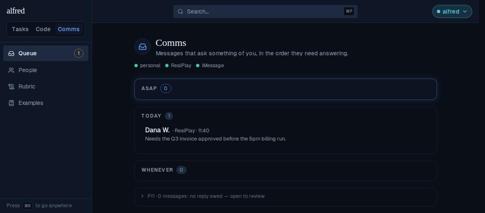
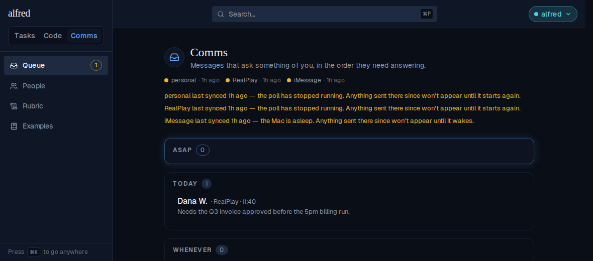

# Comms sources stay honest in a long-lived tab (ALF-227)

*2026-09-12T18:24:30.586Z*

The bug: leave alfred open, go elsewhere for an hour, come back to Comms — every source is amber, "the poll has stopped running", while all of them are polling fine. Nothing on the server changed; only the browser's clock moved. The Comms store is seeded once at page load and kept current by a Realtime socket, and Realtime is fire-and-forget: a socket that lapses while the tab is backgrounded or the machine asleep drops every change made in the gap and replays none of them. Account health is the surface that shows it, because it is the one thing read against a ticking clock — a `last_seen_at` frozen at the seed decays into "stale" on its own.

Captured through the live app (Playwright + the in-memory Supabase mock), with the page clock fast-forwarded an hour. Step 1 — the tab is opened: every source polled a minute ago and is green.

Step 2 — an hour passes with the tab away. The pollers never stopped, but this tab heard nothing, so all three dots decay to amber and the module accuses three healthy sources of having died.

Step 3, BEFORE the fix — the owner comes back to the tab. Nothing re-reads, so the accusation stands for as long as the tab stays open.

Step 3, AFTER the fix — returning to the tab (and, for a machine that woke with the tab in front, the Realtime channel rejoining) re-reads GET /api/comms/health and replaces the frozen reading with the current one. Same second, same fast-forwarded clock, same seeded pollers: three green dots and no warnings.

A failed re-read changes nothing and says nothing: the stale reading it would have replaced is still better than a blanked roster, and the next return tries again.
