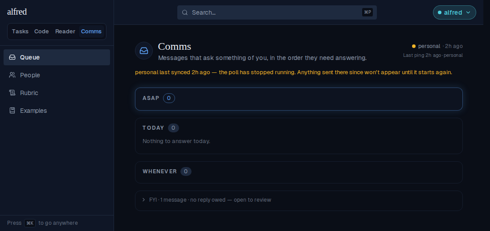
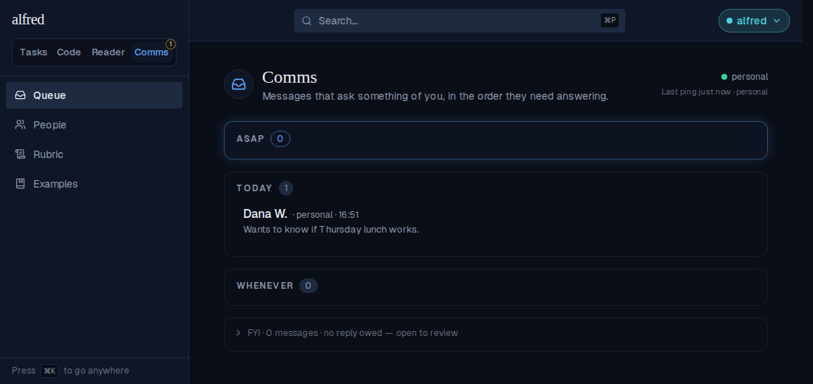
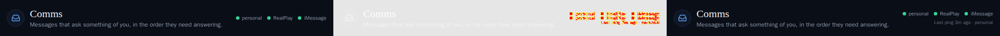
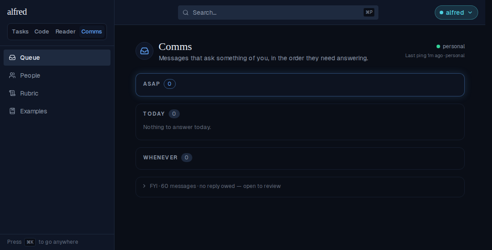
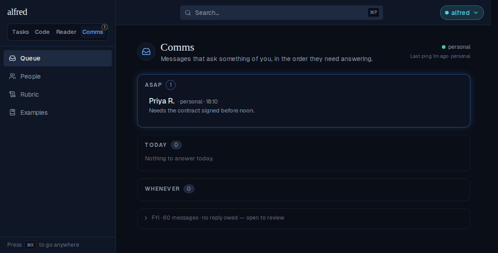
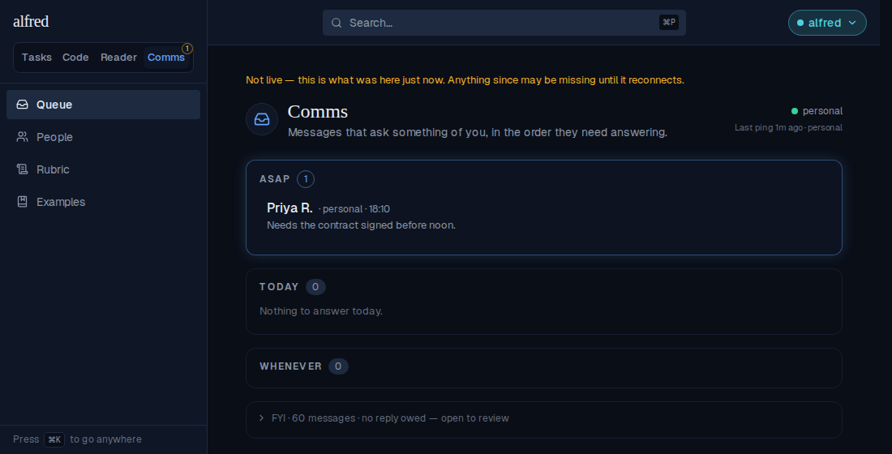
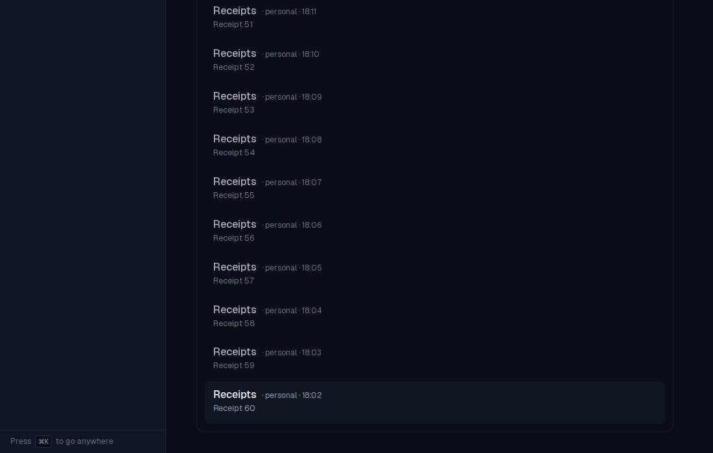

# ALF-258: Comms live-updates again (and says when it last heard from a source)

*2026-09-22T17:52:18.623Z*

**Root cause.** Every store's realtime channel called `.subscribe()` straight from a mount effect. A channel's join payload is frozen at that moment, before the browser Supabase client has read the session, so the join carried no `access_token` and the server subscribed it as `anon`. Every Comms table's RLS policy is `to authenticated`, so an anon channel is delivered nothing, silently. supabase-js re-sends a token to a joined channel only when it *changes*, and by the time the join completed it had already stored this one, so the tab stayed anon until the JWT next rotated (up to an hour). Production confirmed it: `realtime.subscription` held a full set of `claims_role = anon` rows for an open tab. A hard refresh re-rolled the race, which is why it looked like the fix. The same race hit the Tasks (`items`) and Code (`code_items`, `epics`) channels, so all three now join through `joinWhenAuthenticated` (`frontend/lib/supabase/realtime.ts`), which awaits `realtime.setAuth()` first.

**Before the fix.** The live app runs on the Playwright mock backend, whose fake realtime socket now drops pushes to a channel that joined without a token, as RLS does. The page has just received a classifier re-tier (FYI → Today) and a fresh poll on `personal`, and neither lands: Today is empty and the source still reads 2h stale.

**After the fix: the page as it opens.** The row is on the FYI shelf, and the new last-ping line under the dots says which source checked in last and when.

**After the fix: the same two pushes, no reload.** The re-tiered row moves into Today, the dot turns green, and the line reads "Last ping just now · personal".

**The Comms header baseline moved on purpose.** Below is the visual-snapshot gate's diff (old, diff, new): the dots lift slightly and the last-ping line appears beneath them. The same shift moved the queue-view stories' baselines, all approved in this branch.

## Recovering whatever the socket missed

A working channel still can't replay what it missed: a tab in the background, a laptop asleep, a phone that suspended the app, or the moment between the server render and the join. So the view re-reads itself via `GET /api/comms/snapshot` and replaces what it holds. It does this whenever every channel (re)joins, on tab return, on `online`, and after a burst of live changes settles. The read is small because the view only holds what it shows: everything above FYI in full, the first 50 shelf rows, and the shelf and Reader totals as counts.

**A message written while the tab was away, with no realtime push for it.** The page opens with 60 FYI rows and nothing owed. Then a new ASAP message is written straight to the backend, standing in for the change the dropped socket never delivered. The tab comes back to the front:

**When it can't re-read, it says so.** The re-read is blocked, standing in for being offline. The queue keeps what it had, and a line above everything says the view may be behind. It clears on the next successful read.

**The shelf pages from the server.** The count says 60 while the view holds only 50 rows. "Show more (10 older)" is the same snapshot read asked for 100, and afterwards all 60 are on screen, down to Receipt 60:

