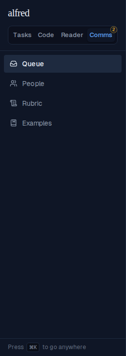
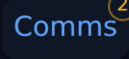
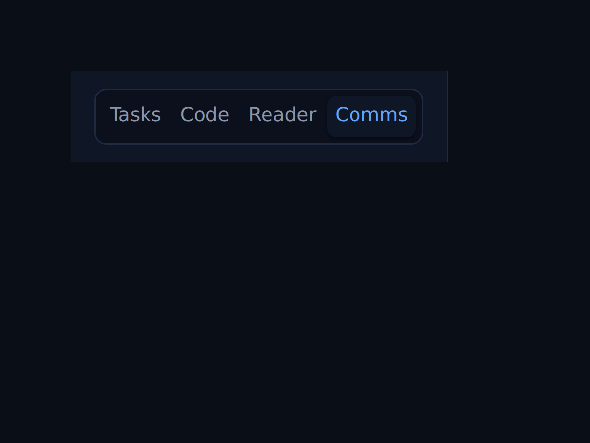
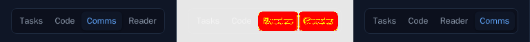

# Comms queue badge moves to the module switcher

*2026-09-20T21:19:14.932Z*

ALF-222: the queue count (how many messages are waiting for a reply) moves off the sidebar's Queue link and onto the Comms segment of the module switcher, as a small badge over its top-right corner. Comms also moves to the far right of the switcher, so the badge lands at the control's own end instead of a corner in the middle.

Two messages are seeded into counted tiers (asap, today) and one onto the FYI shelf (uncounted). Screenshot of the real, authenticated app's sidebar on /comms: the switcher's Comms segment (now last) badges "2", and the Queue link below it carries no badge at all.

A closer look at the corner badge (Storybook's ViewSwitcher story, framed at the real 256px sidebar width): the badge pokes slightly *outside* the segment's own corner, like a conventional notification badge, rather than squeezing inside next to the label — the segment is only ~13px of text tall, so any inside-the-box position collided with the label's own cap-height (an earlier version of this badge visibly overlapped the final "s" in "Comms"). That only works because `truncate` (the text-clipping `overflow-hidden`) moved off the segment link itself and onto an inner span wrapping just the label text — left on the link, it would clip the badge's overhang along with any overflowing text.

The resting state — nothing owed, so the badge disappears entirely (hides at zero, exactly like the Habits sidebar badge did before it, and like the Queue badge did before ALF-222 moved it here). The reserved right padding stays, so Comms doesn't jump width when a message arrives.

Order and accessibility are pinned by tests: the switcher's DOM order is Tasks, Code, Reader, Comms, and the badge exposes its meaning through an accessible label ("N waiting for a reply") exactly like the Habits and old Queue badges did.

Moving Comms to the far right shifted the switcher's committed Storybook baselines for all four modules (each segment's own rendered width and position shift when the fourth slot changes hands) — the auto-generated diff for the two modules that actually swapped seats, Comms and Reader:

