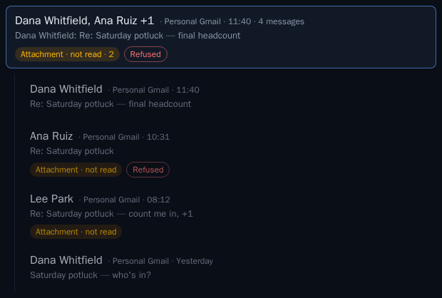

# FYI shelf collapses into conversations

*2026-10-04T19:55:27.929Z*

The FYI shelf used to draw one row per message, so a busy group chat or an email thread buried everything else on it. It now draws one row per conversation: shelved messages sharing an account and thread key collapse to one row, and an iMessage chat is also split wherever two messages are more than 6 hours apart. Every screenshot below is the live authenticated app against the Playwright mock backend, on the same seeded data: a 3-message burst in the 'Climbing crew' chat, a 4-message potluck email thread (one reply refused), a lone Chase statement, and an older 2-message burst in the same chat about 10 hours earlier.

Before (base commit, same seed): ten rows, one per message.

After: four rows. The chat's two bursts are two conversations because the gap between them is over 6 hours. Each multi-message row shows who it is with (the chat name, or up to two senders and '+N'), the account, the newest time and '· N messages' as plain text rather than a badge, and the newest line, prefixed with its sender when more than one person is talking. The thread's refused reply shows as a 'Refused' chip on the collapsed row. Chase is a one-message conversation and looks exactly as a row did before. The shelf summary still counts messages (10).

Selecting the thread opens it: its four messages appear as full shelf rows, newest first, indented under a rule. Each one keeps its own tier picker. Only one conversation is open at a time, because opening follows the view's single selection. j/k step onto the header, through its messages and past it, and Escape closes it.

Storybook baselines added by this change (no existing baseline moved, so there are no diff images). The queue view's ShelfOpen story:

ShelfConversation, collapsed then open. The chips roll up with counts (Attachment · not read · 2):

