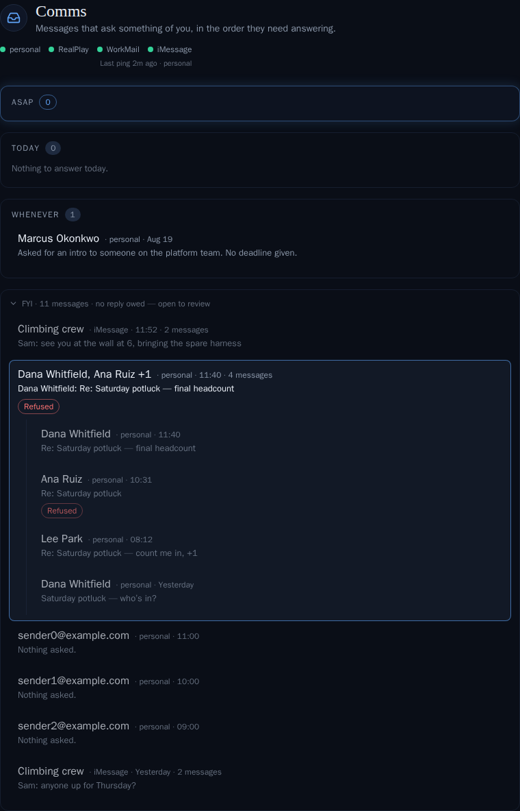
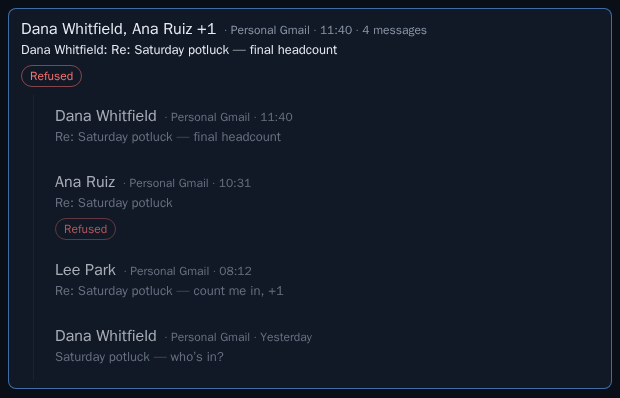

# The FYI shelf, collapsed into conversations

*2026-10-04T19:57:49.450Z*

Opening the FYI shelf used to draw one row per shelved message, so a busy group chat or a long email thread filled the shelf with near-duplicate rows. It now draws one row per conversation: an email thread, or an iMessage chat split wherever six quiet hours pass. Opening a conversation shows its messages as full shelf rows, each with its own tier picker.

All shots below come from the running app (Playwright against the in-memory Supabase mock), seeded with the same 13 shelf messages: a 4-reply email thread with one refused reply, a group chat texted in two bursts a night apart, a mother's texts in two bursts, and one statement email.

**Before** (base commit): every message is its own row.

**After**, same data: six rows. A conversation of two or more says who is in it (a group chat by its own name; otherwise up to two senders and "+N"), the newest message's time, and "· N messages" as meta text, not a badge. Its second line is the newest message's, attributed ("Sam: …") when several people are talking. The refused reply inside the potluck thread rolls up onto the collapsed row, so it can't hide. The chat's two bursts (today and yesterday) are separate rows; the lone Chase email is drawn exactly as rows always were. The summary still counts messages (13).

Clicking the potluck thread opens it: its four replies, newest first, indented under a left rule. Only one conversation is open at a time, since it is open exactly while it or one of its messages is the selection.

Pressing `j` from the selected header walks into the conversation: the newest reply is selected and expands to its full shelf row, tier picker included. Further `j` presses walk its messages and then past it, which closes it; `Esc` closes it too, and the verb hotkeys do nothing on a header.

**A page edge never cuts a conversation.** Here 60 lone receipts and a 3-reply thread whose newest reply is the 48th newest shelf row; its two older replies sit past the 50-row page edge. The server completes every conversation the page touched, so the thread shows its exact count (3 messages) on first load, and "Show more" counts the 11 messages the tab doesn't hold yet.

After "Show more", the thread is unchanged (still 3 messages) and the next page appends below it.

**Storybook.** No existing snapshot moved: the queue view's collapsed-shelf stories keep their shelf sizes, and a shelf row of one message renders exactly as before. Three new baselines pin the new surfaces: the queue view's shelf opened by conversation (chat bursts split, potluck thread opened with its refusal rolled up), and the ShelfConversation component collapsed and opened.

