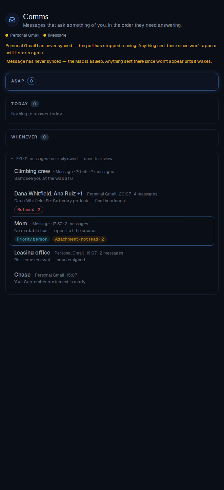
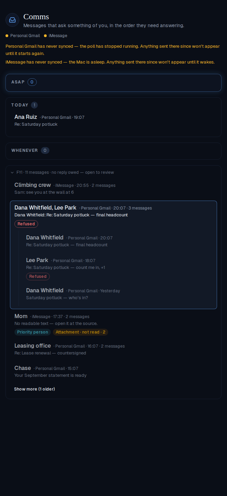
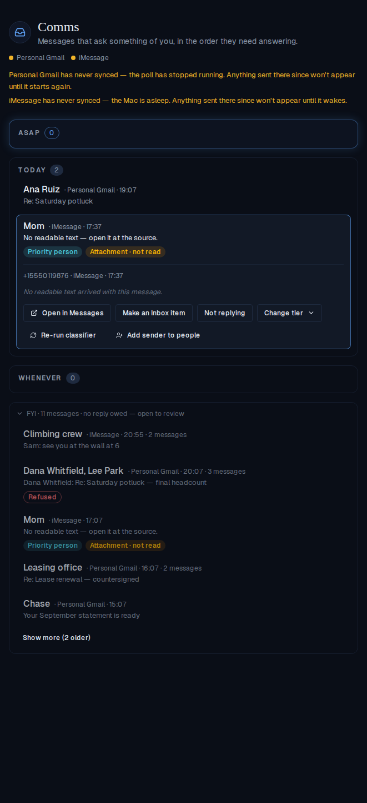
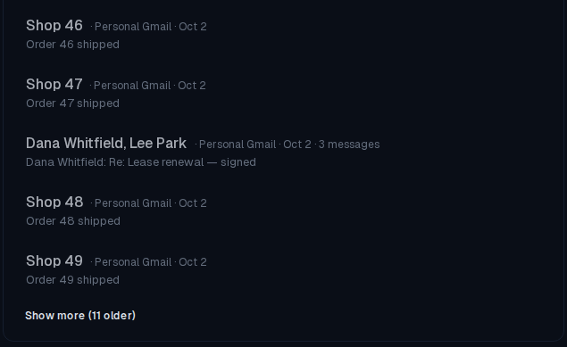
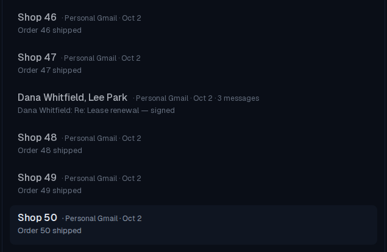
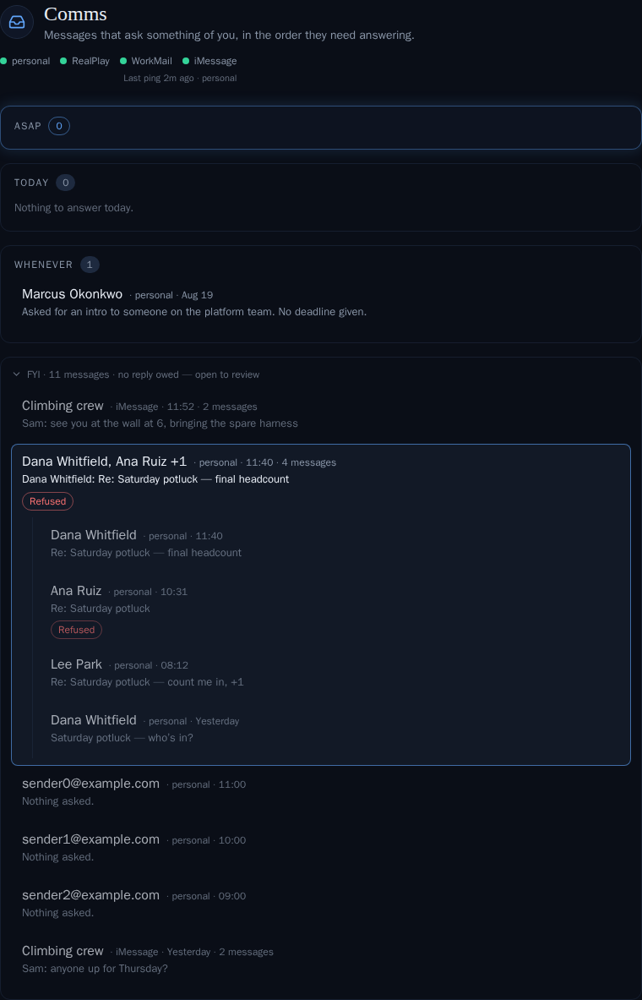
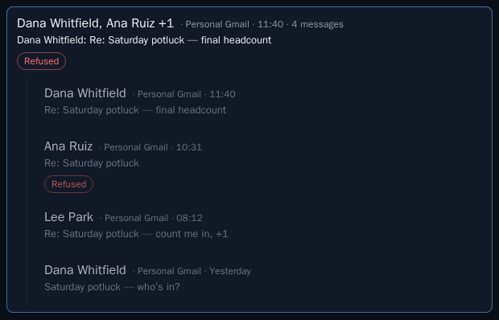

# The FYI shelf, collapsed into conversations

*2026-10-04T21:08:24.740Z*

Opening the FYI shelf used to draw one row per shelved message, so a busy group chat or a long email thread filled the shelf with near-duplicate rows. It now draws one row per conversation: an email thread, or an iMessage chat split wherever more than six quiet hours pass. Opening a conversation shows its messages as full shelf rows, each with its own tier picker. Every shot below is the running app (Playwright against the in-memory Supabase mock).

## Before and after, same data

13 shelf messages: a 4-reply email thread with one refused reply, a group chat texted in two bursts a night apart, a mother's texts in two bursts, and one statement email. **Before** (base commit): every message is its own row.

**After**: six rows. A conversation of two or more says who is in it (a group chat by its own name, otherwise up to two senders and "+N"), the newest message's time, and "· N messages" as meta text, not a badge. Its second line is the newest message's, attributed ("Sam: …") when several people are talking. The chat's two bursts are separate rows, and the lone Chase email is drawn exactly as rows always were. The summary still counts messages (13).

## Opening one

Clicking a conversation opens it to its messages, newest first, indented under a left rule. Clicking again closes it (the GIF opens, closes and reopens the potluck thread).

## Chips roll up, counted

A second seed for the rest of the journey. On the collapsed rows, every chip a conversation's messages carry shows, counted when more than one carries it: "Refused · 2" on the potluck thread, "Attachment · not read · 2" on Mom's two photos. Mom is a priority person, a chip about the sender, so it is never counted. The Leasing office thread's first message is 55 days old, and its expiry chip does not roll up onto the collapsed row.

Opened, the expiry chip is on the message it is about.

## Walking it with the keyboard

`j` from a selected header walks into the conversation; the newest message is selected and expands to its full shelf row, tier picker included (first seed).

`j` past the last message moves on to the next row and closes the conversation (here, from the Leasing office thread onto Chase).

Only one conversation is open at a time: opening Mom's burst closed the potluck thread opened just before it. The verb hotkeys do nothing on a header; verbs belong to messages.

`Esc` closes it.

## Promoting a message out of a conversation

Promoting Ana's refused reply to Today from its tier picker: it leaves the conversation, which stays open with one message fewer (3 messages, "Refused" now uncounted).

Promoting one of Mom's two photos leaves one message, which is drawn as a plain row.

## A page edge never cuts a conversation

60 lone receipts and a 3-reply thread whose newest reply is the 48th newest shelf row; its two older replies sit past the 50-row page edge. The server completes every conversation the page touched, so the thread shows its exact count (3 messages) on first load, and "Show more" counts the 11 messages the tab doesn't hold yet.

After "Show more", the thread is unchanged and the next page appends below it.

## Storybook

No existing snapshot moved: the queue view's collapsed-shelf stories keep their shelf sizes, and a one-message shelf row renders exactly as before. Three new baselines pin the new surfaces: the queue view's shelf opened by conversation, and the ShelfConversation component collapsed and opened.

