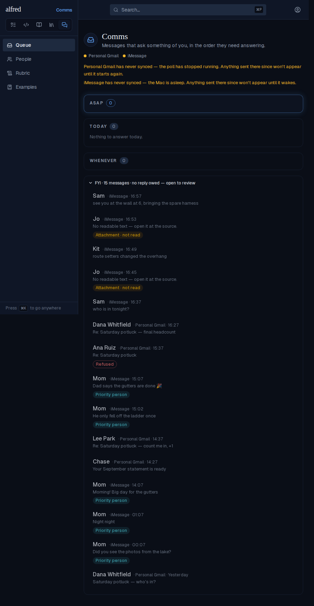
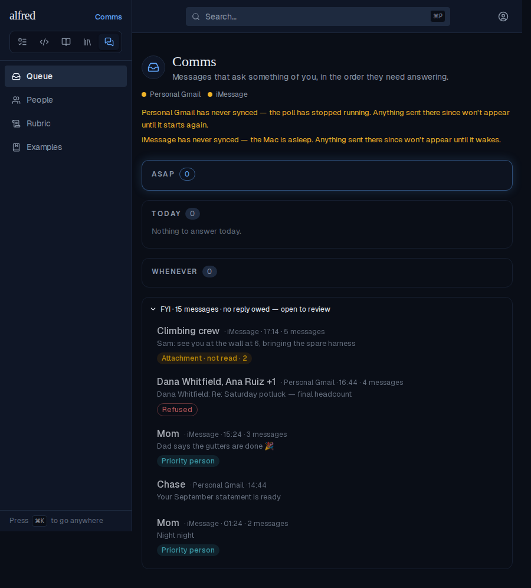

# FYI shelf collapses into conversations

*2026-10-03T17:24:50.897Z*

ALF-307: the FYI shelf drew one row per message, so a busy group chat or a long email thread filled it row by row. It now draws one row per conversation. A conversation is an email thread, or an iMessage chat split wherever two shelved messages are more than 6 hours apart. A collapsed conversation shows who it is with, the newest message's line (prefixed with the sender when there are several), the message count as text in the meta line rather than a badge, and every chip its messages carry, counted. Selecting it opens it onto its messages as full shelf rows, newest first.

Both shots below are the same seeded data, run through the Playwright mock-backend harness: a 5-message 'Climbing crew' group chat (two photos with no text), a 4-message potluck email thread (one reply refused), Mom texting this afternoon and again last night more than 6 hours earlier, and one Chase statement. **Before**: the shelf opened on main, with all 15 messages as separate rows.

**After**: the same shelf as five rows. 'Climbing crew' is named by its chat name and carries 'Attachment · not read · 2'. The potluck thread is 'Dana Whitfield, Ana Ruiz +1 · 4 messages' with its refused reply rolled up as 'Refused'. Mom's chat is two conversations because its bursts are more than 6 hours apart. Chase, a one-message conversation, is drawn exactly as the row was before. The summary still counts messages (15).

**Opened**: clicking the potluck header selects it, which opens it. Its four messages are drawn as full shelf rows, indented under a left rule and newest first, and the inner row still shows its own 'Refused' chip.

Storybook: no existing visual baseline moved, because RowMarkers renders the same chips from its new kind list and the existing queue stories never open the shelf. Three new baselines were added: `Comms/CommsQueueView › ShelfOpen` and `Comms/ShelfConversation › Collapsed / Opened`, the last with a play function that opens, closes and reopens the conversation.
