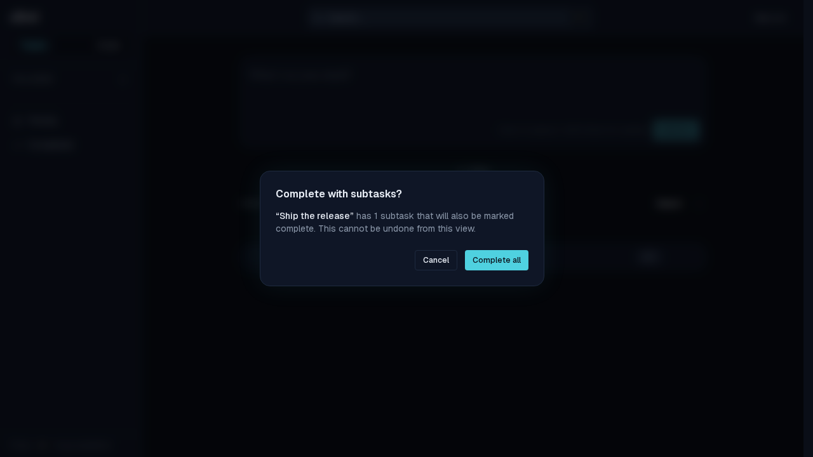
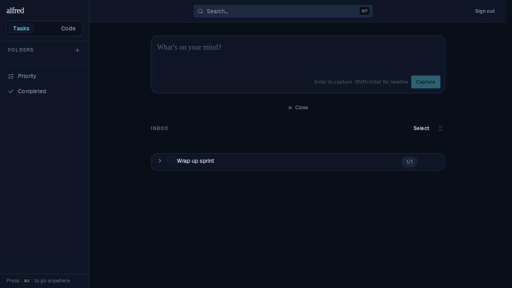
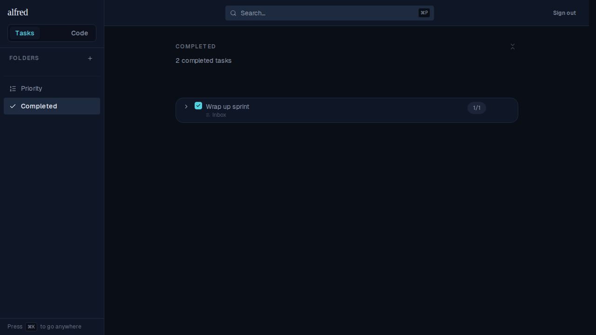

# Completing a parent skips the cascade warning when all descendants are done

*2026-07-03T00:34:52.585Z*

ALF-73. The cascade-confirm modal warns that a task's subtasks will *also* be marked complete. That warning only makes sense when there's still active work to sweep. When every descendant is already completed, completing the parent cascades nothing new — so we now skip the modal and complete the parent straight away.

**Unchanged: an active descendant still warns.** A parent with a still-active subtask shows the confirmation exactly as before.

**New: all descendants completed → no warning.** "Wrap up sprint" sits in the Inbox with its one subtask already done (the `1/1` badge).

Clicking its checkbox completes it directly — no modal appears — and it lands in the Completed view with both rows (parent + already-done subtask) counted.

