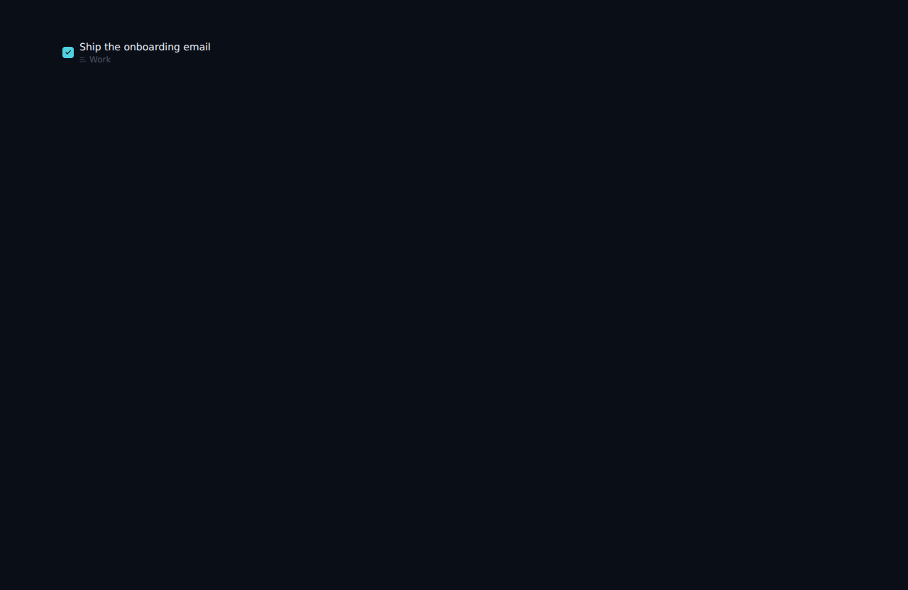
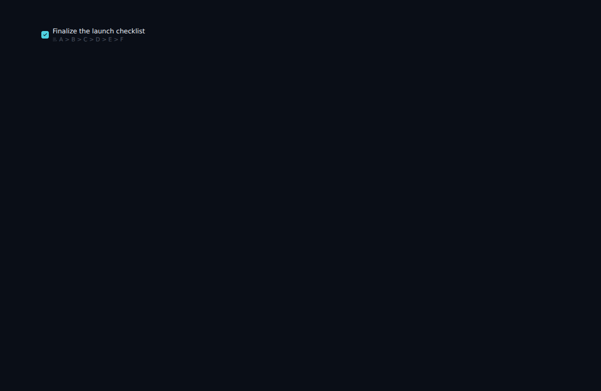

# Completed screen: parent folder label

*2026-06-10T21:02:45.427Z*

Each completed item now shows its parent folder (or "Inbox") in low-contrast text beneath the task title, with a ListCheck icon. This gives context at a glance when viewing completed items from different projects in one list.

The label is computed in TaskRow for each top-level row of the Completed view (isCompleted && depth === 0): a nested item shows its ancestor breadcrumb (below), a top-level item shows its folder name or falls back to "Inbox". Rows rendered nested under a visible completed parent, and every non-completed view (inbox, folder views), show no label.

Evidence is a screenshot of the rendered row, captured from the Storybook 'Tasks/TaskRow → CompletedInFolder' story (a completed item filed under the 'Work' folder). Storybook renders the component outside the Supabase auth gate, so it reproduces in CI and the web sandbox — unlike the live /completed route, which redirects to /login without real credentials and seeded data. Below the title, in low-contrast text, the list-check icon precedes the parent folder name.

When a completed item is itself a subtask, the label becomes its full ancestor breadcrumb instead of a folder: every parent from oldest (root) to youngest (immediate parent), joined by " > ". Ancestors are resolved from the full task list, so they show even when those parent tasks are still active and filtered out of the Completed view. Below is a completed leaf whose ancestor chain is A → B → C → D → E → F.

