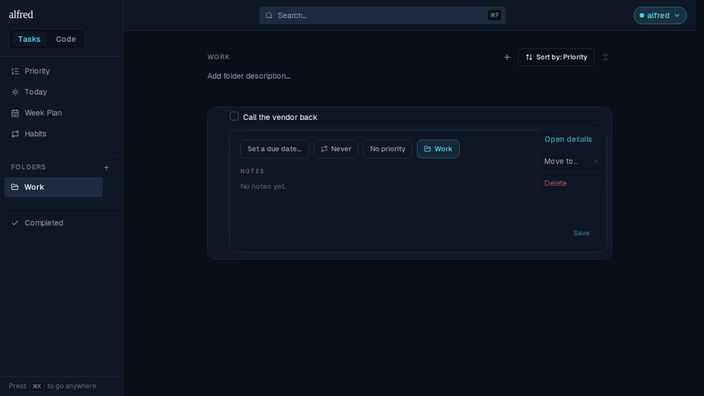
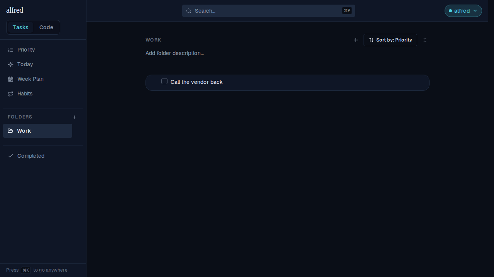
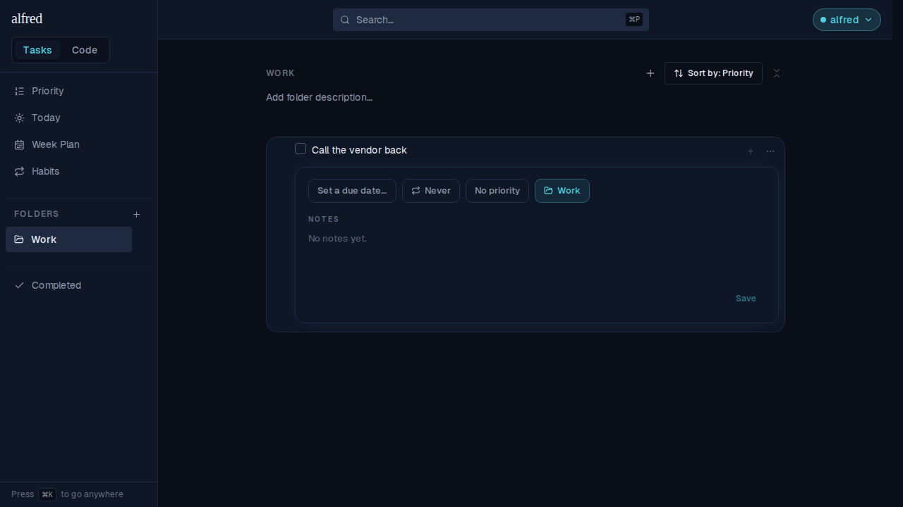

# Open details stays open when the create it belongs to lands

*2026-09-07T06:32:34.966Z*

ALF-199. Capture a task and open its details before the write comes back, and the panel used to vanish the instant the create reconciled — the row's own detail panel, closing itself for no reason the user can see.

The reason: a create inserts an optimistic row under a temp id and the reconcile REPLACES it with the server row, id and all. Every flag the ExpansionProvider holds is keyed by that id, so the open panel was left pointing at an id no row carried any more.

The journey below is the same script both times — capture a task into a folder with its POST held open, open the details while the row is still unsaved, then release the write. Only the fix differs.

## Before the fix

The write is still in flight and the panel is open — Due / Repeat / Priority / Folder over the notes area.

The create lands — and the panel is gone. Nothing was dismissed, nothing was pressed; the row simply changed id underneath it.

## After the fix

Same moment, same held write: the panel is open on the unsaved row.

And the create lands with the panel still open, on the saved row — the reconcile now carries the row's open disclosures from the temp id to the server's.

