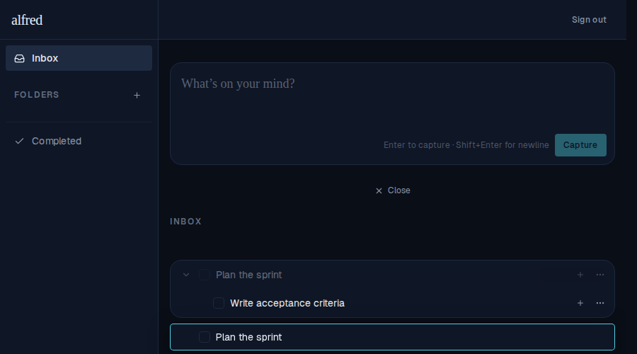
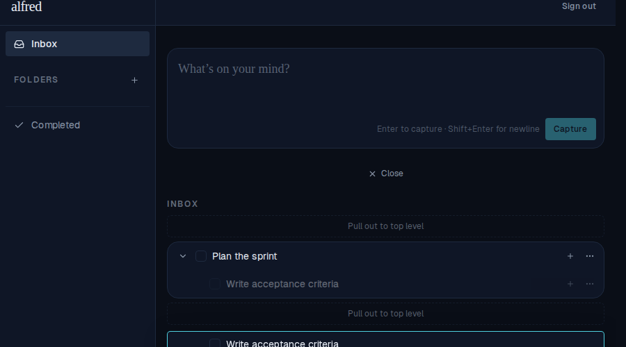

# Fix drag overlay text alignment on cancel snap-back

*2026-06-13T18:05:15.055Z*

When a drag is cancelled (the task "flies back" to its original position), the text in the DragOverlay must sit at the same horizontal position as the text in the in-place row. If the left padding differs, the title appears to jump the instant the overlay disappears. This fix makes the DragOverlay mirror the row's flex layout — depth-aware indent + invisible toggle placeholder + invisible checkbox placeholder — so the title text aligns at every nesting depth.

Root task (depth=0): DragOverlay text left-aligned with the dimmed in-place row.

Subtask (depth=1): DragOverlay inherits the extra depth-1 indent, keeping the title aligned.

Snap-back animation: the overlay returns home without a text jump.

