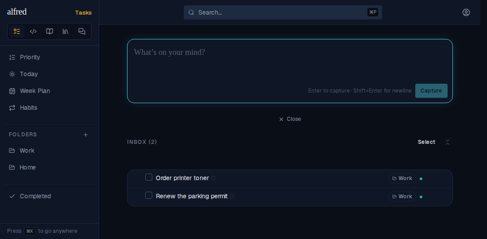
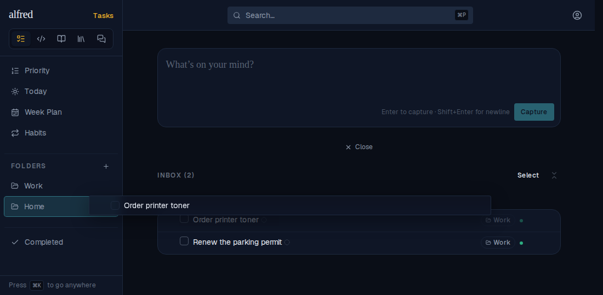
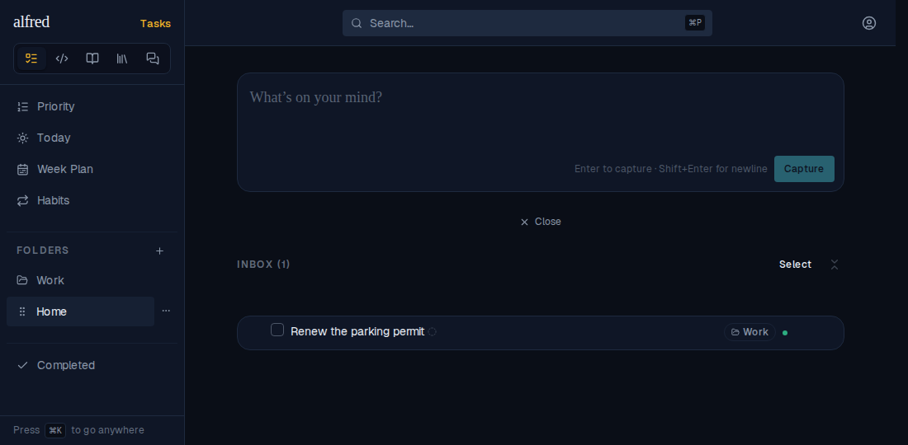
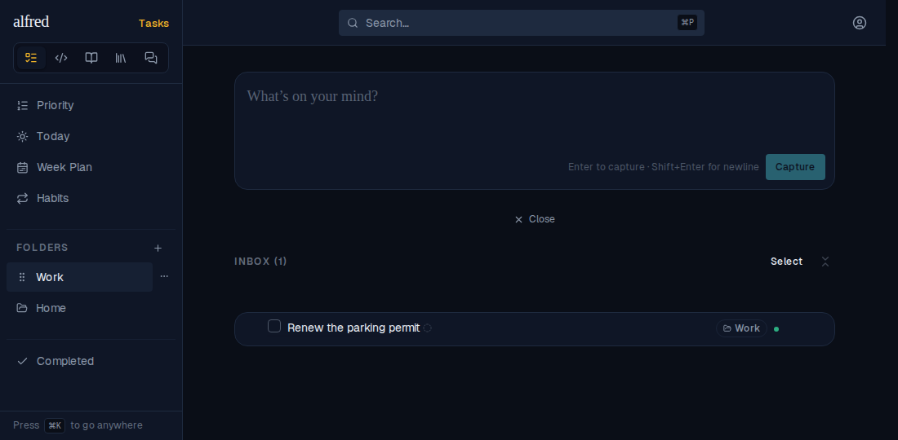
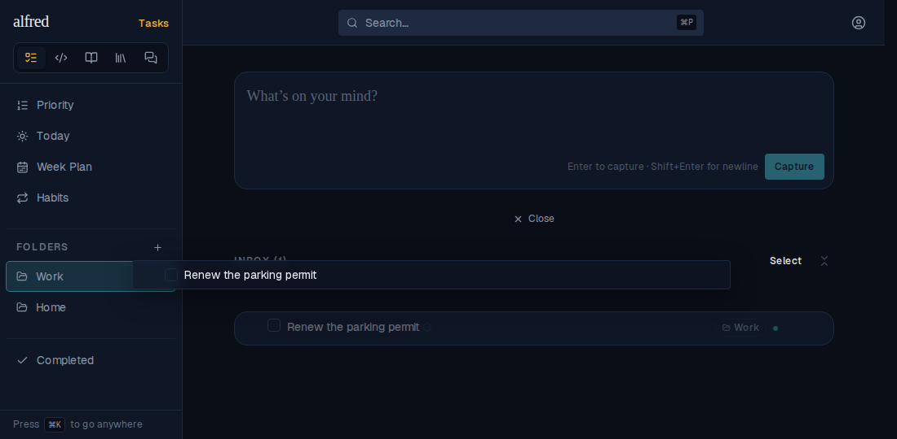
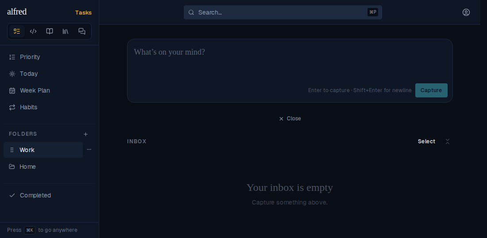
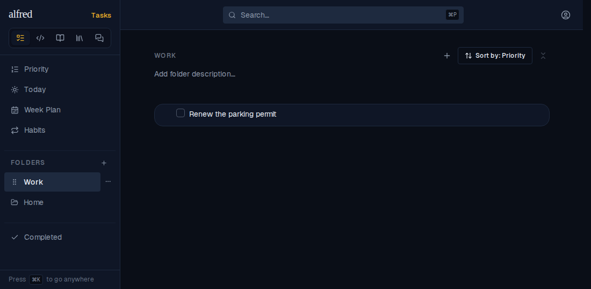

# Dragging an Inbox task onto the folder it is labelled with files it (ALF-216)

*2026-09-30T05:33:35.669Z*

The classifier can fill in `folder_id` on an item still sitting in the Inbox: a **label** naming where it would land, shown as the row's folder chip. Before ALF-216, a labelled Inbox task could be dragged onto **any other** folder, but a drag onto **the folder its label names** did nothing. The drop's "already there?" check compared the target with the label instead of with where the task lives (`residentFolderId`, which is `null` until a task is dispatched).

Every frame below is the live app (the Playwright mock harness), seeded with two folders, **Work** and **Home**, and two Inbox tasks that are both labelled **Work** and not yet dispatched.

### Before the fix (main)

**Control: a different folder works.** "Order printer toner" is dragged onto **Home**, and Home lights up as the drop target…

…and on release it is filed: the Inbox count drops to 1.

**The bug: the labelled folder.** "Renew the parking permit" is dragged onto **Work**, the folder its chip names. Work lights up as the drop target, exactly as Home did…

…but on release nothing happens. The task is still in the Inbox (count still 1) and still only labelled Work.

### After the fix (this branch)

The same journey. The same drag of "Renew the parking permit" onto **Work** arms the target…

…and on release the task is dispatched: it leaves the Inbox, which is now empty.

After a full page reload (so this reads the saved row, not the optimistic patch), the task is filed in **Work**.

