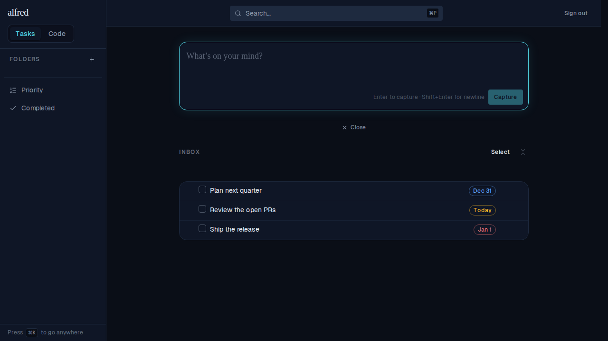
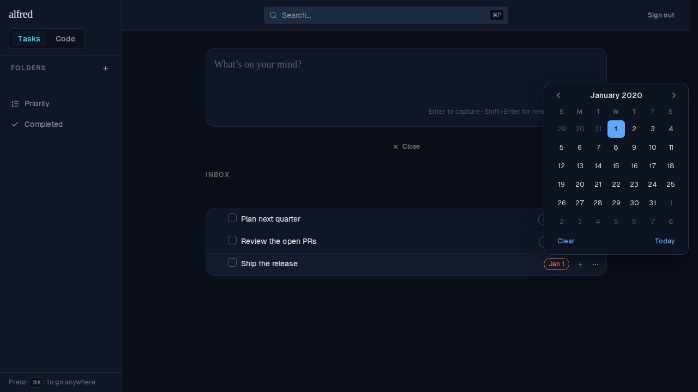
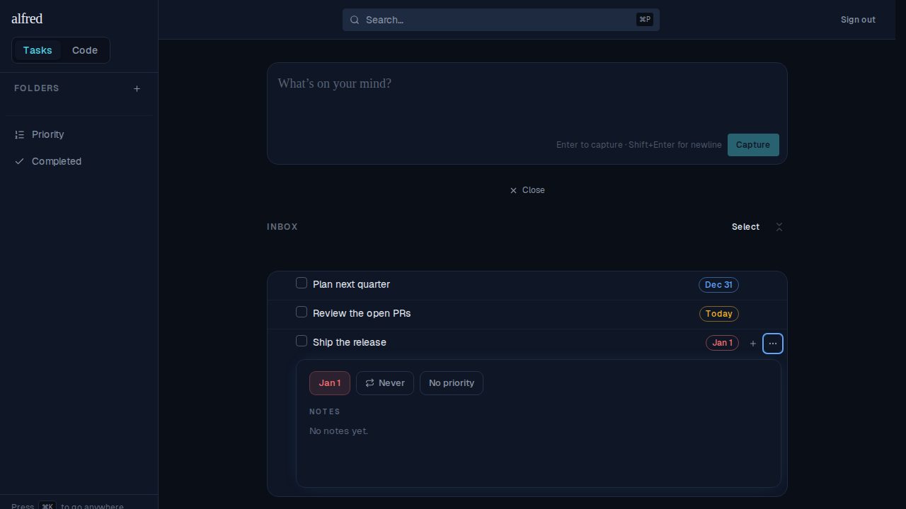

# One due-date chip: red/amber/blue and clickable in both places (ALF-94)

*2026-07-03T17:49:39.242Z*

ALF-94 folds the two divergent due-date renderings into **one** `DueDateChip`: the compact badge on a task row and the larger chip in the detail panel are now the same component, with the **same red/amber/blue urgency colouring** and **clickable in both places** (each opens the month-grid calendar to change or clear the date, auto-saving). `size="compact"` keeps the row badge consistent with its Type/Repeat/Priority neighbours; `size="comfortable"` matches the detail panel's chips.

### 1 · One chip, three urgency bands on the row
Overdue is red, due-today is amber, upcoming is blue — the same bands the folder attention badges use.

### 2 · The row badge is now clickable
Previously the row badge rendered as a button wired to nothing. Clicking the overdue (red) chip now opens the calendar right on the row — no need to open the detail panel first.

### 3 · The detail panel's Due chip carries the same colour
The detail panel used to show the Due chip in a fixed blue regardless of urgency. It now uses the shared component, so an overdue task reads **red** here too (amber when due today, blue when upcoming) — and it stays clickable, opening the same calendar.

