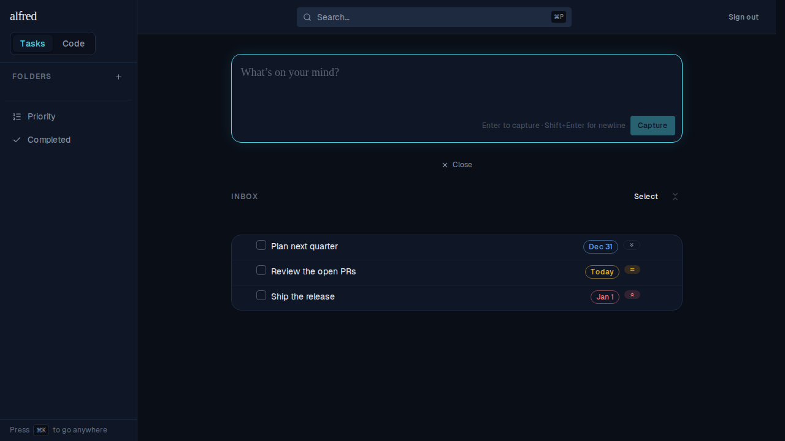
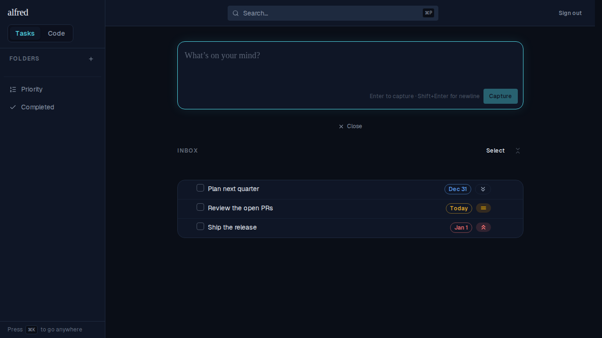
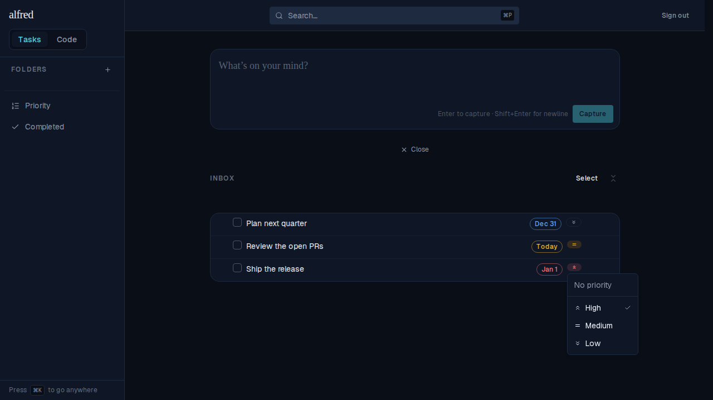
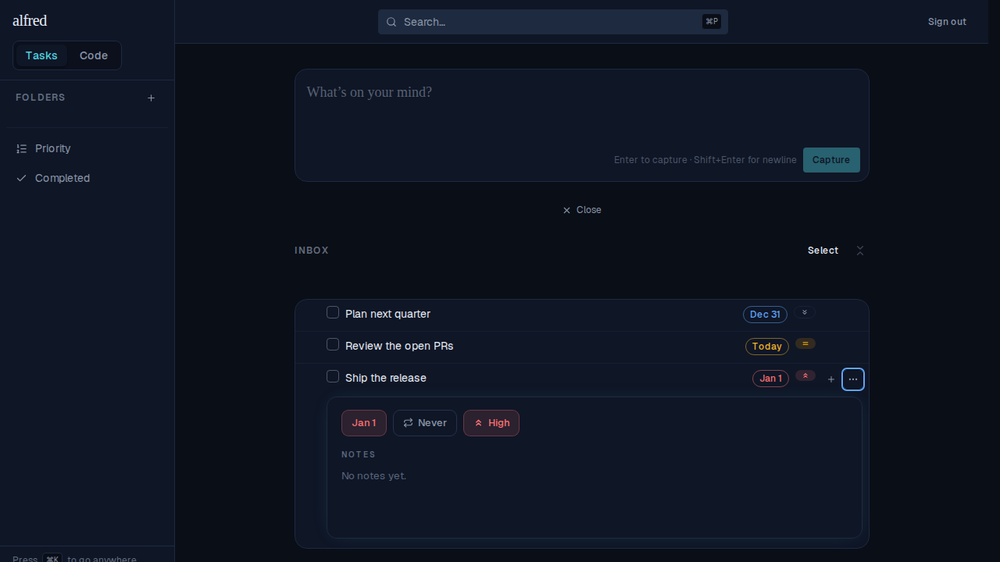

# One priority chip: interactive in both places, badges the same height (ALF-94)

*2026-07-04T02:22:57.358Z*

ALF-94 (follow-up) folds every priority-badge rendering into **one** `PriorityChip`: the compact badge on a task row, the larger chip in the detail panel, and the By-Priority row. It's **clickable in all of them** — each opens the shared `PriorityMenu` to re-prioritise (auto-save) — and the row glyph is now sized to the badge line-box so **all the row badges stand the same height**. `size="compact"` keeps the row badge with its Type / Due neighbours; `size="comfortable"` matches the detail panel's chips.

### 1 · The row badges are now the same height
Before, the priority glyph was shrunk to 10px on desktop — visibly smaller than the due-date badge beside it. Now it's sized to the text line-box, so the priority pill matches the due-date pill.

**Before** — the priority chevrons are shorter than the `Dec 31` / `Today` / `Jan 1` due badges:

**After** — the priority pills stand the same height as the due-date pills:

### 2 · The row badge is now clickable
Previously the row priority badge was display-only. Clicking it now opens the shared picker to change or clear the level, right on the row.

### 3 · Same component in the detail panel
The detail panel renders the same `PriorityChip` in its `comfortable` size (icon + label, level-tinted), opening the same picker.

