# Due times: a task can be due at 3 PM, not just on a day

*2026-10-03T18:27:23.126Z*

Every screenshot below is the live authenticated app on the Playwright mock backend, in America/Chicago with an en-US locale and the browser clock pinned to Saturday 3 October 2026. The API, database and classifier sections run real code against a throwaway backend.

## Setting a time on an undated task

The detail panel's Due chip reads **Set a due date…**. In the picker, Add time opens a native time field; 3:00 PM is typed but not yet committed.

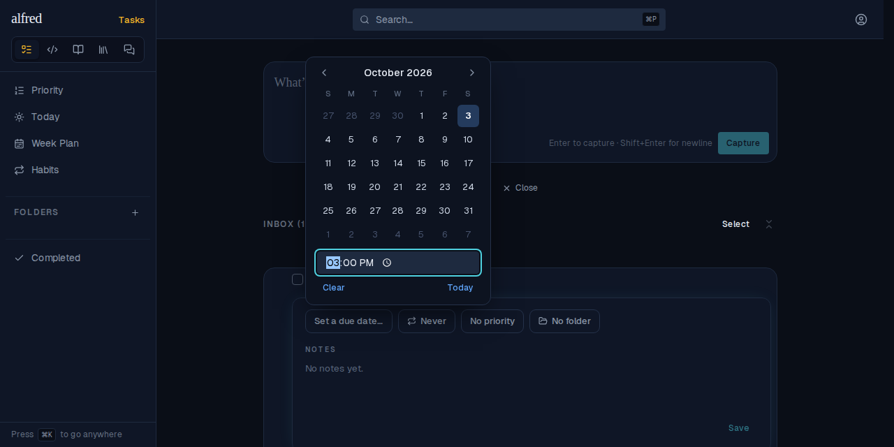

Enter commits the time. The task had no date, so committing a time also sets the date to today: both chips now read **Today 3 PM**. The picker stays open, now with a × that clears just the time.

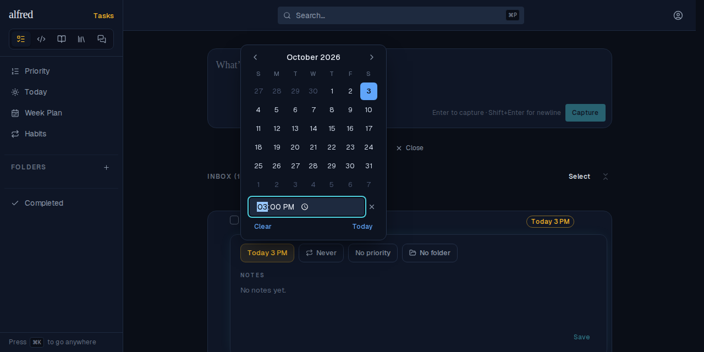

After a reload, the time comes back from the backend. This is the mock backend; the real column is exercised in the database section below.

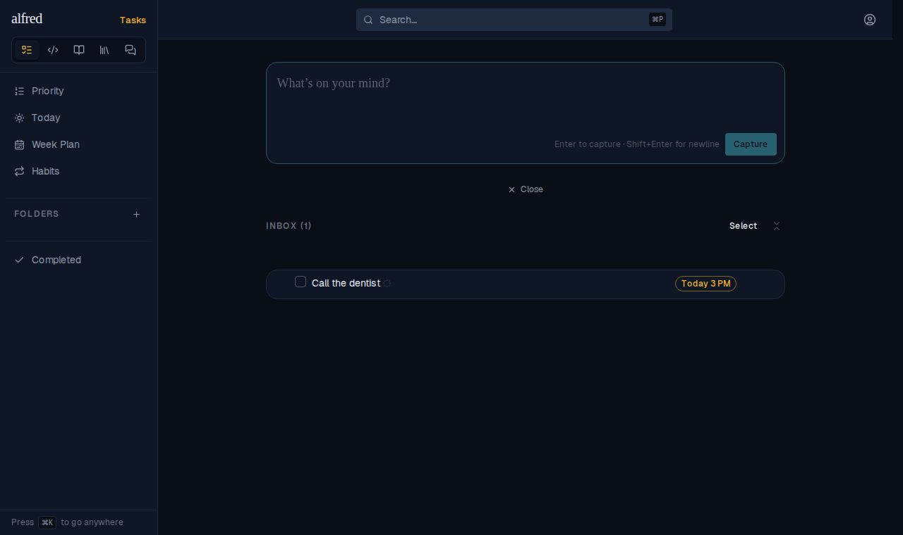

## The row's own due chip: a day pick keeps the time, × clears only the time

Clicking the row's **Today 3 PM** chip opens the same picker, with the time field filled in.


Picking October 10 saves and closes the picker, and the time stays: the chip reads **Oct 10 3 PM**.

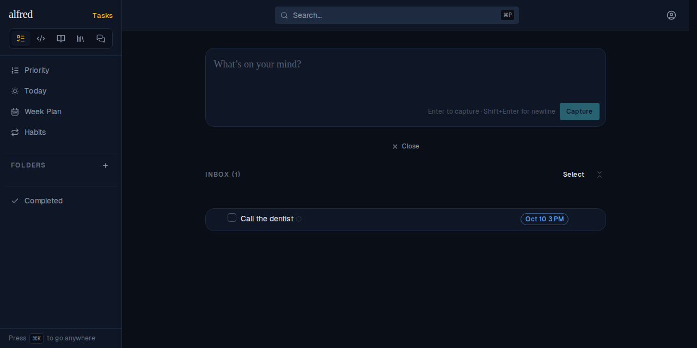

Reopening the picker and pressing × clears only the time. The date stays (**Oct 10**), and the row goes back to **Add time**.

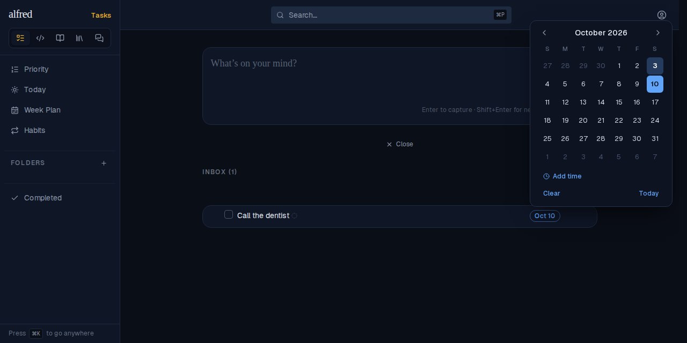

⋯ → Due date → Custom… opens the same picker, with the same time row.

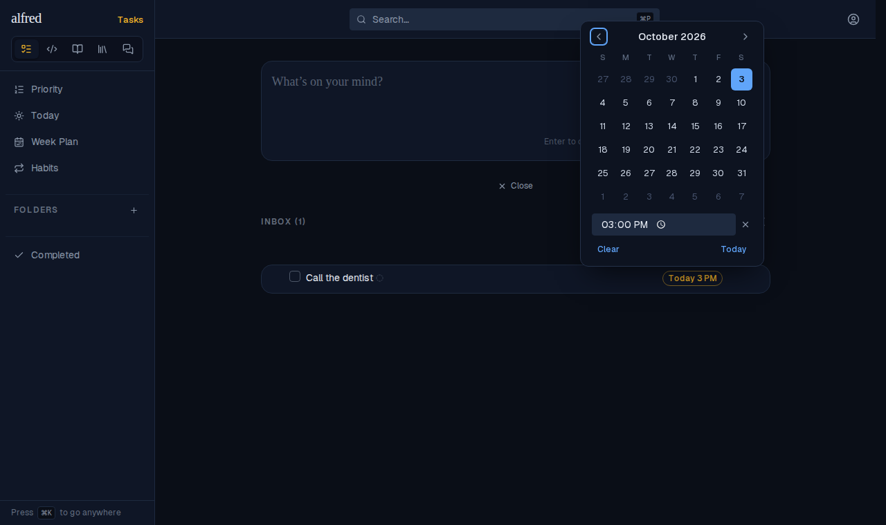

## Every due chip reads the time

By-Priority still leads on priority level. Within the High tasks, the time is the tiebreak, and the untimed High task comes last. The chips are display-only here.

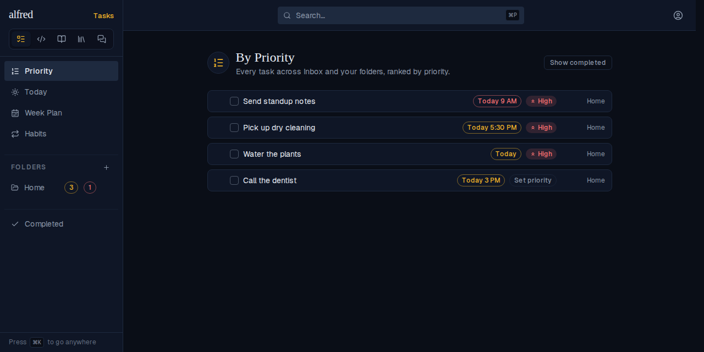

Select mode renders chips inert (no picker), and they still show the time.

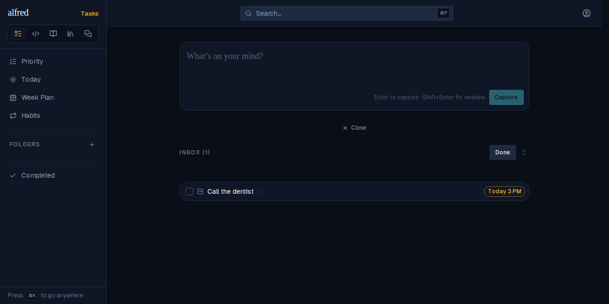

## A day orders by time, and turns red at the minute

A folder sorted by **Due date** runs today's tasks by time, with the untimed one last. This is ahead of priority: Call the dentist has no priority, but at 3 PM it comes before the High task due at 5:30 PM.

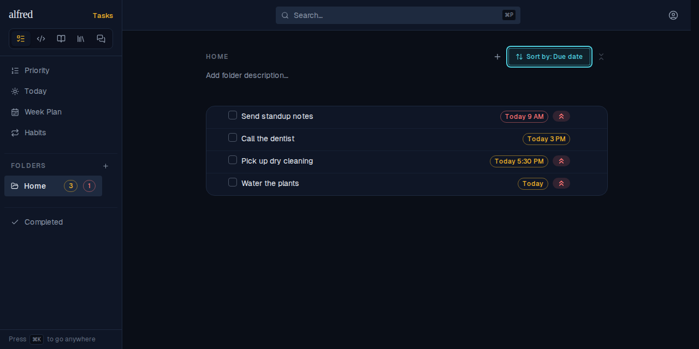

Today at 14:59:30 runs the same way. Call the dentist is amber, both on its chip and on the Errands folder badge.


One minute later, with no reload, Call the dentist turns red where it stands, and the Errands badge moves from its amber count to its red one. Water the plants is untimed, so it stays amber all day.

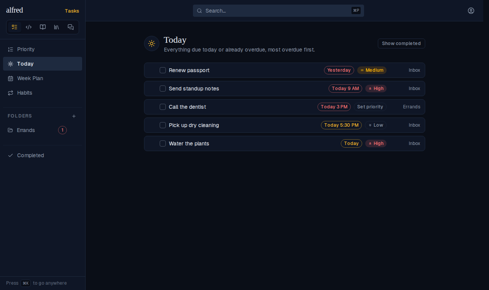

A parent's overdue-subtask tally works the same way. At 14:59:30 the subtask due today at 3 PM isn't late yet, so no tally appears.

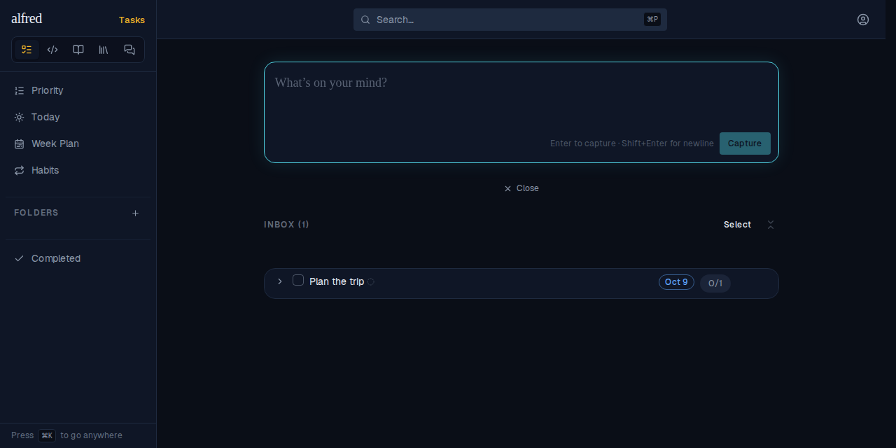

At 15:00 the red **1** appears, with no reload.

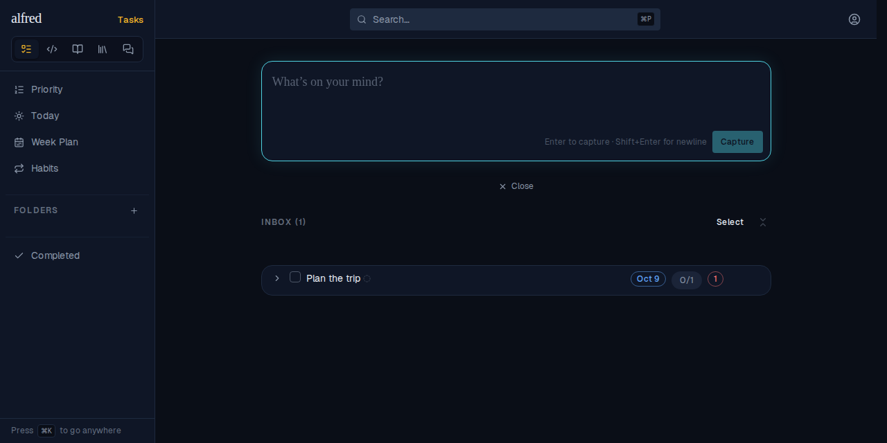

## A recurring timed task

A daily task due today at 7 PM:

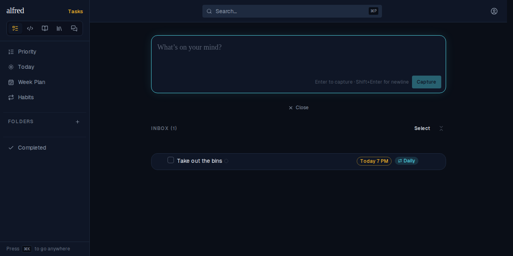

Completing it spawns the next occurrence at the same time. It reads **Tomorrow 7 PM** optimistically, and still does after a reload, once it has come back from the server's complete_and_spawn.

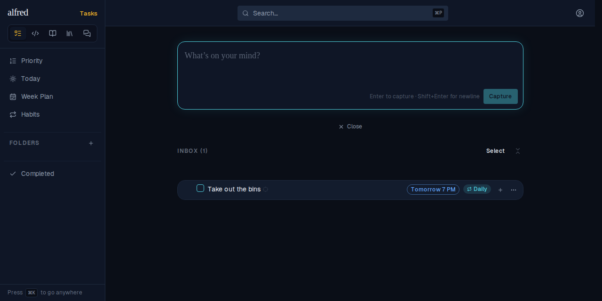

## Changing the type clears the time with the date

A timed task, before Classify as… → Knowledge:

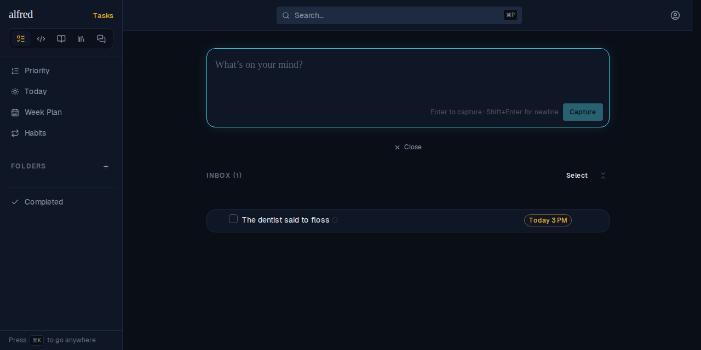

The browser sent this PATCH, captured from the request: `{"item_type":"knowledge","due_date":null,"due_time":null,"recurrence":null,"intended_project_id":null,"intended_epic_id":null,"folder_id":null}`. The write succeeds and survives a reload; a knowledge row carries no date or time.

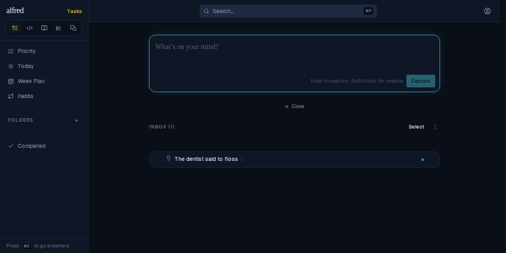

## The API

[`with-app.sh`](with-app.sh) builds and boots the real Next app against the in-memory Supabase mock. It then runs [`api-contract.mjs`](api-contract.mjs), which signs in with the app's own auth library and makes each request. The mock mirrors the migration's CHECK and its clear-with-the-date trigger.

One thing to note: the last PATCH sends a time alone for an undated row. The route can't see the stored date, so the database's CHECK refuses it, as designed. The route then answers **500**, because `mapSupabaseError` maps every CHECK violation (`23514`) to 500, app-wide; that mapping predates this change. The UI never sends this request.

```bash
docs/demos/due-times/with-app.sh
```

```output
Create
POST /api/items {"title":"Dentist","item_type":"task","due_date":"2026-10-04","due_time":"15:00"}
  → 201 {"due_date":"2026-10-04","due_time":"15:00"}
POST /api/items {"title":"Dentist","item_type":"task","due_time":"15:00"}
  → 400 {"error":"Invalid request body","details":[{"code":"custom","path":["due_time"],"message":"\"due_time\" requires a \"due_date\""}]}
POST /api/items {"title":"Dentist","item_type":"task","due_date":null,"due_time":"15:00"}
  → 400 {"error":"Invalid request body","details":[{"code":"custom","path":["due_time"],"message":"\"due_time\" requires a \"due_date\""}]}
POST /api/items {"title":"Dentist","item_type":"task","due_date":"2026-10-04","due_time":"3pm"}
  → 400 {"error":"Invalid request body","details":[{"origin":"string","code":"invalid_format","format":"time","pattern":"/^(?:[01]\\d|2[0-3]):[0-5]\\d$/","path":["due_time"],"message":"Invalid ISO time"}]}

Update
PATCH /api/items/:id {"due_time":"09:30"}
  → 200 {"due_date":"2026-10-03","due_time":"09:30:00"}
PATCH /api/items/:id {"due_date":"2026-10-10"}
  → 200 {"due_date":"2026-10-10","due_time":"09:30:00"}
PATCH /api/items/:id {"due_time":"15:00:00"}
  → 400 {"error":"Invalid request body","details":[{"origin":"string","code":"invalid_format","format":"time","pattern":"/^(?:[01]\\d|2[0-3]):[0-5]\\d$/","path":["due_time"],"message":"Invalid ISO time"}]}
PATCH /api/items/:id {"due_time":"25:00"}
  → 400 {"error":"Invalid request body","details":[{"origin":"string","code":"invalid_format","format":"time","pattern":"/^(?:[01]\\d|2[0-3]):[0-5]\\d$/","path":["due_time"],"message":"Invalid ISO time"}]}
PATCH /api/items/:id {"due_date":null,"due_time":"15:00"}
  → 400 {"error":"Invalid request body","details":[{"code":"custom","path":["due_time"],"message":"\"due_time\" cannot be set while clearing \"due_date\""}]}
PATCH /api/items/:id {"due_date":null}
  → 200 {"due_date":null,"due_time":null}
PATCH /api/items/:id {"due_time":"15:00"}
  → 500 {"error":"new row for relation \"items\" violates check constraint \"items_due_time_needs_date\""}
```

## The database rules

[`db-rules.ts`](db-rules.ts) builds a throwaway Postgres from every committed migration (the integration suite's cluster, so it needs no credentials). It runs each rule as the browser's `authenticated` role.

```bash
node docs/demos/due-times/db-rules.ts 2>/dev/null
```

```output
1. A time with no date is refused:
   new row for relation "items" violates check constraint "items_due_time_needs_date"
2. Moving the date keeps the time; clearing it clears both:
   after a move : {"date":"2026-10-05","time":"15:00:00"}
   after a clear: {"due_date":null,"due_time":null}
3. Sending a timed task to the factory succeeds and drops the time with the date:
   {"item_type":"code","due_date":null,"due_time":null}
4. Completing a recurring timed task spawns the next occurrence at the same time:
   next occurrence: 2026-10-04 at 15:00:00
5. A human time edit claims an unjudged row from the classifier:
   claimed: true
6. Dispatching a row whose guessed time was changed logs a due_time correction:
   {"field":"due_time","direction":"changed","guessed_value":"15:00","chosen_value":"16:30"}
```

## The classifier, through the real sweep

[`sweep-harness.mjs`](sweep-harness.mjs) runs the shipped `runSweep` against real Postgres with every migration. Only two things are stood in. A small shim plays PostgREST. A stand-in model endpoint returns a fixed answer per capture, because there is no API key here and the doc must reproduce. Everything the Worker does with an answer is real.

The five answers cover:
- a stated time;
- **tonight**: a day but no clock time, per the prompt's rule;
- a model that breaks the rules with a time but no date;
- a malformed time;
- a time guessed for a different day than the one the owner set.

The last block dispatches the dentist after the owner changed its time.

```bash
node docs/demos/due-times/sweep-harness.mjs 2>/dev/null
```

```output
── what the sweep sent the model ──
  - due_time: answer only when the text states a clock time (“at 3”, “3pm”, “15:30”, “noon”), as 24-hour HH:MM. Never infer a time from a part of day (“tonight”, “this afternoon”, “first thing”) or from urgency. When the text gives a time but names no day, due_date is today. Never answer due_time without a due_date.
  schema.due_time = {"anyOf":[{"type":"string"},{"type":"null"}]}
  due_time required: true

── runSweep → {"eligible":5,"classified":5,"failed":0,"aborted":false} ──
  capture                  model answered             row now holds
  dentist tomorrow at 3pm  2026-10-04 15:00           2026-10-04 15:00  (v5, guess.due_time=15:00)
  call mom tonight         2026-10-03 —               2026-10-03 —  (v5, guess.due_time=none)
  standup at 9:30          — 09:30                    — —  (v5, guess.due_time=none)
  pay rent by 5            2026-10-03 5pm             2026-10-03 —  (v5, guess.due_time=none)
  haircut at 3pm           2026-10-04 15:00           2026-10-06 —  (v5, guess.due_time=15:00)

── the owner moves the dentist to 16:30, then files it ──
  due_time: changed (15:00 → 16:30)
```
