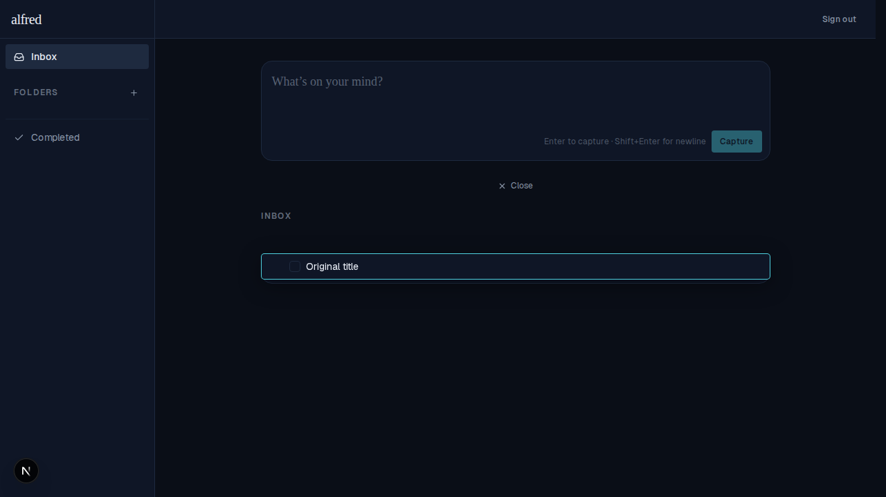
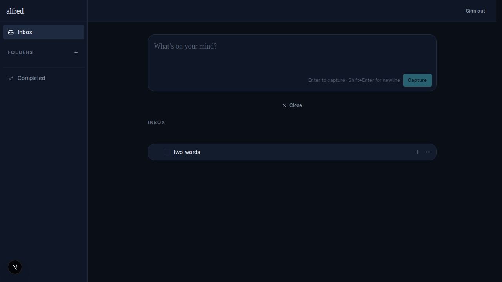
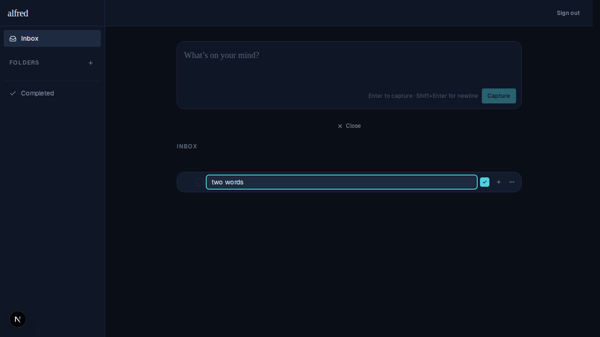

# Spacebar while editing a title no longer triggers a phantom keyboard drag

*2026-06-14T17:56:59.841Z*

## The bug

Double-click a task to edit its title, then press the space bar. The editor closes, the row stops being draggable, the title text becomes highlightable, and double-clicking that item no longer re-opens the editor.

## Root cause

The whole task row is the drag surface: `TaskRow` spreads dnd-kit's draggable `listeners` (which include the **KeyboardSensor** activator) across the row `
`, and the inline title `<input>` is a child of that div. dnd-kit lifts a draggable when **Space** or **Enter** is pressed, so a keydown bubbling up from the focused input matched the activator's start codes. With no separate `activatorNode` set, the activator's guard was skipped, so it called `preventDefault()` (swallowing the space the user meant to type) and started a phantom keyboard drag — collapsing the editor behind the DragOverlay.

The project already guards **pointer** drags from interactive controls with a custom `RowPointerSensor` (+ `isInteractiveTarget`). The **keyboard** sensor had no such guard.

## The fix

Add a `RowKeyboardSensor` (keyboard counterpart to `RowPointerSensor`) that reuses `isInteractiveTarget`: it lifts on Space/Enter exactly like dnd-kit's default **except** when the keypress originates inside a row button or the inline edit input — then it bails without preventing the keystroke. Wire it into `TaskDndProvider` in place of the bare `KeyboardSensor`.

## Before — pressing space starts a phantom drag

Editing "Original title" and typing "two words": the space activates a keyboard drag. The teal-ringed clone is dnd-kit's DragOverlay floating over the row, the editor has collapsed behind it, and the typed space was swallowed (`preventDefault`).

## After — the space is typed and the editor stays open

Same flow with the fix: typing "two words" keeps the inline editor open and the space lands in the value. No drag is started.

Pressing Enter saves the spaced title:

…and double-clicking the same item still re-opens the editor — it was never hijacked by a drag:

