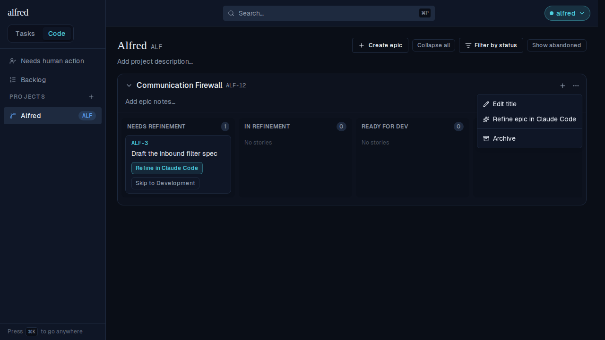
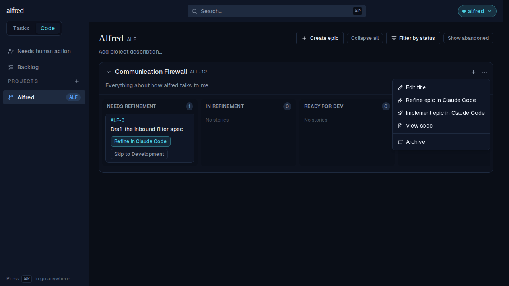
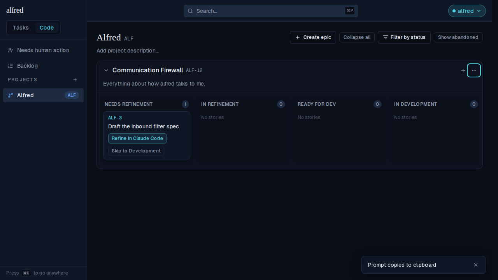

# One-shot an epic in Claude Code (ALF-217)

*2026-09-09T02:48:18.357Z*

An epic could be refined into a spec, but nothing could build it: shipping the epic meant cutting stories by hand, refining each, then launching a session per story. ALF-217 adds the lane that skips all of that — an **Implement epic in Claude Code** action that opens ONE session whose job is to build the whole epic spec by dispatching implementer subagents, and open ONE PR.

## 1. The action appears only once the epic has a spec to build

An epic nobody has refined has nothing for a one-shot session to read, so the menu offers refinement and nothing else — the same gate `View spec` uses.



Once a refinement PR has recorded a spec on the epic, the launch appears directly under **Refine epic in Claude Code** — the order the epic moves through them — with Archive still last.



## 2. Clicking it launches the session and moves nothing

The prompt is copied to the clipboard (the mobile paste-fallback, since the Claude app drops the `q` param) and the prefilled tab opens. The epic's own story, ALF-3, has not budged from Needs Refinement: an epic carries no lifecycle state, so the launch writes nothing at all — the PR is the only signal, exactly as the epic-refinement launch behaves.



## 3. The prompt that tab is prefilled with

Built by the real `buildEpicImplementationUrl`. It casts the session as an ORCHESTRATOR dispatching a subagent per slice, points at the new implement-epic skill for how to slice and brief them, and carries the `alfred` block with the EPIC's ref under `phase: epic-implementation`. Two lines are the ones this lane turns on: the session **cannot create tickets**, so work it leaves out is a question for the human rather than an invented ref; and the epic spec is long-lived context, so — unlike a story's implementation prompt — there is no archive step and it says to leave the file where it sits. A spec-less epic (reachable only by a direct caller, since the menu gates on the spec) is told the truth instead of being pointed at a file nobody wrote.

```bash
node --no-warnings docs/demos/epic-one-shot/build-one-shot-prompt.mjs
```

````output
=== An epic carrying a committed spec (the only case the menu offers) ===
ALF-12: Communication Firewall

You are implementing the EPIC ALF-12 in ONE session: build everything its epic spec describes, then open ONE pull request for the whole epic. You are the ORCHESTRATOR — cut the epic into slices and dispatch an implementer SUBAGENT per slice, then integrate what they return yourself.

1. Ground yourself first: skim the repo and honor its own conventions — read any CONTRIBUTING or CLAUDE.md — and build on the code that already exists.
2. Read the epic spec committed at `docs/specs/epics/ALF-12.html` — it is this session's plan, and the whole of it is in scope. It is long-lived context, not scaffolding: do NOT edit, archive, or move it.
3. Follow the implement-epic skill at `.claude/skills/implement-epic/SKILL.md` (it auto-loads in this session) — it owns how to slice the epic, brief and dispatch the subagents, and integrate their work. If the skill is absent, build the slices yourself, one at a time, in dependency order.
4. If the spec is ambiguous, has drifted from the code, or implies work you end up leaving out, ASK ME HERE — I'm in this tab. You cannot create tickets in the orchestrator, so uncovered work is something to tell me about; never invent a ref for it.
5. Build each slice following the repo's own conventions (tests/TDD included) — pin each requirement with a test.
6. When done, open ONE pull request whose description carries this machine-readable block verbatim — a CI check enforces it, so reproduce the fence exactly:

```alfred
alfred-ticket: ALF-12
phase: epic-implementation
```

7. Before opening the PR, confirm the epic spec's requirements are built and pinned by tests, the repo's own checks are green, the epic spec is untouched where it sits, and the block above is reproduced exactly.


Context (from the epic notes):
Everything about how alfred talks to me: notifications, Siri capture, the morning brief.

=== A spec-less epic: step 2 names no file, it routes back to the human ===
2. There is NO committed epic spec to read — the plan for this epic has not been written down. Settle it with me here before building anything.
````

## 4. What the webhook Worker does with that PR

`epic-implementation` is a phase of its own, and the reason is mechanical: it ENDS with `implementation`, and the phase regex is first-match-wins, so an alternation that listed the shorter phase first would parse an epic one-shot PR as a story implementation and PATCH `code_items` for a ref the shared per-project counter only ever issues to epics — matching nothing while answering ok. Parsed as its own phase, every action is an explicit no-op: an epic has no lifecycle state and no implementation-PR column, so merging the PR advances nothing and the human archives the epic themselves. The story rows below are what an epic ref would have triggered instead.

```bash
node --no-warnings docs/demos/epic-one-shot/epic-one-shot-webhook.mjs
```

```output
parsed PR block : {"tickets":["ALF-12"],"phase":"epic-implementation"}

epic-implementation + opened             → no-op
epic-implementation + closed & merged    → no-op
epic-implementation + closed & NOT merged → no-op
implementation + opened                  → {"target":"story","updates":{"factory_state":"ready_for_review","implementation_pr_url":"https://github.com/ac3charland/alfred/pull/217"},"snapshotSpec":false}
implementation + closed & merged         → {"target":"story","updates":{"factory_state":"done"},"snapshotSpec":false}
```

## 5. The enforcing CI check accepts the new phase

The copy-ready `alfred-frontmatter.yml` each project repo installs gets the same alternation fix. The one-shot block passes carrying no `spec-path` (only the two refinement phases and a spike require one), and the story archive rule is untouched — it still fails an implementation PR that leaves its spec sitting in the active specs directory.

```bash
node --no-warnings docs/demos/epic-one-shot/frontmatter-check.mjs
```

```output
the epic one-shot PR                           PASS — ok: ALF-12 epic-implementation
a story implementation PR (unchanged)          PASS — ok: ALF-42 implementation
a story implementation PR leaving its spec un-archived FAIL — implementation PR must archive its spec: git-move docs/specs/ALF-42.html to docs/specs/archive/ALF-42.html
```

## 6. The skill the session loads

`.claude/skills/implement-epic/SKILL.md` is what the prompt's step 3 points at: it owns how to cut the epic into slices (foundations first and alone, vertical behavior over layers, a file boundary per slice, parallel only when disjoint), how to brief a subagent that cannot ask a follow-up question, and that the orchestrator — not the subagents — owns integration, the gates, and the single PR.

```bash
sed -n '/^# Implementing an epic/,/^## Slice the epic/p' .claude/skills/implement-epic/SKILL.md | head -32
```

```output
# Implementing an epic in one session

> This skill is **dropped into each project repo** at `.claude/skills/implement-epic/SKILL.md`.
> An epic-implementation session triggered by our agent orchestrator (alfred) auto-loads it; the
> launch prompt also points here.

You are the **orchestrator** for one epic. The committed **epic spec is the plan** — the whole of
it is in scope — and your job is to get it built, integrated, and into a single PR. You do that by
**cutting the epic into slices and dispatching an implementer subagent per slice**, not by typing
every line yourself.

This lane exists so an epic can ship **without being split into stories by hand first**. Nobody
refined these slices; you are doing that work in-session, at speed, which is exactly why the rules
below are about not fooling yourself.

## You cannot create tickets

The session has no write access to the orchestrator. So when the spec implies work you end up
leaving out — out of scope, too big, blocked on a decision — **say so to the human in the tab**.
Do not invent a ref for it, do not add it to the PR block, do not leave it as a TODO nobody sees.
A made-up ref names nothing; a human reading the PR is the only route from "not done" to "tracked".

The same goes for scope you *are* covering: the block names the **epic's** ref, once. You never
enumerate story refs, because the point of this lane is that no stories were cut.

## Slice the epic before you dispatch anything
```
