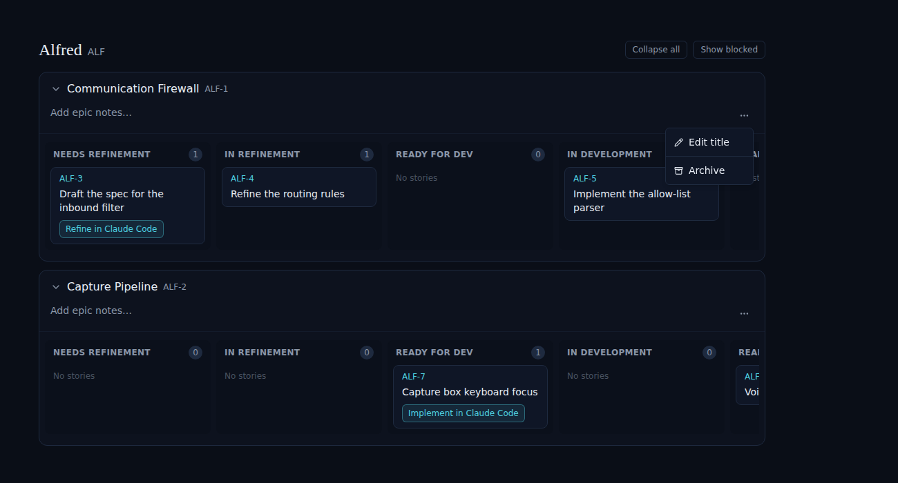
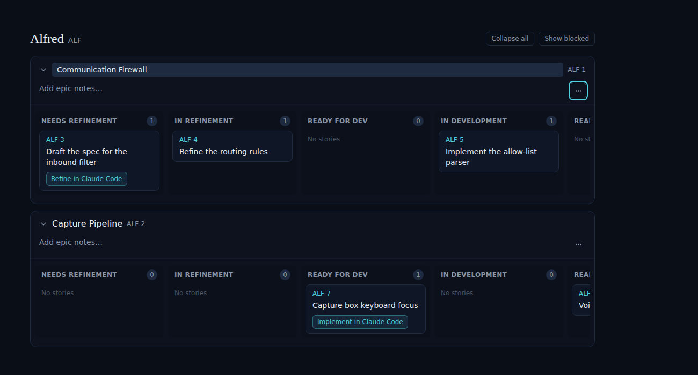
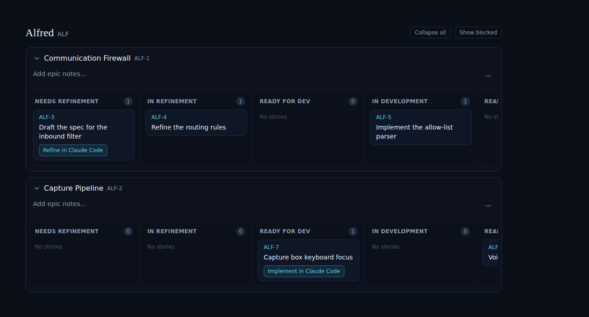
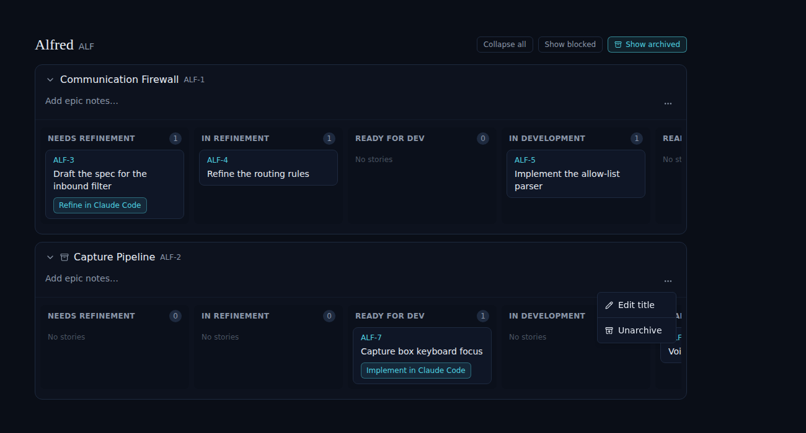
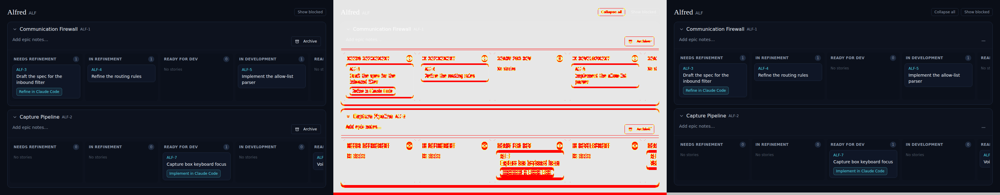

# Epic title editing & actions menu

*2026-06-15T18:05:33.567Z*

Epic title editing replaces the static Archive button with a 3-dot actions menu. The menu exposes two items: Edit title (inline rename of the epic heading) and Archive/Unarchive (toggle the epic's archived state). Epics can be renamed by clicking Edit title, editing the inline input, and pressing Enter to save or Escape/click-outside to cancel. When an epic is archived, the same menu item toggles to Unarchive.


Step 1: Default state — the 3-dot (⋯) actions menu button replaces the former Archive button. It appears in the expanded epic's action area.



Step 2: Clicking ⋯ opens a dropdown with two items: Edit title and Archive.



Step 3: Clicking Edit title transforms the epic heading into an inline text input (teal ring, pre-selected). Enter saves; Escape or clicking outside cancels.



Step 4: Pressing Enter saves optimistically and exits edit mode. The heading is restored from the store response.



Step 5: For an archived epic (archive icon in header, shown via Show archived toggle), the menu shows Unarchive instead of Archive.

```bash
npm run test -w frontend 2>&1 | grep -E 'Tests:|Suites:' | tail -4
```

```output
Test Suites: 56 passed, 56 total
Tests:       942 passed, 942 total
```


