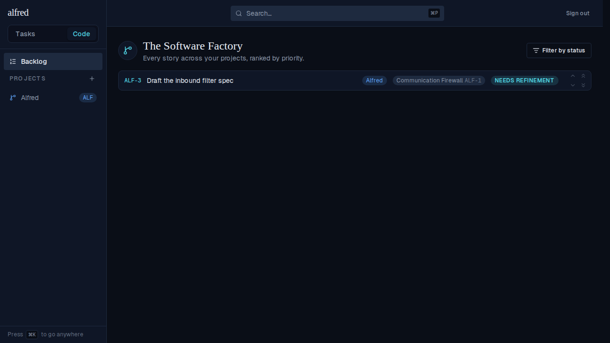
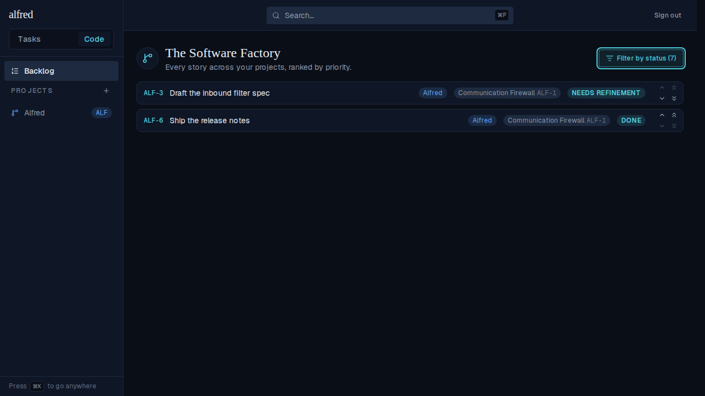
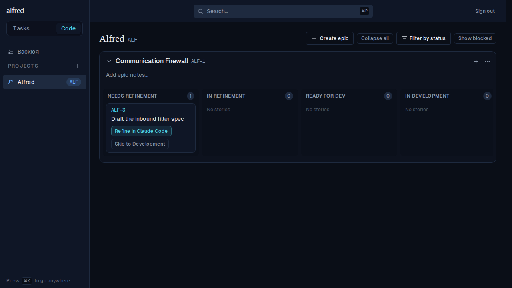
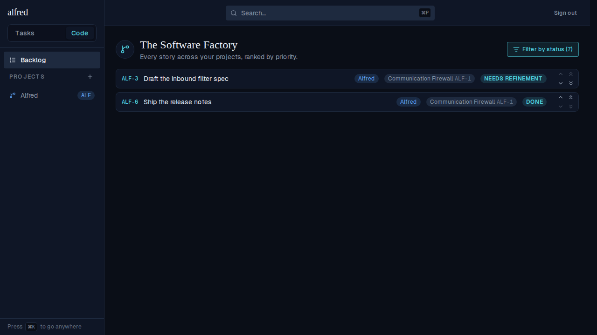

# Backlog/board status filter survives SPA navigation (ALF-79)

*2026-07-03T01:00:05.530Z*

The Code module's "Filter by status" selection is held per view in a layout-mounted coordination store (`CodeFilterProvider`), keyed `backlog` for the Backlog and by project id for each board. Because the store lives above the URL-driven view router, the Backlog and boards can unmount and remount as you navigate between them without losing their filter — where before the selection lived in the view's own `useState` and reset to the default on every return.

The journey below drives the real authenticated app (Playwright mock backend): filter the Backlog, navigate to a project board and back via the sidebar (a client-side History push, no reload), and confirm the selection is still active.

**1. Backlog at its default** — the outstanding-only filter hides the `done` story ALF-6; only ALF-3 is listed.

**2. Filter on Done** — checking Done reveals ALF-6 and the trigger shows the `(7)` active-filter count.

**3. Navigate to the project board** — a client-side switch via the sidebar; the Backlog view unmounts.

**4. Back to the Backlog** — the Done filter is still active: ALF-6 remains listed and the `(7)` count persists. Before ALF-79 the Backlog would have reset to its default and re-hidden ALF-6.

